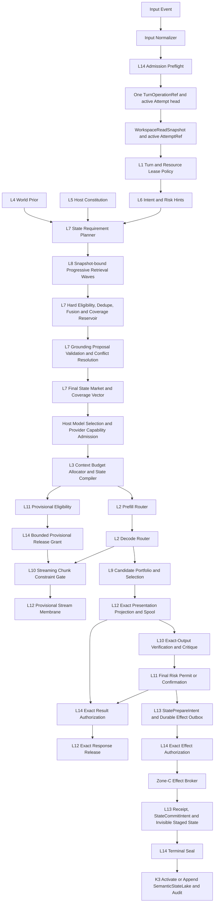

# iPhone Air → Future Apple Silicon 14-Layer System Architecture Design

> **Forward development status (2026-08-29):** Superseded by [Qinao single-developer Git and lightweight PR design](2026-08-29-qinao-single-developer-git-and-lightweight-pr-design.md). External authority closure was never completed, and no historical authority is retroactively claimed. The single developer selected ordinary Git plus lightweight PR review; former source-admission, controlled-document, signer/trust-root, controller/CAS, authority-receipt, registry, and quorum gates are retired for forward development. Historical facts and hashes remain evidence; a historical non-authority limitation remains a forward gate only when the superseding design explicitly restates it.

**Status:** A+ convergence approved; architecture and implementation remain `REVISE` until the reopened physical fault-model gates in Sections 34 and 37 close
**Date:** 2026-07-14; A+ convergence revision 2026-07-16
**Scope:** Current iPhone Air/A19 Pro baseline, iOS 27 minimum across every workspace-owned iOS package slice/app/extension target, and capability-driven future Apple Silicon
**Decision:** Adopt a capability-driven backend portfolio under invariant semantic, quality, state, and sovereign contracts

## 1. Executive Decision

The architecture is fixed on four independent axes plus seven orthogonal views:

> **14 Semantic LayerCores own semantic authority; 4 Physical Kernels own shared mechanisms; 4 bounded ControlRings own feedback cadence; 7 top-level planes describe orthogonal system views. Silicon Capability Fabric connects capabilities and evidence across planes without becoming an eighth plane.**

The four counts must never be added together:

- `14` is exactly the semantic layer count, `L1` through `L14`.
- `4` Physical Kernels are software mechanism, deployment, resource, and fault-ownership domains; they are not Apple CPU/GPU cores.
- `4` ControlRings are bounded feedback protocols; they are not semantic layers or mutable-state owners.
- `7` planes are orthogonal views; they are not serial pipeline stages.

The selected runtime direction is:

- Qinao is the model-neutral deterministic application substrate. It owns protocol, authority, state, planning, verification, audit, recovery, and host integration; every LLM/runtime remains outside the SDK behind a constrained Provider/Proposal boundary.
- The host's signed default profile selects Qwen3.5-4B through an external certified MLX/Metal Provider. Qwen3.5-4B is never hard-coded as an SDK default and a Provider cannot mutate authoritative state.
- Core ML is used only for separately certified microheads.
- Core AI is a research/certification lane until exact model, quality, StateABI, memory, thermal, and recovery gates pass.
- Future devices are admitted by observed capability and exact evidence profile, never by speculative `if A20/A21` chip-name branches.
- A turn has one authoritative heavy backend owner per phase. Healthy Apple Silicon utilization means best verified goodput, energy, memory, latency, and recovery behavior—not simultaneously saturating CPU, GPU, Neural Accelerators, and Neural Engine.

The final verdict is deliberately split:

| Question | Verdict |
|---|---|
| Is the A+ architecture ready to be called closed under the abstract fault model? | **REVISE until the reopened K3 durability, capability attenuation, remote-egress, cache-scope, erasure, and non-convergence gates pass** |
| Does current production code conform to this complete architecture? | **REVISE** |
| Can current iPhone Air promise general or sustained `40 tok/s`? | **NO; thermally-cold resident accepted-decode 40 is an UNVERIFIED workload-qualified stretch target** |
| Can current iPhone Air promise sustained `30 tok/s`? | **NO under current evidence** |

No prose-only review, prior abstract-model pass, or green retained-foundation test can close these reopened gates. A later `PASS` means only that the written architecture's fault model and acceptance matrix are internally closed; it still does not mean that the future architecture is implemented or production-certified.

## 2. Goal

Design a complete on-device cognitive runtime that:

1. preserves the exact 14-layer semantic doctrine;
2. gives every semantic decision, mutable mechanism, feedback loop, and hardware adapter one clear boundary;
3. allows deep cooperation through typed immutable artifacts and attenuated capabilities rather than hidden callbacks;
4. extracts the best healthy performance from current and future Apple Silicon;
5. preserves full model quality under thermal, memory, cache, backend, helper, and effect failures;
6. makes retrieval, generation, verification, external effects, and state evolution crash-recoverable and auditable;
7. can evolve across iOS and silicon generations without changing semantic authority or silently weakening quality.

## 3. Non-Goals

This design does not:

- claim the target architecture already exists in the repository;
- define an implementation task sequence or authorize production code changes;
- promise 40 tok/s on every prompt, context length, sampling policy, thermal state, or OS build;
- treat requested Core ML/Core AI compute units as proof of actual ANE placement;
- promise general exactly-once semantics for arbitrary external effects;
- invent public APIs for P/E-core pinning, ANE utilization, thermal-frequency control, or hard silicon reservations;
- make a new smaller, lower-bit, fixed-expert, or separately trained model a thermal fallback for the current full-quality model lineage;
- let a model/Provider read Qinao's SQL stores, StateLake, tool credentials, actors, or mutable state directly; select its own routing/authorization; or publish a proposal as truth;
- create one physical model runtime, scheduler, or database owner per logical context window;
- turn Silicon Capability Fabric, Effect Broker, Input Normalizer, or an operator recovery root into another semantic layer or Physical Kernel.

## 4. Evidence and Repository Truth

### 4.1 Evidence grades

Every runtime profile, optimization, and public performance claim carries one grade:

| Grade | Meaning |
|---|---|
| `E0` | Design or schema only |
| `E1` | Pure-function or canonicalization unit evidence |
| `E2` | Simulator or local functional evidence |
| `E3` | Reproducible evidence from one physical device and one OS/runtime build |
| `E4` | Multi-device, multi-cohort evidence including cold/warm cache, thermal, memory, revocation, helper crash/upgrade, and effect fault injection |
| `E5` | Controlled production canary with rollback, revocation, and incident drill |

A production `ModelExecutionProfile` requires at least E4. A cache hit, architecture label, API availability check, or microbenchmark cannot promote a backend.

### 4.2 Current iPhone Air public facts

Apple currently specifies iPhone Air with:

- A19 Pro;
- 6-core CPU: 2 performance and 4 efficiency cores;
- 5-core GPU with Neural Accelerators;
- 16-core Neural Engine;
- Apple C1X cellular modem and N1 wireless networking chip.

These public facts describe available hardware, not third-party scheduling authority. The app can request work through public frameworks and observe supported signals, but it cannot reserve silicon, pin arbitrary work to P/E cores, prove ANE utilization from a compute-unit preference, or command thermal frequency.

### 4.3 Current repository truth to preserve

The repository already contains valuable foundations:

- stable `L1...L14` identities and naming assets;
- MLX/Metal as the real 4B decode hot path;
- `BASDecodePlanner` and never-worse/acceptance concepts;
- thermal sampling, memory-cap modeling, pressure-ladder primitives, prefix/session state, and device evidence ledgers;
- sovereign token and signature foundations;
- SQLite event-log transactions;
- Core AI shadow/research gates;
- NAX-capable vendored MLX paths.

These are foundations, not proof of conformance. Current code also contains structural gaps that the target design must not disguise:

- `BASExecutionPlan` elects more than it actuates; load, prefill, and cache decisions are not one authoritative production spine.
- native-v2 stage closures can have outputs discarded before the v1 coordinator runs, creating future double-compute or double-effect risk when closures become real.
- multiple routing authorities overlap: execution plan, hardware scheduler, device routing, and MLX decode planner.
- live memory headroom is observed but not consistently used for admission.
- current ANE capability records contain estimates that are not direct hardware observations.
- requested tensor backing or compute units do not prove physical placement.
- the current `.statelake` reader is a neural NDArray/tensor-state format, not the semantic multi-lane memory system specified here.
- sovereign issuance, nonce, spent, and consumed-bundle state is currently in memory in important paths.
- the current Ed25519 raw seed is stored as a Keychain generic password and reconstructed in process; that is Keychain at-rest protection, not a non-exportable Secure Enclave Ed25519 key.
- no production implementation yet exists for the complete Artifact Mesh, Capability Mesh, LayerCell membrane, durable Effect Broker, StateABI fallback graph, or unified MemoryLedger described here.
- `QinaoRuntimeSDK` currently publishes concrete `QinaoMLX` and Apple Foundation Models products/targets and exposes a raw-string organ endpoint; the target boundary must be inverted so concrete model/runtime packages depend on the SDK contracts, never the SDK on a concrete LLM runtime.
- the current host turn request has no canonical workspace/window/generation identity, the prompt cache is substantially keyed by two hashes, and the current commit gate is shape-oriented rather than an authority/snapshot/effect proof.
- workspace-owned package manifests and the Rust XCFramework build script still contain iOS 18 deployment declarations. The product decision is iOS 27 minimum, so every app/package/extension/binary slice and emitted Mach-O minimum must converge before implementation can claim conformance.

The code audit captured these concrete ship blockers at the review snapshot:

| Area | Repository evidence | Target disposition |
|---|---|---|
| execution actuation | `BASExecutionPlan` explicitly limits actuation while load/prefill/cache remain elected; production sources do not show one universal elector→actuator spine | one typed plan owns load through receipt |
| admission | `BASExecutionPlanElector` observes memory headroom but admission is still dominated by static profile estimates; a non-fit plain plan can still exist | dynamic resident+transient reservation must reject before load |
| session path | `MLXOrganAdapter` session decode has paths that bypass or diverge from the shared planner/fallback behavior | every entry point consumes the same exact plan/executor |
| MTP recovery | stateless execution has a plain recovery path, while fused/session paths do not uniformly prove the same catch, rollback, and hysteresis | one fallback state machine and rollback receipt |
| target/speculation state | current trunk checkpoint/session persistence does not bind the complete pending-token/RNG/sampler/grammar state, and draft paths can mutate cache before rejection rollback | one logical target checkpoint/version; generation-isolated disposable scratch; accepted-receipt CAS is the only advance |
| dual runtime | `BASNativeStageExecutor` can execute closure-shaped stages whose outputs are not the authoritative turn result, followed by unconditional coordinator execution | one typed result owner; shadow work is explicitly non-authoritative |
| hardware scheduler | assignments describe backing/kernel/cost, while latency multipliers and ANE capacity fields include estimates | split raw observation, certified profile, policy preference, and actual receipt |
| model default | capability manifest and zero-argument MLX adapter name different production-default model families | one signed bundle/profile selection SSOT |
| SDK/model boundary | `QinaoRuntimeSDK/Package.swift` publishes `QinaoMLX`; `QinaoOrganEndpoint` is raw-string shaped; proposal adoption and commit checks do not yet enforce the complete authority closure | move concrete Qwen/MLX implementation outside the SDK; add value-only Provider/Proposal contracts and deterministic adoption gates |
| workspace/attempt identity | `EBrainTurnRequest` lacks workspace/window/generation/attempt binding; prompt/session artifacts can outlive the semantic snapshot that justified them | one `ContextWorkspaceRef` + `AttemptRef` + active-attempt CAS fence on every derived artifact and capability |
| pressure behavior | pressure-ladder actuation is feature-gated in important paths; pressure can quantize session KV despite known continuation divergence | production-default ledger policy; no unqualified identity-changing fallback |
| state reader | `BASStateLakeReader` performs neural tensor-state reads with multiple potential transient representations | rename/reframe as NeuralStateCache I/O and stream/map under ledger |
| retrieval fusion ABI | a pure Rust RRF implementation exists in `bas-retrieval-ranker`, while the current C ABI exposes other fusion operations rather than that RRF production call | extend the existing narrow Rust ABI/Swift bridge with byte/parity tests; do not add another ranker |
| semantic memory | existing cognition/memory paths can collapse candidates into a ranking pool and lose scope/sensitivity in projections | snapshot lanes, hard eligibility, typed conflict, preserved projection labels |
| mesh | `BAS14LayerMeshMap` is declared zero-behavior-change with no production semantic/capability spine; reference actors/hooks are not the authoritative path | migrate behind LayerCell contracts without claiming current conformance |
| kill/revoke | layer kill and production kill-switch identities are split and lack one pervasive generation check | one monotonic epoch checked through queue, dispatch, receipt, and seal |
| capability default | at least one adapter treats an empty allowed-domain set as permissive | empty/missing authority is deny |
| sovereign state | `BASSovereignTokenAuthority` and relevant consumed-bundle paths retain in-memory issuance/spend state | helper-private transactional durable ledger |
| receipt semantics | current control-plane receipts lack exact effect/profile/adapter/idempotency/seal state; some coordinator paths synthesize generic execution | expanded signed operation receipt and durable saga |
| state folding | SQLite event append has a strong transaction foundation, but convenience folding paths can start from zero, ignore duplicate/new status, or continue after append error | hydrate from log, deterministic event identity, CAS and projector cursor |
| K3 durability | EventLog, direct memory atoms, user-state projections, and cursors currently use separate handles/WALs or actor memory, mostly with `synchronous=NORMAL`; they cannot satisfy the target's same-transaction control-state invariant across power loss | one K3 control nucleus in one SQLite file/WAL with `synchronous=FULL`; event/integrity, Attempt head/generation, outbox, staging, authoritative cursor, permit, and deletion epoch/tombstone commit together |
| K3 writer convergence | Swift `BASSQLiteEventLogStorage` and routed Rust EventLog both expose writes but use different high-water/integrity/sequence schemas; independent builders can open writable stores | one physical writer lease per K3 path, sealed-checkpoint migration, and owner-led strangler cutover; every old writer becomes read-only before the new writer is authoritative |
| memory authority | default wiring can keep the direct SQLite atom writer beside an independently appended EventLog, while `QinaoMemory` is another runtime-consumed actor-memory map | EventLog/K3 command truth plus one encrypted content-addressed artifact owner; atom tables and Qinao frontstage memory become scoped read-only projections/adapters |
| event-sourced content | admitted memory events persist a content digest but the current event-sourced atom store keeps raw content only in an ephemeral cache; cold replay cannot reconstruct it | store raw content exactly once as an encrypted artifact referenced by the EventLog; cache loss is harmless and erasure destroys the key/blob before closure |
| memory isolation | `QinaoMemory` frontstage state is process-global and can be auto-injected without an authority/workspace/window/session filter | scope every admission/recall/bundle to the canonical workspace/Attempt closure and deny an absent scope; public mutation methods adapt into K3 commands rather than mutating a second store |
| erasure closure | current Qinao forget can remove only process memory while vector/FTS/usage/artifact/Provider copies remain independently reachable; wall-time EventLog prune can remove a deletion tail while retaining older admission truth | monotonic deletion epoch and blinded tombstone first, then owner purge acknowledgements plus rescan; no completed receipt before closure and no compaction that permits resurrection |
| K4 durability/anchor | token/nonces/spent state, snapshot anchors, version trees, halt state, and plan caches remain partly actor memory; the optional audit database does not yet anchor K3 HWM/root/deletion epoch | helper-private `FULL` K4 state under a stable Keychain key, with signed monotonic K3 checkpoints and restart-safe claim/revoke/anchor recovery |
| projector truth | user-state/projector stores can select by wall time, swallow read errors, or keep their cursor only in actor memory | authoritative cursor advances with its K3 event/head transaction; projection writes are idempotent, throwing/fail-closed, and byte-equivalent to full replay |
| retrieval isolation | current vector paths can score a broad corpus before the final deny filter, and RRF can count duplicate/correlated appearances repeatedly | compile hard eligibility into the physical partition before ANN/Rust/reranking; lane dedupe/source caps precede fusion |
| loop authority | current multi-round code can retain a final projection after cycle/budget termination and feed it forward as if authoritative | only the canonical `convergedVerified` receipt outcome (`converged + verified`) may become authoritative; every other terminal state remains typed proposal/degraded/remand evidence |
| cache scope | current session/KV persistence binds only a subset of model and sequence identity | one exhaustive cache-scope contract binds model, modality, StateABI, tokenizer/template, authority/workspace/snapshot, epoch vector, and exact token history |
| effect cutover | current consumed-bundle truth is actor memory and direct tool execution can survive as a competing path | L13/L14 decide the semantic effect and terminal seal; K3 alone owns EventLog/outbox/permit/stage/activate transitions; K4 issues, reserves, claims, signs, and anchors; Zone C alone owns durable dispatch/reconciliation; legacy bundle state is a read-only cache after an epoch cutover |
| MLX concurrency | the current two-session cap is a smoke configuration, not thread-safety, state-isolation, or thermal proof for the pinned vendored runtime | production cap is one until the exact runtime passes the multi-seat/TSAN/state/termination/memory/thermal gate |
| MLX image closure | package resolution does not prove that final App→MLX and App→Framework→MLX paths produced one C runtime/state singleton in each process | Release link-map/`nm`/`otool` and runtime sentinel gate; exactly one MLX image per process |
| device execution profile | current static profile lacks the exact OS/runtime/known-issue/build/shape/modality/entitlement closure required to reuse device evidence safely | every change produces a new quarantined profile key and requires the declared recertification |

All entries in this table are implementation `REVISE`; none invalidates the selected target architecture.

### 4.4 Reuse-first convergence doctrine

The implementation default is **existing-owner convergence**, not an additive clean-room facade. A clearer boundary does not by itself justify a new public type, actor, target, registry, store, ledger, planner, compiler, receipt family, or state machine. An implementation is acceptable only when each semantic fact and each mutable transition has one canonical owner.

The latest repository audit for this revision was refreshed at commit `659e46576` on 2026-07-16. That hash is provenance, not a permanent implementation base. Before each convergence work package, the candidate `HEAD` must be reconciled against `/Users/changgeng/Project/Project06/Project06/docs/superpowers/specs/qinao-owner-ledger-v1.json` and pass `python3 scripts/check_qinao_owner_ledger.py --root "$ROOT" --ledger "$ROOT/docs/superpowers/specs/qinao-owner-ledger-v1.json"`. The ledger is the machine-readable planning/static authority for `currentOwner → adapter/migration → targetOwner → frozen/removed`; prose or a green unit test cannot waive an unresolved duplicate writer.

The migration shape is an **owner-led strangler**: extend the selected current owner until it satisfies the target invariant, place every displaced implementation behind a read-only migration/projection adapter, cut over once at a sealed restoration/schema epoch, and then retire the old write surface. Long-lived dual writes, “temporary” second truth, and a new store that later intends to absorb the current owner are forbidden.

The absence of an exact type name is not evidence that a capability is missing. The review found no exact-name collision between the proposed types and current declarations, while finding many semantic duplicates whose different names would evade the compiler and create contradictory digests, grants, release decisions, watermarks, receipts, or recovery states. Reuse review therefore compares responsibility and authority, not spelling.

Every proposed component is classified before implementation:

| Class | Meaning | Required action |
|---|---|---|
| **R — Reuse** | The invariant and production mechanism already exist | Call it directly; do not wrap unless a dependency/process boundary requires translation |
| **E — Extend** | The current owner is correct but lacks fields, canonical identity, durability, or a stricter invariant | Modify that owner in place or add a same-owner extension; preserve wire/source compatibility |
| **A — Adapter only** | A real module, process, framework, or legacy-wire boundary exists | Translate once; the adapter cannot rank, authorize, persist a second truth, cache independently, or execute a second effect |
| **M — Missing** | No repository owner or public/upstream primitive satisfies the required invariant | A new owner is allowed only after the create gate below passes |

#### Canonical owner map

| Domain | Canonical owner to reuse or extend | Locked convergence rule |
|---|---|---|
| L1–L14 identity | `BASCognitiveLayer`, with existing motherboard mappings as compatibility views | `BASSemanticLayerID` is an alias/projection, never a second 14-case enum |
| kernel/ring/plane identity | `BASMotherboardKernel` plus current motherboard compatibility types | Extend the four-kernel owner with stable K1–K4 projection; add only the genuinely missing ring and seven-view identities; explicitly map the legacy three-domain plane rather than treating it as the seven-view taxonomy |
| layer execution | `BASLayerActor`, `BASLayerReferenceActor`, `BASLayerCascadeRunner`, `BAS14LayerMeshMap/Assembler`, `BASLayerSlice`, current kill-switch state | LayerCell adds pure ingress/core/egress membranes around this actor mesh; `BASLayerSlice` is only a bounded ceiling/display projection, while the same K3 nucleus owns `BASBudgetLeasePayload` spend CAS and receipts; budget and kill facts are never deducted or advanced twice |
| common envelopes | `BASResult`, `BASFrameEnvelope`, `BASPermit`, `BASBundle`, `BASCard` | New domain records reuse these low-entropy shapes unless a materially different canonical payload is proven |
| event truth and replay order | `BASEventLogEntry` and `BASEventLogStorage` contract, converged behind exactly one physical K3 writer | Event/integrity, Attempt head/generation, `BASBudgetLeasePayload` use claims, outbox, invisible staging, authoritative cursor, boundary permit, and deletion epoch/tombstone converge into its one K3 `FULL` transaction; Swift/Rust writers are migration alternatives, never concurrent owners; replayable projection WALs have source watermarks but no second sequence/hash chain |
| memory command/content truth | the selected EventLog/K3 command owner plus one encrypted content-addressed Artifact Mesh payload owner | `QinaoMemory`, direct atom stores, user-state tables, FTS/vector/usage/graph stores become scoped read-only projections or migration inputs; raw content never depends on an actor cache for cold replay |
| retrieval mechanisms | `BASL8RoutedMemoryService`, `BASRAGRetriever`, vector/FTS/temporal/entity/graph stores | SemanticStateLake lanes are adapters and snapshot-bound projections; they never rebuild an index or retrieval engine |
| context packing | `BASContextCompiler` in `ContextCompilerCore.swift` | Tokenize-once spans, exact budgets, and descriptor binding extend this owner; scoped/semantic/turn compilers supply inputs or compatibility projections |
| model identity and invocation | `BASModelCapabilityManifest`, `BASModelManifestRegistry`, `BASLLMInvocationContract` | Quality identity is a canonical projection; the neural execution contract extends/nests the invocation contract rather than becoming a third editable model identity |
| model-neutral SDK boundary | `QinaoRuntime`, existing Qinao proposal/release/seat contracts, BAS manifest/invocation/plan chain | Extend these into value-only Provider/Proposal ports; concrete Qwen/MLX/Core AI/Foundation Models products move out of `QinaoRuntimeSDK`, depend inward on contracts, and are selected only by the host's signed profile |
| workspace/task/attempt identity | existing turn/session/task identities plus the event-log sequence | Extend into one canonical workspace generation and AttemptRef; do not create a second task manager, attempt registry, or scheduler truth |
| turn operation identity | the selected K3 EventLog/Attempt owner for durable admission, root/head installation, typed branch allocation, and receipt lineage; `BASTurnRuntimeEngine` only for reference composition and a transient unsealed Provider event-tail CAS | Provider egress, provisional stream, final publication, and `effect[ordinal]` are typed child branches with separate attenuated grants and terminal facts; a crash drops the unsealed runtime tail, while legacy specialized operation IDs are deterministic projections, not roots |
| execution plan | `BASExecutionPlan`, `BASExecutionPlanElector`, current decode planner and MLX session/executor paths | One canonical execution binding root is owned by the plan; request, lease, and receipt reference it instead of repeating digest bundles |
| memory and thermal evidence | `BASMLXMemoryModel/Budget`, `BASThermalTwin`, `BASSystemProbe`, existing pressure and device probes | A new process ledger consumes these measurements; it does not replace estimators, probes, or framework memory managers |
| thermal and placement taxonomy | canonical system thermal classification in RuntimeCore; `BASComputeTier` for physical tier; a separate evidence-status axis | The duplicate five-case Metal thermal enum becomes an alias/adapter; physical tier never mixes with `observed/inferred/unknown` epistemic status |
| risk and release decision | existing L10/L11 risk types, `BASExecutionGovernance`, `BASProviderReleaseGate`, current render/candidate types | Exact/provisional durability extends the current gate; no second independently permissive L11 or release authority |
| sovereign issuance and audit | `BASSovereignTokenAuthority`, commit token/warrant/enforcer, `BASSovereignAuditLedger` | CapabilityGrant supplies the canonical attenuated semantic contract; durable K4 extends the one mint/reserve/claim/spend authority and explicitly migrates the existing token schema |
| tool execution | `BASToolInvocation`, `BASToolResult`, `BASToolDispatcher` | Effect Broker wraps these payloads and becomes the only production dispatch path; it does not define a second tool protocol |
| runtime scheduling | `BASTurnRuntimeEngine`, stage plan/ledger, native/parallel stage executors, `BASEBrainRuntimeCoordinator` | The semantic DAG becomes the v2 topology truth but executes through these mechanisms; the legacy stage plan is a frozen projection, not a second canonical topology |
| public result | `BASEBrainTurnResult` and its current host projections | One unsigned authoritative-result payload artifact wraps this exact result and is projected only after the separate sovereign publication journal finalizes; there is no pending/final result-artifact hierarchy or second public answer type |
| Apple lifecycle/telemetry | existing BGTask bridge, device harnesses, signpost/field-metric collectors | New architecture gates aggregate their evidence; they do not create another background scheduler, live tracer, or device measurement protocol |

#### Create gate

Every new production `Create` must carry a reviewable proof containing all of the following:

1. the repository search and exact existing-owner candidates;
2. the relevant Apple/public/upstream primitive search;
3. the one invariant that is absent today;
4. why extension, composition, a generic low-entropy primitive, or a thin adapter cannot satisfy it;
5. its single authority, mutable-state owner, storage owner, and failure/recovery boundary;
6. its dependency direction and why it does not introduce a second source of truth;
7. its compatibility projection and the old path's freeze, migration, or retirement condition;
8. mutation, crash, replay, and duplicate-authority tests that would fail if a second owner appeared.

A cleaner name, a preferred folder layout, a new `Core`/`Manager`/`Registry`/`Store` suffix, or an exact-name `rg` miss is never sufficient. When the proof is incomplete, the item defaults to **E** or **A**, not **M**.

#### Identity and receipt normalization

- A domain payload never encodes its own `BASArtifactID`, artifact digest, storage locator, or signature. The Artifact Mesh envelope alone owns its ID. The sole signature-byte payload is a child attestation: it may contain the proof over another artifact, but never its own ID/digest.
- Attestation is an ordinary artifact payload stored through the same `put → BASArtifactStoreReceipt` path. There is no special attestation store or second identity algorithm.
- New cross-plan artifact, receipt, signature, snapshot, spool, manifest, and authorization references use typed `BASArtifactID`; raw `String` references remain only in legacy-wire adapters.
- A signature is a child attestation over an unsigned canonical artifact payload. A transport may be self-contained, but its signed transport envelope is not a second canonical artifact identity.
- `BASCapabilityUseReceipt` and K4 claim receipt are one canonical durable consumption fact. Validation and claim cannot each consume or persist the same grant independently.
- One ordered `BASLaneWatermark` representation carries lane, sequence, root/provenance, and required proof. Snapshot and replay reuse it; dictionary counters and replay-specific copies are forbidden.
- A response spool is one Artifact Mesh object derived from the existing canonical rendered output. Verification, risk, release, sink, reservation, and finalization records reference its artifact ID instead of copying spool/digest/presentation tuples.
- A replay manifest is stored as an artifact. Its index and publication journal may be separate ports, but they cannot become another immutable-object store.
- The existing execution-plan owner owns one canonical silicon execution binding. Requests, child leases, K4 authorization context, usage receipts, and replay records reference that binding root; caller-supplied parallel lists of quality/profile/ABI/fallback digests are forbidden. The binding contains exactly one `providerBranchPolicyArtifactID` plus a canonical `stepRuleID → model/profile/plan-template/budget Artifact ID` mapping. Each instantiated plan/template reopens the exact modality, StateRequirementPlan/retrieval-wave, verification-ladder, QualityIdentity, StateABI, bundle, and fallback artifacts it requires; the binding never copies or overrides those owners or the L7/L10 semantic decisions.

#### Public and upstream primitives that must not be rebuilt

- Swift actors own business state; `TaskGroup` handles bounded fan-out; `AsyncStream` handles streams; `ContinuousClock` or the existing monotonic wrapper handles duration. No custom thread pool, blocking-semaphore scheduler, lock queue, or third time system is introduced.
- Vendored MLX `WiredMemoryManager.shared`, `WiredMemoryTicket`, cancellation/waiting, hysteresis, baseline restoration, and `Memory.snapshot()` remain the sole MLX wired-memory mechanism. The BAS ledger is an application-level cross-framework reservation owner, not a second MLX limit manager.
- Core ML uses public `computeUnits` and `MLState`; requested or planned device usage remains distinct from observed placement. No custom Core ML state-buffer manager or ANE scheduler is created.
- MLX, MPSGraph, and MPS are preferred over custom Metal. A custom kernel requires a missing public primitive, numerical parity, measured device benefit, and a complete fallback. Vendor patches may add observation only and may not alter model mathematics or hidden scheduling semantics.
- SQLite transactions, constraints, WAL, backup/checkpoint behavior, FTS5, and BM25 remain the database primitives. The project does not implement a WAL, B-tree, FTS engine, or lexical scorer. Every SQLite store reuses the existing file-protection, integrity, and secure-delete policy for the database and its WAL/SHM sidecars.
- CryptoKit, Security, Keychain, Secure Enclave P-256, and system randomness own cryptographic primitives and encodings. The system does not implement signature algorithms, PRNGs, DER/ASN.1, or call a Keychain-stored exportable Ed25519 seed a Secure Enclave key.
- Enhanced Security helper extensions and public XPC/ExtensionFoundation mechanisms own process isolation. No private Mach/XPC protocol, custom socket, or release-mode in-process imitation is accepted.
- The existing `AppleBGTaskSchedulerBridge` owns background scheduling. Durable recovery must remain correct when no background launch occurs or a task expires; no daemon or keepalive loop is created.
- `Logger`/`OSSignposter` mirror live structure and timings but do not replace canonical evidence. MetricKit is delayed field/canary evidence, not an E4 per-run deterministic verdict source.

#### Genuinely missing owner allowlist

The audit permits new ownership only for these currently absent invariants, while still reusing the mechanisms above:

- keyed Artifact Mesh identity, CAS head/store, and ordinary child attestations;
- immutable multi-lane semantic snapshot/barrier and typed state-requirement planning;
- one canonical cross-lane snapshot join, global hard-eligibility/conflict/coverage gate, and deterministic State Market selection owner;
- complete cross-backend StateABI contracts; the canonical execution binding extends the existing `BASExecutionPlan` owner;
- one application-level process MemoryLedger/local-heavy-owner authority across MLX, Core ML/Core AI, Metal, retrieval, verifier, and spool memory;
- durable response spool, hash-chain verification, idempotent publication reservation/finalization;
- algorithm-agile trust manifest and optional Secure Enclave P-256 root, with the current fingerprint manifest as a v1 migration view;
- durable K4 issue/reserve/claim/spend/recovery in the iOS 27 Enhanced Security helper;
- one independent durable Zone-C effect journal/saga/reconciliation owner. K3 prepare/outbox/stage/seal/activate is an extension of the selected EventLog owner, not a separately allowlisted store;
- canonical semantic DAG contracts, complete pre-publication replay manifest, aggregate E0–E5 certification, candidate-tree attestation, and source-entry audit.

Adding any other new production owner requires an explicit amendment to this design. Tests, schemas, migrations, scripts, and deliberately thin adapters may still be new files, but their owning runtime concept must be one of the existing or allowlisted authorities above.

#### Anti-duplication acceptance assertions

The implementation plans and code gates must prove at least:

1. semantic layer identity is an alias/projection of `BASCognitiveLayer`;
2. LayerCell mechanism dispatch reaches the existing `BASLayerActor` mesh and cannot execute a second semantic actor path;
3. exactly one capability/K4 authority can mint and atomically consume a grant, with one durable token schema and one use receipt;
4. exactly one K3 physical writer owns the event sequence/integrity chain and the same-transaction Attempt head, outbox, staging, cursor, permit, and deletion epoch/tombstone;
5. exactly one context packer tokenizes, allocates, orders, and hashes a compiled prompt;
6. exactly one execution plan/binding and one heavy-owner lease can actuate each neural phase;
7. exactly one final spool/publication path can make response bytes visible, and one finalized `BASEBrainTurnResult` leaves the runtime;
8. K3 outbox owns prepare/stage/seal/activation while Zone C owns dispatch/ack/indeterminate/reconcile; neither reducer can write the other's state;
9. exactly one `TurnOperationRef` roots Provider egress, provisional stream, final publication, and effect branches without collapsing their separate grants or terminal truths;
10. no independently writable `BASStateCommitStore`, direct atom/Qinao memory authority, or second projector-cursor timeline exists;
11. the semantic DAG runs through the current turn engine/stage executors and cannot execute a hidden second coordinator result;
12. no adapter contains independent ranking, authorization, persistence, retry truth, cache authority, or external-effect logic.

### 4.5 Current performance truth

Repository device ledgers establish a more conservative reality than a headline peak:

- best observed short, nominal/thermally-cool Qwen3.5-4B decode result is approximately `34.6 tok/s`; this engineering best is not yet an E4/full-quality headline and is not process-cold TTFT or end-to-end turn goodput;
- the same campaign reports an approximately `16.7 tok/s` 20-minute mean and approximately `15.9 tok/s` in the final quarter;
- measured memory bandwidth around `59 GB/s` implies a plain-decode roof around `25 tok/s` for the current 4-bit target path;
- the measured path is approximately `0.82 GB/accepted-token`; a sustained `30 tok/s` path at the observed effective bandwidth needs roughly `0.45 GB/accepted-token`, about a 45% reduction, or a materially higher accepted-token yield per trunk read;
- existing adaptive multi-token evidence is workload-dependent, with acceptance and thermal behavior determining accepted-token goodput.
- the measured 14-layer substrate overhead is approximately `11 ms/turn` (about `0.3%` in the cited campaign), so pure supersteps improve boundary cleanliness and fixed overhead but cannot explain or close the 30/40 decode gap.

Therefore:

- `40 tok/s` is a qualified future certification target, not a current general capability;
- the observed `34.6 → 40` gap is about 15.6%, so cold-resident 40 is a plausible research stretch but not a certified result;
- short nominal `30+` observations must not be presented as a product SLA;
- sustained `30 tok/s` is about 88.7% above the observed final-quarter `15.9 tok/s` and is not supported by the current long-run evidence;
- the performance target is **accepted, verified, correctly terminated tokens per second**, not speculative proposals per second.
- cache hits, suffix continuation, prefill reuse, avoided model calls, and council prefix forks are reported as TTFT/task-goodput/calls-avoided improvements; they are never relabelled as decode `tok/s`.

## 5. Approaches Considered

### Approach A — Capability-driven portfolio under invariant semantic contracts

Keep MLX/Metal as the incumbent, Core ML for certified microheads, Core AI as a measured promotion lane, and future silicon behind capability/evidence profiles.

Advantages:

- preserves current working paths while enabling deep Apple-specific optimization;
- avoids depending on a beta framework or an unreleased chip name;
- makes promotion, demotion, StateABI, thermal, and quality rules explicit;
- keeps the 14-layer semantic architecture stable.

Costs:

- requires a real profile registry, one execution actuator, receipts, and recovery protocols;
- does not offer a shortcut around physical bandwidth or thermal limits.

### Approach B — Air-first vertical specialization

Optimize directly around A19 Pro/Air implementation details, then abstract later.

Advantages:

- concentrated near-term engineering;
- may reach a local benchmark faster.

Costs:

- higher migration debt;
- invites chip-name policy and inferred-placement claims;
- makes future OS/runtime invalidation harder to contain.

### Approach C — Core AI-first migration

Make Core AI the primary trunk and adapt the model/runtime around it immediately.

Advantages:

- potential future stateful/AOT/layout benefits;
- closer alignment with Apple’s new generative-inference direction.

Costs:

- current API and conversion path are not yet certified for exact Qwen3.5 behavior, custom operations, StateABI, thermal stability, or full recovery;
- an OS-managed placement request is not a placement receipt;
- premature migration risks lower quality and silent state incompatibility.

### Decision

Choose **Approach A+**: Approach A with the minimum physical convergence locked by this revision—one K3 `FULL` control nucleus, one-shot capability conservation, durable Provider egress/effect boundaries, complete workspace/cache/erasure scope, progressive retrieval/verification, and pure LayerCell supersteps. Approaches B and C remain bounded experiments whose artifacts can be promoted only through the same evidence gates; they cannot replace the authority spine through benchmark success alone.

## 6. Locked Counting and Naming Model

### 6.1 Cardinality invariant

The architecture contains exactly:

- `14` Semantic LayerCores;
- `4` Physical Kernels;
- `4` bounded ControlRings;
- `7` orthogonal top-level planes.

No object may be introduced as another member of these sets without a new architecture decision. In particular:

- there is no additional semantic layer after L14;
- there is no additional Physical Kernel for effects;
- Silicon Capability Fabric is not a top-level plane;
- outer feedback loops are not included in the 14 semantic count.

### 6.2 Stable identity and aliases

`L1...L14`, `K1...K4`, and the four ring IDs are canonical. Human names are aliases resolved through one `NamingMatrix`.

The target naming policy must reconcile current repository drift, including multiple layer identity types and the L9 `Kunlun`/`Dream` alias. Serialization, signatures, capability audience, kill epochs, telemetry, and replay use stable IDs, never a display alias.

### 6.3 Core distinction

The word “core” has two different qualified uses:

- **Semantic LayerCore:** owns meaning and a bounded semantic decision.
- **Physical Kernel:** owns shared mutable mechanism, resource, deployment, and fault containment.

“Physical” here means mechanism/fault-domain placement in the software architecture. It does not mean one-to-one binding to a CPU, GPU, Neural Engine, or hardware core.

## 7. Seven Orthogonal Top-Level Planes

| Plane | Owns | Does not own |
|---|---|---|
| **Semantic Authority** | L1–L14 decision ownership and semantic invariants | kernel implementation, hardware placement |
| **Kernel Ownership** | K1–K4 mutable mechanisms, resource brokers, fault domains | semantic truth or user-facing verdicts |
| **Execution DAG** | per-turn artifact dependencies, joins, remands, cancellation, deadlines | layer identity or durable state truth |
| **ControlRing** | bounded receipt-driven adaptation protocols | final decisions, state, effects, data ownership |
| **Data Plane** | immutable artifact bodies, snapshots, CAS, indexes, logs, outboxes, ledgers | semantic interpretation |
| **Adapter / IO** | model/runtime/storage/OS/tool/network bridges and Zone-C Effect Broker | semantic authorization |
| **Observe / Replay** | evidence, receipts, traces, deterministic replay, certification | live control authority or hidden mutation |

Silicon Capability Fabric spans only:

- Kernel Ownership;
- Adapter / IO;
- Observe / Replay.

It exposes facts, certified profiles, revocable offers, and receipts. It never generates a semantic answer, risk permit, state truth, or authorization decision.

## 8. Four Physical Kernels

| Kernel | Mechanism ownership | Required boundaries |
|---|---|---|
| **K1 Lease & Life** | thermal/power/memory observation, process-wide MemoryLedger, admission reservation, process-wide local heavy-owner gate, cancellation/checkpoint signals | consumes policy from L1; cannot decide answer/risk/state truth |
| **K2 Neural Organ** | Provider-independent neural orchestration, logical neural-state identity/version/lease/checkpoint contracts, cache admission, prefill/decode supervision, and the Provider gateway | consumes neural plan from L2; never owns concrete model/runtime packages or silently chooses model identity; a leased Provider owns only its physical model/session/state bytes |
| **K3 State & Evolution** | SemanticStateLake stores/indexes, artifact storage, event log, durable outbox, staged state, projector cursors, evolution graph | consumes L7/L8/L13 decisions; cannot make eligibility, conflict, or promotion truth by itself |
| **K4 Sovereign Microkernel** | signer, key manifest, durable issuance/reserve/spend ledger, nonce/replay defense, audit log, helper-private persistence | consumes L14 decision; cannot schedule silicon, execute tools, decode, or author an answer |

Layers do not have a unique “home kernel.” A layer may use multiple mechanism ports through membranes, while its semantic authority remains singular. Any current `primaryKernel` mapping is a migration aid, not the target authority model.

The Zone-C Effect Broker is Adapter/IO infrastructure, not another Physical Kernel.

## 9. Four Bounded ControlRings

| Ring | Observes | May request | Hard bound | Forbidden |
|---|---|---|---|---|
| **ΩR Resource** | lease, thermal, power, memory, command-buffer, latency receipts | defer, pause, cache eviction, safe checkpoint, compatible backend remand | transition deadline, retry cap, phase budget | semantic answer/risk/policy changes |
| **ΩG Grounding** | coverage, conflict, freshness, lane watermarks | bounded extra query, partial join, remand to requirements | max epochs, lanes, bytes, tokens, deadline | silent truth selection or completed-turn mutation |
| **ΩD Deliberation** | proposal, critique, verification receipts | bounded candidate revision or new branch | max branches, rounds, tokens, queue bytes | unbounded self-dialogue or commit authority |
| **ΩE Effect / Evolution** | prepare, authorization, dispatch, receipt, reconcile, seal | query provider, compensate, remand, activate next state/version | saga deadline, attempt/reconcile cap, operator escalation | automatic replay of an indeterminate irreversible effect |

A ControlRing may observe receipts, request a bounded remand, and propose adaptation. It owns no semantic truth, mutable state, verdict, or external effect.

Every ring terminates with one typed state:

- `converged`;
- `degraded_with_coverage`;
- `deferred`;
- `rejected`;
- `needs_confirmation`;
- `indeterminate_needs_reconciliation`.

Cycle detection or budget exhaustion cannot silently return a committable “last answer.”

### 9.1 RSI is a bounded protocol, not a fifth ring

RSI means a receipt-driven improvement protocol shared by the four rings:

```text
Observe → Diagnose → Propose → Simulate/Compare
→ Authorize → Act → Verify → Consolidate candidate
```

There is no `RSIManager`, recursive super-agent, hidden scheduler, fifth ring, or additional commit gate. Each iteration is an immutable invocation artifact whose self-ID-free `BASControlLoopEnvelopePayload` references—not copies—the existing authority and budget truth:

```text
root AttemptRef + ring + deterministic logicalInvocationKey + optional parent invocation Artifact ID
WorkspaceReadSnapshot artifact ID + epoch vector
CapabilityGrant artifact ID + BASBudgetLeasePayload artifact ID
prior BASBudgetUseReceipt artifact ID + BASControlLoopProgressWitnessPayload artifact ID
visited state/decision digest-set commitment
declared remand edge + depth/branch/deadline bounds
```

`logicalInvocationKey` is a bounded non-authoritative idempotency/order key, never an Artifact ID or a second operation root. Construction order is acyclic: ordinary-put the envelope first; ordinary-put the invocation payload that references that envelope; then ask K3 to claim budget use while binding both now-existing Artifact IDs. No payload predicts, embeds, mutates, or backfills its own content-addressed identity.

Before each step the same K3 writer, exposed only through `BASBudgetLeaseControlPort`, atomically claims tokens/bytes/branches/time against the installed `BASBudgetLeasePayload` using compare-and-swap and emits one self-ID-free `BASBudgetUseReceipt`; concurrent branches cannot spend an envelope-local counter. The caller ordinary-puts that immutable receipt, but replay treats it as authoritative only after equality-checking the K3 use row/root. Authorized operations/remands derive from the one `CapabilityGrant` and current epochs. Projected “remaining” values are display-only equality-checked views. Terminal state/reason lives only in `BASControlLoopTerminalReceiptPayload`, not mutable envelope state.

Continuing a loop requires a monotonic, phase-specific witness. Valid witnesses include new required-lane coverage, strict deficiency/conflict reduction, resource transition toward a safe terminal state, or effect-saga rank advance. Novel prose, a different random sample, or revisiting an existing digest is not progress. Repeated digest, exhausted/failed budget claim, missing witness, stale epoch, or illegal remand terminates deterministically.

Ring **types** may alternate ΩG → ΩD → ΩG, so the type relation is not claimed acyclic. Every concrete invocation graph is nevertheless a DAG: a remand creates a new child artifact with a new digest, strictly greater remand depth, an unspent budget receipt, and a progress witness; it can never reopen or point back to an earlier invocation/digest. Boundary rules are:

- ΩD may remand to a **new** ΩG invocation only before visible output/effect dispatch and only under the grant's declared edge/depth/budget; the resulting evidence may feed only a new ΩD child;
- no terminal invocation is re-entered and no prior state/decision digest counts as progress;
- ΩR is pre-emptive pause/checkpoint/resume control, not a semantic child loop;
- ΩE after the effect dispatch boundary may only query, reconcile, compensate under a new authorization, or seal an established result; it cannot regenerate and redispatch;
- a new problem-solving cycle after a terminal boundary is a new Attempt, not recursive continuation of the old one.

Self-scheduling is deterministic within signed budgets. Adaptation can change only fields inside a signed adaptation envelope. Self-repair can rebuild derived projections, caches, indexes, and certified physical state from authority. Self-evolution is shadow/offline evidence for a future signed epoch. On-device loops cannot rewrite executable code, model weights, schema authority, security policy, or the currently executing semantic cores.

Only a `BASControlLoopTerminalReceiptPayload` whose canonical outcome is `convergedVerified` (`converged + verified`) may feed an authoritative downstream semantic input or commit path. `cycle_detected`, `budget_exhausted`, `no_progress`, `degraded_with_coverage`, and `indeterminate_needs_reconciliation` remain typed proposal/remand/partial-evidence states; they may be disclosed or used to ask the user, but may never be concatenated into raw user input or relabelled as the loop's authoritative final answer. ΩE uses the same ring protocol for effect reconciliation and offline evolution, but those are distinct modes and cadences: reconciliation can only advance the existing saga, while evolution can only emit shadow evidence for a future signed epoch.

## 10. LayerCell Boundary

Every semantic layer is implemented as:

```text
typed ingress membrane
    ↓ validate schema, parent, capability, epoch, snapshot
pure semantic core
    ↓ emit decision/proposal artifact; no direct I/O
typed egress membrane
    ↓ validate narrowing; request a K4-materialized one-shot grant; invoke the private mechanism port if authorized
```

The pure core:

- is deterministic relative to explicit inputs and declared model/non-determinism receipts;
- holds no cross-turn shared mutable state;
- does not call another layer’s private mechanism;
- does not perform filesystem, network, model-runtime, signer, or external-tool I/O;
- cannot bypass capabilities or kill epochs.

The membrane:

- validates canonical bytes, schema, lineage, audience, epoch, snapshot, deadline, and budget;
- translates semantic decisions into narrowly scoped mechanism requests;
- records request and usage receipts;
- validates that every requested field is equal or narrower, then asks K4 to materialize the production-v1 one-shot grant; the membrane never derives, signs, or forwards a delegable child grant.

LayerCell is a semantic and proof boundary, not a mandatory actor, process, queue, or fsync boundary. A layer whose applicability predicate proves that no semantic change is required emits a canonical `.noChange` or `.notApplicable` disposition binding the same input/output root, the versioned predicate/proof, current Attempt/snapshot/policy epochs, and `mechanismCalls == 0`.

The existing turn executor may run adjacent pure cores as one synchronous **pure superstep** only when all share the same Attempt, snapshot, capability, and budget view and there is no await, I/O, budget claim, fan-out/join, Provider call, K4 call, publication, effect, visibility, cancellation, or checkpoint boundary between them. It still emits one canonical artifact/subreceipt per semantic layer—including no-op dispositions—then batch-stores the artifacts and exposes them through one K3 compare-and-swap at superstep exit. The executor revalidates the generation vector at entry and exit and discards the unexposed batch if either check fails. It may not coalesce across L5 policy, L14 authorization, required eligibility/verification, or any externally visible boundary. There is no `SuperstepManager`, second actor mesh, or second scheduler.

L14 illustrates the boundary precisely:

- the L14 core emits an immutable `AuthorizationDecisionArtifact`, revocation decision, or seal decision;
- the L14 egress membrane asks K4 to mint/sign/reserve/spend/seal;
- K4 does not invent the decision;
- a helper process protects keys and ledger state but does not prove a compromised host’s semantic reasoning was correct.

### 10.1 Qinao SDK and external Provider boundary

Qinao SDK is a model-independent deterministic substrate. Its public boundary is capability-shaped, value-only, versioned, and auditable:

```text
Host model selection + signed policy
    ↓
Qinao capability/profile admission
    ↓
materialized ProviderRequest values
    ↓
external Provider executes leased physical state
    ↓
untrusted ProviderProposal + ProviderClaimReceipt
    ↓
Qinao observed receipt, verification, adoption, release, commit
```

The boundary names contract roles, not permission to add parallel owners. Existing Qinao proposal/release/seat types and the BAS manifest/invocation/plan chain are extended where possible.

Qinao owns or deterministically projects:

- `QualityIdentity`, exact per-turn neural contract, execution binding, and the signed pre-allocation routing/fallback plan; it declares admission/capability value contracts and validators while K1, K3, and K4 remain the unique mutable authorities named below;
- logical neural-state identity, version, ownership fence, cache visibility, checkpoint requirements, a pure recovery projection over K3 branch claim/event-head evidence, publication/effect projections over their sovereign receipts, and observed usage receipts; Qinao/K2 owns no independent retry flag, claim map, or boundary truth;
- materializing the minimum input projection and validating the structural/Attempt binding plus target-observed acceptance of proposed tokens, and independently gating every tool request, grounding claim, state delta, and completion. Qinao does not claim to re-prove the Provider's neural logits without executing the target.

The selected Provider owns only its leased physical implementation:

- model and optional native-MTP tensor bytes;
- concrete tokenizer/runtime session when the signed contract delegates that mechanism;
- opaque/COW physical KV, GDN, convolution, RNG, and decoder state that implements the Qinao-owned logical state version;
- runtime-local command buffers and transient allocations within the granted ledger/phase lease.

Every neural wire message carries the complete canonical typed `BASProviderExecutionRef`; only its inner `providerExecutionID` is a non-authoritative correlation value:

```text
ProviderExecutionRef = {
  turnOperationRef,
  providerEgressBranchRef,
  attemptRef,
  leaseID,
  providerExecutionID,
  acceptanceGeneration,
  requestSequence
}
```

Provider identity and containment are frozen beside—not copied into—that exact ref. W1 extends the existing `BASOrganDescriptor` with the canonical `BASProviderContainmentClass` (`inProcessCertified|isolatedExtension|remote`) and freezes that complete embedded value inside one self-ID-free `BASPersistedOrganDescriptorPayload` v1. After value-only routing selects one candidate, Silicon constructs that governed parent, ordinary-puts/reopens it only through `BASGovernedArtifactPayloadCodec`, and passes the returned opaque parent ID as `selectedProviderDescriptorArtifactID`; raw `BASOrganDescriptor` is never independently put or registered. K3 never parses BASOrgan types, but binds that exact parent ID into its allocation row plus allocation/claim receipts. The sole executor current-decodes the receipt-bound parent, unwraps its descriptor, and requires the parent's canonical bytes plus embedded provider/containment identity to equal the actual adapter. Replay reaches the same governed parent through the lineage entry's allocation/claim receipt, so neither a caller-restated provider ID nor a post-claim containment substitution can authorize execution.

The allocation, claim, lineage entry, and proposal identity use the canonical sequence-zero base `BASProviderExecutionRef`. Every Provider event still echoes that **same type**, constructed only by its checked `withRequestSequence(_:)`; its other six fields must equal the base exactly. Event validation accepts the next sequence/digest once, and any validator that needs branch identity canonicalizes back to zero only through that same checked initializer—there is no second event-execution ref or codec. Qinao equality-checks the branch parent/kind/ordinal, active lease, and acceptance generation on every request, chunk, checkpoint, proposal, and receipt. Adoption is a compare-and-swap over `(base ProviderExecutionRef, expectedLogicalStateVersion, event requestSequence)`: one exact sequence/digest may advance target state at most once; an identical duplicate is audit-only, a same-sequence/different-digest claim is a protocol violation, and old/out-of-order/mismatched refs are rejected. The existing `BASTurnRuntimeEngine`/TurnOperation actor owns only this transient, unsealed `(nextSequence, digest)` hot-tail CAS; it calls no second Provider and cannot make the tail replay authority. The K3 control nucleus remains sole durable allocation/claim/checkpoint/terminal-seal owner, so the hot path performs no `synchronous=FULL` SQL transaction per token or chunk. A crash discards the transient tail; if it was not covered by a K3 seal, the durable branch remains `possible_start_indeterminate` and recovery is query/reconcile-only—it cannot justify a blind physical re-invocation on the same branch or a sibling disguised as retry/fallback.

Model-specific tokenization may execute in the external Provider package as a deterministic value-only adapter, but the signed tokenizer asset/config digest and known-answer vectors are part of the bundle. Qinao owns the resulting canonical token sequence/span descriptor and tokenization receipt; prefill must bind exactly those tokens. The Provider cannot silently retokenize under another template/tokenizer.

A Provider never receives dereferenceable Qinao actors, SQL handles, StateLake handles, mutable artifact stores, tool credentials, sovereign keys, release sinks, or a general host callback. Requests contain copied/materialized values and attenuated opaque artifact references whose projection has already been authorized. It cannot select its own model, fallback, retry, cache visibility, tool, state commit, or publication path.

The package dependency graph enforces the architectural half of this rule: Qinao SDK/Provider-contract targets cannot import or link concrete Provider targets, and an `inProcessCertified` Provider target may depend only on the contract/value module plus its runtime/upstream libraries—not Qinao state, SQL, tool, risk, release, or sovereign modules. CI dependency/lint/link-symbol gates pin that closure. This prevents accidental capability growth; because code still shares a process, it does not defend against malicious native code. Hostile/unreviewed Providers require `isolatedExtension` or `remote` containment.

This is a relocation, not a naming convention: `QinaoRuntimeSDK/Package.swift` must stop publishing or depending on concrete `QinaoMLX`, Qwen, Core AI, or Foundation Models products/targets. Those implementations live in external Provider packages that depend inward on the value-contract target; only the host composition imports both sides. The host's signed deployment profile may select Qwen3.5-4B as its current default, but the SDK contains no concrete model default, fallback registry, or model-package factory.

The exact `BASProviderContainmentClass` deployment values are explicit:

| Trust class | Boundary | Required interpretation |
|---|---|---|
| `inProcessCertified` | separate package/target behind the same value contract | performance boundary only; it is **not** malicious-code isolation and shares the host process fault domain |
| `isolatedExtension` | XPC/extension transport with schema and capability checks | stronger memory/process containment; still untrusted semantic output |
| `remote` | authenticated network transport | additionally requires L11 disclosure approval, L14 egress authorization, data-residency policy, and a redacted/materialized request projection |

Remote disclosure has a durable boundary rather than a check-then-send race. L11 and L14 first approve the exact materialized `payloadArtifactID`, destination, purpose, and disclosure class, and K4 durably claims the matching one-shot authorization against the current anchored EventLog root, returning the canonical `BASCapabilityUseReceipt` artifact ID. Immediately before transport, the K3 control nucleus performs one conditional transaction over that exact use receipt, the still-active Attempt/generation vector, and current policy/deletion epochs, advances the request from `egress_prepared → egress_permit_pending`, and creates one `BASProviderEgressBoundaryPermit(payloadArtifactID, destinationProfileDigest, turnOperationRef, providerEgressBranchRef, egressBoundaryInstanceID, attemptRefArtifactID, generationVectorArtifactID, policyEpoch, deletionEpoch, disclosureDecisionArtifactID, authorizationGrantArtifactID, capabilityUseReceiptArtifactID, requestID, boundaryOwnerEpoch, bootSessionID)`. That pending permit is not yet usable. K4 then atomically covers the permit's committed source root with `anchorClaimedBoundary` and returns the durable `BASBoundaryAnchorReceipt` bound to the source/covering roots, permit, instance, exact branch, grant/use receipt, owner/boot epoch, and short monotonic arm deadline. The existing K3 Provider-gateway state owner—not the transport adapter—performs the sole conditional consumption, requiring both artifacts, unchanged generations/epochs, the same live owner/boot epoch, and an unexpired arm deadline; it advances `egress_permit_pending → egress_boundary_armed` and emits `BASBoundaryArmReceipt` with the call-handoff deadline. Inside the sole `BASProviderAttemptExecutor.executeExactlyOnce → BASOrganAdapter.executePlanned` seam and immediately before the invoke closure, the package-only same-owner `BASK3ProviderEgressHandoffPort.beginProviderEgressHandoff(...)` view over that same injected `BASSQLiteEventLogStorage` reopens those facts and advances `egress_boundary_armed → sent_or_unknown`; only the fresh CAS winner receives a callable outcome, while exact replay is non-callable. Neither public K3 protocol exposes this call capability. Two concurrent consumers therefore cannot both send, and no `EgressBroker` is introduced.

The existing Provider event-head seal request/receipt carries the paired optional `providerEgressBoundaryArmReceiptArtifactID` and `providerObservedReceiptArtifactID`. The sole Silicon executor derives containment from the allocation/claim-receipt-bound descriptor: `inProcessCertified` requires both nil, while `isolatedExtension`/`remote` requires both exact nonnil IDs plus the selected plan/payload/destination proof. K3 keeps the descriptor and Silicon binding opaque. For an isolated/remote success, `sealProviderEventHead` reopens the canonical supervisor-authored terminal `BASProviderObservedReceipt`, its own handoff row, and arm→permit/anchor chain, then atomically advances `sent_or_unknown → terminal_or_indeterminate` in the same K3 transaction that stores both evidence IDs and the terminal event-head seal/receipt. It exact-checks the K3-owned root, branch, canonical sequence-zero execution claim, terminal event's same-ref stable fields/sequence, Attempt/generations/epochs, grant, and use receipt; replay separately reopens the descriptor/plan and rechecks containment, provider, payload, and destination. Because every shared `BASProviderBranchLineageEntry` already references that one seal receipt, replay obtains both evidence IDs without a second lineage field or manifest evidence array. A missing, incomplete, foreign, lost, or unqueryable result remains `sent_or_unknown`, cannot seal/publish, and is query/reconciliation-only; a recovered authenticated result may enter the same seal CAS but never resend.

K4 anchor issuance conservatively means disclosure is possible if the process crashes before K3 durably records arm or denial; recovery queries the same permit/anchor/remote operation and never creates another permit or blind resend. Erasure or revocation before pending-permit creation, or a later one that wins the immediate arm CAS, produces durable denial and proves no transport call. Otherwise, after the anchor exists it prevents every later chunk, release, state adoption, and new send but cannot claim the payload was undisclosed; the erasure saga waits for a destination purge/query receipt when supported, otherwise remains `erasure_indeterminate` and permanently quarantined.

`ProviderProposal` and `ProviderClaimReceipt` are untrusted claims about what the Provider attempted and observed. W1 extends the existing cross-target low-entropy owner `BehavioralAISubstrate/Sources/BASRuntimeCore/BASLowEntropyPrimitives.swift`—an `E` under the logical `provider.package-boundary` contract—with one self-ID-free, bounded, ordinary-Artifact-Mesh `BASProviderObservedReceipt`; K3 can therefore decode it without importing Qinao or BASOrgan. It binds the canonical sequence-zero execution ref, allocation-receipt-bound descriptor Artifact ID, materialized request Artifact ID, accepted terminal event ref/head digest, monotonic start/end observations, cancellation/byte/token observations, terminal proposal/result Artifact IDs, optional echoed Provider receipt, and a typed observed terminal state. Its validating initializer enforces root/ref/descriptor/request equality, equality of the terminal event ref's six stable fields to the base, canonical sequence/order and digest/count/time bounds, plus complete-versus-failed/cancelled/indeterminate presence rules. The existing model-neutral endpoint/supervisor adapter in `QinaoRuntimeSDK/Sources/QinaoLoop/QinaoOrganEndpoint.swift` constructs it; the Provider cannot. It is observation evidence, owns no mutable state/retry/release/result truth, has no self ID/signature/storage API, and a Provider receipt never promotes itself.

For remote execution, an unverifiable backend/model placement remains `unknown` in the observed receipt. It cannot serve as an invisible same-identity fallback unless a signed deployment attestation and the complete bundle/runtime identity satisfy the certified profile; API/model-name agreement alone is insufficient.

The host chooses the model before exact context tokenization. Qwen3.5-4B is the signed host default for the current product profile, not an SDK constant. Automatic Provider-route fallback may remain invisible only before K3 allocates the affected branch and only when the target is exactly attested under the same `QualityIdentity`, exact per-turn contract, and signed pre-allocation fallback edge. After allocation, the route is immutable and recovery continues that exact branch; after claim/possible start it is query/reconcile/termination only. Any replacement requires a newly authorized Attempt, never a fresh old-root ordinal. Any cross-model or cross-lineage change always terminates with `model_change_required`, discloses the change, obtains explicit host/user consent when policy requires it, recompiles context, and starts that new Attempt.

## 11. Fourteen Semantic LayerCores

| Layer | Semantic authority | Primary outputs | Explicitly forbidden |
|---|---|---|---|
| **L1 Wick Life** | turn-life, resource-policy, phase budget, and lease-requirement truth | `TurnLifePolicy`, `ResourceRequirement`, `LeaseAcceptanceDecision` | reading prompt content beyond required labels; implementing thermal/memory mechanism |
| **L2 Brain Tissue (semantic)** | model requirement, neural execution plan, neural receipt interpretation | `NeuralRequirement`, `NeuralPlanDecision`, `NeuralResultArtifact` | owning model bytes/KV/token loop; silently changing model identity |
| **L3 Folded Lung** | context admission, budget allocation, compile/binding/fingerprint decisions | `ContextProjection`, `ContextBudget`, `CompiledContextDescriptor` | retrieval truth; direct model/file I/O |
| **L4 World Prior** | versioned world claims and domain assumptions | `WorldClaimSet`, `PriorRevision` | treating stale claims as timeless; direct final ranking |
| **L5 Host Constitution** | host preference, policy, disclosure, persona, and user-bound constraint truth | `ConstitutionProjection`, `PolicyEpoch` | effect execution; hardware scheduling |
| **L6 Situation** | normalized intent, current context, task frame, and risk hints | `SituationArtifact`, `IntentSet`, `RiskHintSet` | final risk permit; authoritative memory selection |
| **L7 Mirror Blade / Grounding** | StateRequirementPlan, hard eligibility, lane fusion, coverage, conflict manifest | `StateRequirementPlan`, `EligibleEvidenceSet`, `ConflictManifest`, `CoverageVector` | owning L8 storage; silently resolving unresolved material conflict |
| **L8 Hippocampal Memory** | snapshot/projection semantics and retrieval candidate production | `StateSnapshotRef`, `LaneResult`, `MemoryProjection` | final eligibility, market winner, answer truth; neural KV ownership |
| **L9 Kunlun / Dream** | candidate portfolio, alternatives, counterfactuals, and selection | `CandidatePortfolio`, `SelectedCandidate` | final verification, effect execution |
| **L10 Tribunal** | streaming-chunk constraint verification, exact-output verification, critique, claim support, and convergence status | `ChunkVerificationReceipt`, `ExactOutputVerification`, `ClaimSupportMap`, `ConvergenceDecision` | risk permit, state commit, unbounded self-loop |
| **L11 Risk** | provisional eligibility, final risk classification, confirmation requirement, and RiskPermit truth | `ProvisionalEligibility`, `RiskPermit`, `ConfirmationRequirement`, `DisclosureRequirement` | executing effects or weakening L14 policy |
| **L12 Soft Hand** | response projection, spool policy, provisional/final release semantics | `ResponseSpool`, `ReleaseProposal`, `PresentationProjection` | allowing provisional text to drive tools/state; bypassing the L10 streaming or exact-output verifier |
| **L13 Evolution** | prepare/commit/evolution proposal, reconciliation interpretation, next-version candidate truth | `StatePrepareIntent`, `StateCommitIntent`, `ReconciliationDecision`, `EvolutionProposal` | same-turn self-modification; activating unsealed staged state |
| **L14 Sovereign** | request admission preflight, exact authorization, revocation, and seal decisions | `AdmissionDecision`, `AuthorizationDecisionArtifact`, `RevocationDecision`, `SealDecision` | model execution, silicon scheduling, answer generation, direct tool/effect execution |

Additional invariants:

- L8 returns candidates bound to one immutable `WorkspaceReadSnapshot` and Attempt generation.
- L7 owns eligibility, fusion, coverage, and conflict semantics.
- L9 owns portfolio selection.
- L10 owns verification and critique.
- L11 owns the risk permit and confirmation requirement.
- L13 may prepare proposals and interpret receipts but cannot make staged state visible.
- L14 is invoked at admission and commit/release points; multiple L14 artifact nodes in a turn do not create a cyclic semantic graph.
- late optional retrieval results cannot mutate a completed Attempt and may enter only the next declared snapshot/Attempt generation.

## 12. Dual Mesh

### 12.1 Artifact Mesh

Artifact Mesh is the immutable, typed, **keyed-content-addressed** semantic DAG inside one protected commitment scope. It carries meaning and evidence, never ambient authority.

Identity, storage, and attestation are three non-circular records.

Every self-ID-free payload independently ordinary-put, used to derive Artifact identity, or reopened is a governed parent: it has one visible schema version, one public schema-first initializer, one registry entry, and passes through only the Contracts-owned `BASGovernedArtifactPayloadCodec` for canonical bytes and current decoding. Raw payload `JSONEncoder`/`JSONDecoder`, caller-selected accepted-version sets, type-local authority compatibility decoders, and reading fields before version rejection are forbidden. A typed backward migration exists only when repository evidence proves a previously authoritative Artifact wire version; an old diagnostic JSON shape is a private bounded membrane and must not be promoted into fictional Artifact history. Embedded values inherit the parent's version and are neither independently put nor separately registered. Owner-private SQL rows instead use the one numbered migration for their store and are not double-registered as Artifact payloads.

Minimum `ArtifactIdentityCore` fields—the only bytes used to derive content identity—are:

```text
canonicalizationVersion
schemaID + schemaVersion
kind
parents[]
producerLayerID
scopeBinding(BASArtifactScopeBinding tag + zero-or-one Artifact ID)
logicalEpoch
createdLogicalTime
canonicalPayloadBytes + payloadLength
confidentialityLabel
provenanceRefs[]
snapshotRoot / readVersionVector when applicable
```

The canonical encoder rejects duplicate keys, non-canonical numbers/strings, unknown required fields, or unordered fields where order is semantic. It serializes the IdentityCore exactly once.

```text
artifactID = {
  integrityAlgorithm,
  commitmentKeyEpoch,
  KeyedCommit(commitmentScopeKey, CanonicalEncode(ArtifactIdentityCore))
}
```

`artifactID`, `payloadRef`, storage encoding/compression/encryption metadata, signature/MAC bytes, and producer/usage receipts are explicitly excluded from `ArtifactIdentityCore`. This prevents self-reference, locator-dependent identity, and receipt/signature dependency cycles.

`ArtifactStorageEnvelope` contains only storage concerns:

```text
artifactID
payloadRef
storedLength
storageEncoding / compression
encryptionKeyID + encryption metadata
```

Changing or relocating `payloadRef` cannot change `artifactID`; storage reads recompute the keyed commitment from canonical decoded payload and IdentityCore before use.

`ArtifactAttestationPayload` is a separate ordinary child-artifact payload:

```text
targetArtifactID
attestationPurpose
producerReceiptArtifactID / usageReceiptArtifactIDs[]
signature/hash suite + key ID/epoch + custody class
signedStatementDigest + signature/MAC bytes
logicalTime + policy/key epoch
```

Its signature signs `targetArtifactID + attestation context`. The payload contains no `attestationArtifactID` or self digest. After the proof bytes exist, the same Artifact Mesh `put` path derives the child artifact ID and returns the ordinary `ArtifactStoreReceipt`; a target index is only a query index. The target artifact never points backward to that child.

`scopeBinding` is the exact `BASArtifactScopeBinding` tagged union that prevents bootstrap cycles: public assets bind `public`; a `ContextWorkspaceRef` binds its authority-scope artifact; an `AttemptRef` binds its `ContextWorkspaceRef`; attempt-scoped artifacts bind `attemptRefArtifactID`; non-executable durable-warrant/audit artifacts may bind one explicit durable-warrant scope. Canonical tags carry zero IDs for `public` and exactly one `BASArtifactID` otherwise. The Attempt reference transitively binds the canonical workspace/window/session/task/Attempt generations; artifacts that also require turn or external-boundary identity carry the canonical `BASTurnOperationRef`/`BASTurnBranchRef` in their domain payload and equality-check it against the reopened Attempt head. Raw editable `turnID`/`branchID` strings are never copied into `ArtifactIdentityCore`. The same canonical `ArtifactIdentityCore` in one protected user/device/tenant scope and key epoch has the same ID; the same payload with different provenance, parent, Attempt, or logical identity is intentionally a different artifact. Content across different scopes or key epochs is not publicly linkable. Public telemetry must not expose raw hashes of low-entropy private artifacts. The design separates:

- internal integrity identity: the keyed canonical `artifactID`;
- storage location: an independent protected random `payloadRef`, never treated as content identity;
- external/audit correlation: blinded or keyed commitment with scoped disclosure;
- public performance correlation: non-content operation IDs.

Immutable DAG nodes are never updated in place. A saga, remand, revocation, or state transition appends a new transition artifact and updates a mutable head/index transactionally. Logical remand may revisit a layer ID, but every invocation creates a new artifact node, so the physical graph remains acyclic.

### 12.2 Capability Mesh

Capability Mesh is default-deny authority. It never travels as an unscoped boolean.

Minimum `CapabilityGrant` fields:

```text
issuer + subject + audience
operation + resource
requestDigest / inputDigest
neuralExecutionContractDigest when neural work is authorized
outputSchemaDigest + outputConstraintsDigest
projectionPolicyDigest
purpose
scopeBinding(attemptRefArtifactID or explicit durableWarrantScopeArtifactID)
turnOperationRef + exact turnBranchRef when boundary authority is granted
workspaceReadSnapshotArtifactID when state-dependent
generationVectorArtifactID + logicalEpoch
bootSessionID or durable warrant epoch
notBefore + monotonicDeadline / durable expiry
maxUses + maxFanout + maxBoundaryInstances + maxBytes + maxTokens + maxCost
authorizationBasisArtifactID
revocationGeneration
nonce
```

The unsigned canonical grant payload is stored through Artifact Mesh; its `BASArtifactID` is the grant identity. Its K4 signature is a child attestation. A self-contained XPC/wire wrapper may carry grant bytes, artifact ID, and attestation together, but it is not another grant schema or identity. K4 remains the only mint/reserve/claim/spend authority.

The generation-vector artifact is derived from the one referenced Attempt/workspace snapshot and contains workspace incarnation/restoration plus workspace, window, session, task, Attempt, capability, policy, deletion, and kill generations. It is loaded and equality-checked at use; callers cannot supply an alternate loose tuple. Provider, release, publication, and effect grants also bind the exact typed turn root/branch and reject a parent/kind mismatch; internal semantic grants bind the root plus exact request/input/output artifacts and leave external `turnBranchRef` absent. Provider, retrieval, release, effect, and state-mutation grants require an Attempt + snapshot closure. A durable warrant cannot act directly; it may only authorize K4 to derive a narrower Attempt-scoped grant. Missing required scope/snapshot/generation denies.

Production-v1 rules:

- absent audience, operation, resource, purpose, projection, epoch, or digest binding means deny;
- executable Attempt-scoped grants are one-shot and non-delegable: `maxUses == 1`, `maxFanout == 0`; runtime code cannot mint a child grant;
- every resource, subject/audience, operation, purpose, projection, scope, snapshot, digest, generation, epoch, deadline, byte, and cost field must be equal to or a strict subset of the authorizing decision/warrant—omission or widening denies;
- `authorizationBasisArtifactID` is audit lineage only for a K4-materialized grant; it never authorizes holder-driven delegation. A durable warrant is not executable. K4 may derive an Attempt grant only in the same helper transaction that reserves the warrant ceiling and proves, for every bounded dimension, `spent + outstandingDerivedReservations + newReservation ≤ warrantCeiling`;
- grant maxima are authorization ceilings; the one referenced `BudgetLease`/budget owner owns reservation and atomic spend, and usage receipts prove `spent ≤ lease ≤ grant` without decrementing two counters;
- a queued task revalidates Attempt/generation vector, revocation generation, deadline, and snapshot at start;
- short-lived grants bind `bootSessionID` and monotonic deadlines; a reboot invalidates them;
- long-lived warrants bind a durable, server/operator-authoritative epoch and wall-clock policy;
- capability bytes are never used as an implicit data payload.

General multi-use or transitive delegation is outside production v1 and requires a new reviewed design amendment with a complete attenuation lattice and aggregate-reservation fault model. It cannot be enabled by changing `maxFanout` in configuration.

One use is the atomic K4 claim for one exact `TurnBranchRef` under the turn's single `TurnOperationRef`. A bounded Provider or release stream may emit many ordered chunks/batches under that already-claimed branch/lease: Provider chunks are observations, while release sink batches are external boundary instances. Neither is a repeated grant use or permission to start a sibling branch. Every external instance has a unique `boundaryInstanceID`; K4 atomically enforces non-overlapping monotonic ranges and `anchoredInstances/bytes/tokens/cost ≤ maxBoundaryInstances/maxBytes/maxTokens/maxCost`. Non-stream branches set `maxBoundaryInstances == 1`. A newly authorized sibling branch still requires its own fresh one-shot grant even though it shares the parent turn-operation root.

“Exact digest” is phase-aware:

- before a result exists, a query/generation capability binds `requestDigest + outputSchemaDigest + outputConstraintsDigest`;
- after a result exists, a derived release/commit capability binds `resultArtifactDigest` exactly;
- an effect authorization binds a canonical `EffectRequestDigest` and exact `TurnBranchRef.effect[ordinal]`;
- the terminal receipt binds both request and result/observed-state digests.

This avoids the impossible requirement to predict a result digest before computation.

### 12.3 Kill and recovery epochs

Every layer and kernel boundary consumes a signed/authorized epoch:

```text
layerOrKernelID
monotonicGeneration
activationSequence
reason
authority
```

The epoch is an unsigned canonical artifact payload whose authorization is a child attestation. Runtime boundaries receive typed epoch and attestation artifact references; the epoch does not embed a second signature identity.

Kill/revoke and the full Attempt/generation vector are checked at ingress, queue start, every Provider chunk acceptance, mechanism dispatch, provisional/exact publication boundary, Zone-C pre-dispatch boundary, effect authorization, state commit, and seal—not only once when an actor first receives input.

Attempt-, policy-, authority-, and deletion-scoped runtime revocation has one mandatory order: L14's exact revocation decision first drives a K3 conditional transaction that advances the affected generation/epoch, fences descendants, and appends `RevocationFenceReceipt`; only after that commit may K4 mark the matching grant/operation revoked. K4 rejects a standalone runtime-revoke request that lacks the exact covered K3 fence artifact. Because pending-permit arm uses the same K3 nucleus, revoke-fence versus arm is one physical-WAL race with one winner, not two eventually consistent checks.

The K4 boundary-anchor transaction simultaneously revalidates its own current grant/claim, revocation, key, boot/warrant, policy, deadline, and cumulative-budget state. Its committed receipt is the final K4 sovereign gate for that exact boundary instance; a later K4-local emergency/key revoke blocks every new anchor but cannot promise recall of an already anchored instance, which is already conservatively boundary-possible. K4 also requests the K3 fence path immediately for such an emergency. This defines a linearization order rather than claiming impossible revocation of an external call already dispatched.

If L14/K4 is unavailable:

- new effects and durable state activation fail closed;
- local refusal and safe read-only responses may continue only under pre-authorized policy;
- recovery authority comes from a physical/operator root or signed recovery manifest, not from another semantic layer;
- ledger loss or integrity failure enters quarantine and cannot restart under the same key epoch with an empty spent history.

## 13. Collaboration Grammar

Cross-layer semantics use exactly five high-level verbs:

1. **Query** — request a bounded projection from an authority.
2. **Fan-out / Join** — create independent branches and reduce them under an explicit join policy.
3. **Proposal / Critique** — propose a candidate and attach typed criticism or verification.
4. **Remand** — return a typed deficiency to a named layer under bounded budget.
5. **Commit Saga** — prepare, authorize, execute/release, reconcile, seal, and activate.

Cancellation, deadline, retry, backpressure, reservation, and reconciliation are transport/control protocols, not additional semantic verbs.

Minimum typed control artifacts:

- `JoinArtifact`: expected/received/missing branches, policy, quorum, deadline, conflict sets, input digests;
- `RemandArtifact`: parent artifact/digest, target layer, missing evidence/schema, round/hop, visited-set commitment, `BudgetLease` + prior `BudgetUseReceipt` references, deadline, resolution state;
- `CancellationSignal`: Attempt/branch/operation target, generation vector, reason, dispatch boundary, monotonic sequence;
- `BackpressureReceipt`: queue bytes, concurrency, resource debt, accepted/deferred/rejected result.

These are ordinary Artifact Mesh payloads: their envelope supplies identity, and every attempt-scoped record inherits `AttemptRef`/generation binding. Numeric budget fields are observations/receipts; only the single BudgetLease owner reserves or spends.

Remand invariants:

- maximum rounds, hops, branch count, tokens, bytes, and deadline are explicit;
- the resolution set must grow monotonically or the ring terminates;
- missing mandatory L5 or L14 input fails closed;
- optional retrieval lanes may degrade only with an explicit coverage vector;
- a branch stopped by cycle, missing witness, or budget cannot acquire a committable capability and its last projection can never be reclassified as converged. A downstream authority may accept only its verified `CoverageVector` to construct a new refusal, partial-response disclosure, user question, or new Attempt; it cannot adopt the stopped branch's proposed answer/state/effect.

### 13.1 One TurnOperation root and typed branches

Admission writes one immutable `TurnOperationPayload` first through Artifact Mesh, then installs its canonical `TurnOperationRef` in the same K3 transaction that advances the active Attempt head. The immutable root binds only facts that already exist at admission: workspace/incarnation, `AttemptRef`, generation vector, input artifact, one exact `budgetLeaseArtifactID`, selected model/profile lineage when already fixed, policy/deletion epochs, and restoration/schema epoch. K3 reopens that self-ID-free `BASBudgetLeasePayload` and installs its zero-spend row in this same transaction; it never accepts a caller-restated ceiling. The root never predicts a future StateReadSnapshot, silicon execution binding, Provider branch, or effect. The one K3 `TurnOperationHead` later attaches the exact `semanticSnapshotArtifactID`, one `providerBranchPolicyArtifactID`, and one `executionBindingArtifactID` through monotonic compare-and-set transitions as those artifacts become durable; each field may move from absent to one value exactly once and a conflicting value fails closed. After the capability snapshot and StateRequirementPlan exist, W4 stores and atomically attaches the policy plus `BASSiliconExecutionBinding` before any production R5 grounder call. The binding is a bounded Provider-step DAG/template mapping policy `stepRuleID` values to the selected primary model, certified grounding/verifier profiles, and purpose-specific budget/profile/plan templates—not future context bytes or a list of independently authoritative bindings. The separate self-ID-free `BASProviderBranchPolicy` is the sole branch-grammar truth for purpose, output role, causality/count bounds, answer-only/after-pin rules, verifier allowance, and visibility mode; the binding references its Artifact Mesh ID and cannot copy those fields. When a branch's causal inputs exist, its immutable `BASExecutionPlan` artifact proves membership in that root: the R5 plan binds the reservoir/snapshot, while the terminal-decode plan cannot exist until the post-R6 compiled context exists. K3 allocation consumes that exact plan/root proof and returns the next branch ordinal. Branches and receipts bind the immutable root, one exact step instance, and the then-current head. This is the common recovery root for the complete bounded task/turn, not another scheduler or reducer. W3 proves the semantic R5/R6 boundary with deterministic test/shadow injection; the production grounder and production post-R6 context cutover remain disabled until this W4 attachment, so implementation waves never require a later physical owner inside an earlier gate.

```text
TurnOperationRef
├─ providerEgress[requestOrdinal] # one call per K3-allocated typed-purpose branch
├─ provisionalStream[0]
├─ finalPublication[0]
└─ effect[effectOrdinal]      # zero or more exact effect branches
```

Each branch uses a canonical `TurnBranchRef(turnOperationRef, branchKind, ordinal)` and unique boundary-instance IDs. The branch reference is deterministically derived from the parent and cannot be separately minted. The only reversible compatibility codec is the canonical ref owner's `canonicalLegacyProjection()` plus `init(validatingCanonicalLegacyProjection:)`; it is versioned, length-prefixed, bounded, and rejects noncanonical bytes, parent/kind/ordinal mismatch, or trailing data. Existing `stableEgressOperationID`, `stableStreamOperationID`, `stablePublicationOperationID`, and unscoped effect `operationID` fields are migration/wire projections of the corresponding `TurnBranchRef`; they cannot establish another root, retry domain, or consumed-operation ledger.

One root does **not** collapse authority: each Provider egress, the unique stream/final publication, and each effect retain distinct attenuated grants, budgets, state machines, receipts, and terminal/indeterminate outcomes. K3 alone monotonically allocates every Provider/effect ordinal and binds its canonical `BASProviderStepPurpose` (`groundingProposal`, `turnStep`, or `verifierProposal`), `BASProviderOutputRole` (`internalProposal` or `terminalAnswerCandidate`), exact causal predecessor artifacts, plan/binding, and budget; K4 claims each separately authorized external boundary once. Grounding/verifier calls and tool/RSI continuations remain proposal-only, each `providerEgress` branch receives at most one physical call, and a new ordinal cannot wrap retry/fallback for a possible prior call. Before an answer-mode call, K3 compare-and-sets exactly one `terminalAnswerSourceBranchRef`; only that branch may attach the ordinal-zero provisional-stream branch and feed L10/spool/final publication. Its signed answer-only contract exposes no tool/effect schema or capability; a tool proposal from it is a protocol failure, not permission to resume the loop. After this pin, no new `turnStep` or terminal-candidate branch is legal; only a preauthorized `verifierProposal/internalProposal` causally bound to that source may run before visibility. Once the visibility gate opens, no further Provider branch may be allocated, and a sibling can never replace visible bytes or a failed/possible terminal source. The final join is read-only: it may report `response_finalized_effect_indeterminate`, but cannot erase uncertainty, invent a fourth global status machine, reuse a branch grant, or regenerate/re-dispatch a completed or possible boundary.

These facts have one command surface, `BASProviderBranchControlPort`, declared with the existing EventLog contracts and implemented only by the selected K3 `BASSQLiteEventLogStorage` in its `FULL` WAL. It atomically allocates a branch, claims one execution, seals bounded event heads/terminal proposal, designates the one terminal source, opens visibility once, and reopens branch state. Semantic retrieval, silicon execution, runtime/replay, sovereign release, Qinao, and adapters consume its typed receipts; none may maintain a second ordinal counter, claim set, terminal-source flag, visibility flag, or retry map.

The installed `BASProviderBranchPolicy` chooses exactly one `BASProviderVisibilityMode` and cannot switch it mid-turn; the signed binding merely commits to that policy artifact. `incrementalVerified` pins the terminal source, binds the pre-call/incremental deterministic verification policy receipt, opens the logical visibility gate, and then permits that source's verified chunks to proceed through the separate K3→K4→K3 stream-batch fence; no later Provider branch is legal. `bufferedUntilVerified` keeps every source byte non-visible, seals the terminal proposal, completes all preauthorized verifier-proposal branches plus the deterministic L10 acceptance receipt, then opens visibility and emits the already-fixed bytes; again no later branch is legal. A terminal event head alone is never sufficient evidence to open visibility, and the visibility receipt never replaces the sovereign per-batch/final-publication handshake.

## 14. Canonical End-to-End Execution DAG

The canonical turn is a DAG, not fourteen serial actors:



The provisional, exact-response, and external-effect paths are distinct typed branches of that one `TurnOperationRef`:

- L12 cannot release a provisional byte until L11 provisional eligibility and an L14 bounded grant exist **and** L10 has approved that exact hash-chained chunk under the streaming constraint set. Low-risk input classification alone never authorizes raw decode bytes.
- Completion flows through L9 selection → L12 exact projection/spool → L10 verification of those exact bytes → L11 final risk/confirmation → L14 exact-digest authorization → L12 release.
- If L10 or L11 requires a presentation change, a bounded typed remand creates a new L12 spool and repeats exact-output verification/risk; the previous digest can never be released under the new decision.
- A pure response does not pass through the external-effect outbox or Effect Broker.
- An external effect follows the independent L13/K3 → L14/K4 → Zone-C saga. A turn that both replies and acts has sibling branches under the same operation root, but their grants and terminal states remain separate.
- A response-linked internal state update may use the direct known-result `StateCommitIntent` path after exact bytes exist; it is not disguised as an external effect.

### 14.1 Input Normalizer

Input Normalizer is Adapter/IO infrastructure outside Semantic Authority. It:

- establishes byte identity, source identity, event ID, encoding, length bounds, and canonical transport form;
- performs structural validation, not semantic intent or risk decisions;
- emits the ingress artifact consumed by L14 preflight and L6;
- cannot authorize the request.

### 14.2 Admission before expensive work

L14 preflight rejects structurally forbidden operations, invalid epochs, unavailable sovereign state, and impossible policy scopes before model load or the first retrieval wave. It does not pre-authorize the eventual effect. A later low-risk provisional grant may bind request plus output constraints before content exists, but it cannot authorize tools or state; exact response/effect authorization occurs only after the corresponding result or effect-request closure is known.

### 14.3 Parallelism

Parallelism exists only where artifacts are independent and budgets permit:

- independent queries inside one already admitted retrieval wave may fan out under one snapshot;
- candidate branches may fan out under ΩD;
- CPU parsing/index work may overlap low-intensity waits;
- a heavy neural backend retains one authoritative result owner;
- verifier work using the same constrained accelerator runs serially unless a certified profile proves parallel net benefit.

No execution path is allowed to run a routed stage, discard its result, and then recompute the same authoritative result through a legacy coordinator.

### 14.4 Workspace, task graph, and Attempt identity

The system supports many independent logical context windows without pretending the phone can sustain many independent 4B runtimes. Every admitted input binds one canonical `ContextWorkspaceRef`:

```text
authorityScopeDigest
workspaceID + workspaceIncarnationID + workspaceGeneration
windowID + windowGeneration
sessionID + sessionGeneration
restorationEpoch + capabilityEpoch + policyEpoch + deletionEpoch
```

Stable IDs name containment; their generations fence change at the smallest safe scope. `workspaceIncarnationID` is a fresh durable identity for an installation/key lineage, while `restorationEpoch` advances when an older durable image is restored or imported; matching numeric generations from an obsolete image therefore cannot create an ABA cache/grant hit. On open, the workspace compares its value with the existing K4/key-lifecycle installation manifest outside the restorable workspace image; if freshness cannot be proven, it receives a new quarantined incarnation rather than resuming old grants/caches. A window-local edit advances `windowGeneration`, not every sibling window. Workspace-wide authority/state-root change advances `workspaceGeneration`; session replacement advances `sessionGeneration`. The whole value has one Artifact Mesh identity, so callers cannot mix IDs from one generation with epochs from another. Cross-uninstall/arbitrary-rollback continuity requires an external operator/server monotonic anchor; without one, the system never claims global anti-rollback.

The product exposes a readable default decomposition:

```text
Mission → Objective → WorkUnit → Attempt → SolutionArtifact
```

Storage and scheduling do not hard-code those four semantic depths. Mission, Objective, WorkUnit, and any approved future decomposition are versioned `TaskNode.kind` values in one bounded typed DAG; `Attempt` remains the unique execution, compare-and-swap, cancellation, recovery, and effect-fencing boundary. Every graph declares maximum depth, branches, outstanding Attempts, and budget before admission.

One canonical `AttemptRef` binds every derived object:

```text
contextWorkspaceRefArtifactID
taskNodeID + taskNodeGeneration
attemptID + attemptGeneration
```

Provider requests/chunks, capabilities, snapshots, compiled-context/cache acquisitions, heavy-seat leases, response spool, publication records, effect receipts, and state commits all carry that same Attempt binding; objects at a turn/external boundary additionally carry the exact typed `BASTurnOperationRef` and appropriate `BASTurnBranchRef`, never a second raw identity tuple. Immutable physical cache content may outlive the Attempt only under Section 17's split identity; every use still obtains a fresh Attempt-bound acquisition. Each WorkUnit has one `activeAttempt` compare-and-swap head. Cancellation, remand, recovery, or replacement fences the old attempt generation before a successor can start. Late Provider, retrieval, tool, or publication results from a fenced generation may be retained as audit evidence but cannot release, commit, activate, or spend authority.

Task-graph mutation is an explicit patch over a base root:

```text
baseTaskGraphRoot
readSet + writeSet
preconditions
candidate nodes/edges/status transitions
budget and authority deltas
```

Automatic rebase is allowed only when the concurrent patches are serializable: each patch's writes are disjoint from the other's reads and writes, the base facts it observed remain true, and the merged graph is rechecked for DAG, budget, attempt, authority, and parent/child terminal invariants. Otherwise the patch receives a typed remand/conflict; “last writer wins” is forbidden.

The immutable patch artifact is not task truth by itself. K3 applies it in the same storage transaction that:

1. appends an EventLog entry referencing the patch artifact;
2. compare-and-swaps `taskGraphRoot`, affected node generations, and `activeAttempt` heads;
3. advances the task-graph projector cursor to that exact EventLog offset;
4. for any ancestor/budget/authority change, computes the dependent descendant closure and advances/fences every affected window/task/Attempt generation and CapabilityGrant before exposing the new head.

If any part fails, no new graph head becomes visible; an unreferenced immutable patch may be garbage-collected. A patch on an unrelated subtree does not fence unrelated windows. Rebase never edits an already issued CapabilityGrant: it revokes/fences the affected generation and a successor must obtain a new grant.

Logical windows have three physical residency classes:

- `active`: eligible to hold the one authoritative Provider lease and compete for the process-wide heavy phase;
- `warm`: immutable compiled artifacts and compatible cache/state references may remain under the MemoryLedger, but no independent heavy runtime is implied;
- `cold`: only durable canonical events/artifacts/projections remain and context is rebuilt on admission.

Each claimed Provider branch has exactly one authoritative lease and at most one physical call; one Attempt may contain the policy-bounded causal sequence of grounding, tool-continuation, terminal-answer, and verifier branches, each with its own complete `BASProviderExecutionRef`/`leaseID`. The process still has only one local accelerator-heavy `HeavyPhaseLease`, and K3 pins only one terminal-answer source. Prefill is chunked and scheduled by hierarchical fair queuing in the order `authority → workspace → window → Attempt`, with per-window outstanding caps/token buckets, aging/minimum service, and a profile-derived maximum uninterruptible quantum. Creating many Attempts cannot buy a window additional scheduler weight. Remote I/O and CPU/storage work may overlap other Attempts, but remote and local Providers cannot race for the same branch or become sibling terminal answers. A remote route may change under the same root only before K3 allocates its branch. Once allocated, recovery continues/claims that exact branch; after claim or possible start it permits only exact-branch query/reconcile/finalize. Revocation does not claim the remote machine stopped. A replacement Provider then requires a newly authorized Attempt/operation root, not another old-root ordinal. Optional parallel proposals remain explicitly shadow/non-authoritative and can never win through arrival order.

`HeavyPhaseLease` deliberately covers work coupled to this iPhone's accelerator residency, peak memory, power, and thermal envelope. Remote compute is outside that physical envelope and uses a bounded K1 network/Provider lease, so it may overlap a different local Attempt; this is not a second local heavy seat. The invariant is therefore **one local heavy phase process-wide plus one authoritative acceptance generation per Attempt**, not an unverifiable claim that a remote machine is idle.

## 15. SemanticStateLake

### 15.1 Naming boundary

The design uses two distinct terms:

- **SemanticStateLake** — L8/K3 episodic, factual, entity, relation, metadata, and semantic retrieval state.
- **NeuralStateCache** — L2/K2 KV/recurrent/token-position state used by neural execution.

The current `BASStateLakeReader` reads a neural `.statelake` tensor bundle. It must be treated or migrated as a neural-state reader. It is not evidence that SemanticStateLake exists.

### 15.2 Workspace read snapshot

At Attempt admission, K3 creates one immutable `WorkspaceReadSnapshot` Artifact Mesh payload. Its artifact envelope supplies the snapshot identity; neither the payload nor replay manifest invents a parallel ID:

```text
AttemptRef artifact ID (transitively binds ContextWorkspaceRef)
authorityScopeDigest equality proof
workspaceRoot + taskGraphRoot + semanticStateRoot
versionVector + workspaceIncarnationID + restorationEpoch + deletionEpoch
eventLogHighWatermark
ordered laneWatermarks[]
policyEpoch + schemaEpoch
calendarPolicyArtifactID + derived CalendarPolicyDigest
openedLogicalTime
```

There is one canonical `LaneWatermark` shape: lane ID, event/index sequence, root/integrity commitment, source/provenance identity, completeness, and required proof/attestation reference. Snapshot, lane result, and replay reuse that exact type. A dictionary of bare counters or a replay-specific watermark wrapper is not allowed because it would discard proof and ordering fields.

All projections are read at the same EventLog high watermark. A lane may be older only when its canonical watermark explicitly proves that staleness and policy accepts the resulting coverage state; it cannot silently read a newer event and create a fractured snapshot. Every lane query/result, task-graph patch, compiled context, cache acquisition/use receipt, Provider request, release, and commit binds the workspace snapshot plus Attempt generation. Provider ingress/chunk acceptance, provisional/exact release, effect authorization, and state commit revalidate the current workspace incarnation/restoration epoch plus window/task/capability/policy/**deletion** epochs; erasure, restore, or authority change fences an older snapshot before it can disclose or commit. Required lanes that cannot satisfy the snapshot fail or remand according to policy. Optional late results are recorded for a later epoch and cannot change the completed Attempt.

### 15.3 Retrieval lanes

The standard lanes are:

- SQL / metadata;
- exact / FTS / BM25;
- dense semantic;
- temporal / episode;
- entity / relation.

L7 expresses need before mechanism selection through one `StateRequirementPlan`:

```text
required claim/slot coverage + required/optional lane classes
ordered retrieval waves with versioned trigger predicates
per-wave candidate/byte/token/latency/energy budgets
minimum authority/freshness/provenance and conflict tolerance
grounding and verification requirements
termination, remand, and degraded-coverage policy
```

Required lanes and required coverage cannot be skipped by a marginal-value optimization. Optional expansion is admitted only when a deterministic, policy-versioned upper bound on expected marginal required-slot gain or conflict-risk reduction exceeds its incremental token, latency, memory, and energy cost. Every opened or skipped wave emits a receipt under the same snapshot; a skipped wave records the evaluated trigger and bound rather than pretending it ran.

Each `LaneQuery` carries:

- lane ID and query digest;
- snapshot root and `asOf` requirement;
- requested projection, sensitivity ceiling, scope, limit, byte/token budget, deadline;
- source/authority requirements.

Each `LaneResult` carries:

- lane ID, query digest, semantic snapshot artifact ID, the canonical watermark, and completeness;
- claim key and candidate ID;
- one canonical `BitemporalInterval`: `validTime = [worldFrom, worldTo)` and `transactionTime = [eventOffsetStart, eventOffsetEnd)`;
- source observation timestamp/revision inside provenance metadata, never as an alternate validity/transaction axis;
- sensitivity, scope, authority, freshness, and projection label;
- typed payload artifact ID and integrity commitment;
- missing/timeout/error receipt.

Lane stores produce candidates; they do not decide final rank or truth.

Event payloads, SQL rows, lane results, horizon manifests, conflicts, retractions, and replay all reuse this one `BitemporalInterval` representation. A correction/retraction appends a new event that closes/supersedes the prior transaction interval; it does not rewrite valid time or introduce parallel `validFrom`/`observedAt` truth fields.

### 15.4 Hard Eligibility Gate

L7 owns one versioned `EligibilityPredicate` and applies it in two forms without creating two authorities:

1. **pre-query compiled projection** — K3 compiles the predicate's scope/purpose/sensitivity/deletion/snapshot constraints into SQL/index partitions before exact/FTS/ANN/graph access;
2. **post-retrieval authoritative validation** — L7 evaluates the complete predicate and proofs on every fused candidate before State Market.

The shared non-compensable constraints are:

- capability audience/purpose/projection;
- user/tenant/turn scope;
- sensitivity and disclosure policy;
- snapshot and schema compatibility;
- authority minimum;
- hard validity/expiry;
- provenance requirement;
- kill/revocation epoch;
- token/byte budget admissibility.

The SQL/index filter is a lossless, equality-tested projection of the L7 predicate, not an independent policy engine. Forbidden/deleted/other-authority partitions are never searched or sent to Rust/ANN/grounding, and per-candidate forbidden timing is not exposed. An ineligible candidate cannot re-enter because its relevance score is high.

### 15.5 State Market

Eligible candidates first enter a bounded, coverage-preserving reservoir; this is not final token-budget pruning and must retain unresolved conflicts and at least one admissible candidate for every reachable required claim. After optional/required grounding features are validated, the same L7 owner performs the final constrained multi-objective selection. The preserved vector is:

```text
relevance
authority
freshness
utility
diversity
tokenCost
conflictRisk
```

The implementation uses fixed-point/integer arithmetic, a versioned objective, stable artifact-ID tie-breaks, and a bounded epsilon/Pareto front. Final selection is a bounded claim-coverage/concentration/conflict-aware knapsack or submodular greedy procedure whose marginal value is new required coverage, diversity, utility, and conflict reduction per token. It may use staged optimization or Pareto filtering, but it must not reduce the decision to score sorting, erase individual dimensions into an uninspectable magic scalar, or rely on platform-dependent floating-point order.

Minimum selection requirements:

- reserve budget for constitution, unresolved conflict, user request, and citations before optional enrichment;
- prevent one source/lane/entity from consuming all context;
- preserve diversity until conflict resolution is complete;
- emit selected, rejected, and truncated candidate reasons;
- emit a `CoverageVector`, not merely a top-k list.

### 15.6 Conflict resolution and grounding

L7 emits typed conflict sets keyed by claim identity. Conflict resolution considers:

- source authority and revision lineage;
- canonical valid/transaction intervals and source-observation provenance;
- direct versus inferred evidence;
- user-specific versus general scope;
- retraction/supersession edges;
- explicit uncertainty.

Material unresolved conflicts survive into L10/L11 or cause remand. They are never silently removed by a score tie-break.

The optional small grounding model is an external Provider proposal lane after hard eligibility, lane-local deduplication, bounded fusion, and coverage-preserving reservoir admission—but before final token-budget pruning. Policy marks grounding `required` or `optional` for the request class. A required grounding failure blocks/remands; an optional failure is recorded in coverage. The model may propose claim/evidence alignments, contradiction labels, or compression, but deterministic Qinao validation can prove only structure, referenced spans/artifacts, eligibility, scope, freshness, and rule compliance—not that a semantic judgment is true. Accepted labels retain `proposal` epistemic status and cannot raise authority.

The **same** L7 State Market owner then runs its versioned deterministic final objective once over the same eligible reservoir and emits the final selection/coverage receipt. This is one owner completing one staged decision, not a second market or grounding-owned truth. A fluent proposal cannot hide a failed required lane, introduce a new candidate, or establish authority by itself.

L10 applies one bounded verification ladder to the selected evidence and later output:

1. deterministic schema, canonical span, provenance, scope, snapshot, and Attempt binding;
2. deterministic required-claim coverage, citation closure, conflict disclosure, tool/termination grammar, and policy checks;
3. a small NLI/grounding Provider proposal only when request policy requires it or deterministic checks leave a declared semantic uncertainty;
4. a heavy verifier only when residual risk exceeds its policy threshold and the versioned upper bound on expected error/conflict reduction exceeds incremental token, latency, memory, and energy cost.

Required ladder stages cannot be skipped by marginal value. Each optional stage emits its residual-risk/value-of-information calculation and cost receipt whether it runs or is skipped. The one L10 owner emits the final `ConvergenceDecision`; Provider confidence cannot promote itself, and verification failure may remand only through the bounded RSI protocol.

### 15.7 State prepare and commit truth

Before an external result exists, a `StatePrepareIntent` binds only what can be known:

```text
turnOperationRef + optional effectBranchRef
expectedParentStateArtifactID + expectedVersion
sourceEventID
baseSnapshotArtifactID
optional effectRequestArtifactID
allowedOutcomeSchemaArtifactID
mutationConstraintArtifactID
policyEpoch
deletionEpoch
```

It does not contain a guessed result or new-state digest.

After computation or a terminal effect receipt exists, a `StateCommitIntent` binds:

```text
turnOperationRef + optional effectBranchRef
prepareArtifactID
expectedParentStateArtifactID + expectedVersion
optional terminalEffectReceiptArtifactID + terminalEffectOutcome
orderedLaneMutationArtifactIDs[]
baseSnapshotArtifactID
policyEpoch
deletionEpoch
optional newStateArtifactID
```

Pure internal mutations whose exact output is already known may create `StateCommitIntent` directly. Result-dependent external mutations must pass through prepare → terminal receipt → exact commit. The K3 nucleus uses compare-and-swap and commits the event, active head, outbox/stage state, authoritative cursor change when applicable, permit, and deletion epoch as one tuple. Same event ID with different canonical payload is a conflict. Duplicate identical events are idempotent. Append failure cannot be swallowed while state still folds forward.

Replayable lane projectors use an orphan-safe publication protocol rather than pretending their separate `NORMAL` WAL joins K3: write an idempotent projection generation keyed by `(dbEpoch, sourceHWM/root, projectorSchema, deletionEpoch)`, fsync and verify it while still query-ineligible, then have the K3 nucleus append the publication event and advance the authoritative projector cursor/watermark in one `FULL` transaction. A crash before K3 publication leaves a removable orphan generation; a crash after publication finds the already durable generation. Read/decode failure quarantines the projector and leaves its prior cursor active—`try?`, `[]`, `compactMap`, or wall-clock “latest” cannot advance truth.

### 15.8 Memory horizons are projections, not duplicated memories

`BASEventLogEntry/Storage` remains the sole durable source sequence. “Current / day / week / month” are rebuildable projection manifests over event ranges, not four stores that copy and independently edit content:

| Horizon | Meaning | Manifest proof |
|---|---|---|
| `current` | active working set for the admitted Mission/Objective/WorkUnit | exact workspace/task roots, active Attempt, source ranges and high watermark |
| `day` | calendar-day episode/summary projection | source ranges, calendar-policy Artifact ID (digest derived only on reopen), provenance, coverage, invalidation epoch |
| `week` | calendar-week consolidation and unresolved threads | original source ranges or sealed lossless checkpoint; day manifests are acceleration/provenance hints only |
| `month` | longer consolidation, durable patterns, and supersession graph | original source ranges or sealed lossless checkpoint; week manifests are hints, never source truth |

One versioned `BASCalendarPolicyPayload` artifact binds calendar identifier, locale, timezone identifier, tzdb/ICU/OS rule build, week start, minimum days in first week, day boundary, ambiguous/nonexistent DST resolution, and effective transaction interval. Its digest is derived from that artifact and never supplied as a second raw identity. A timezone/calendar/rule change creates a new artifact, supersedes/invalidates affected manifests, and deterministically rebuilds them without rewriting source events. `BASMemoryHorizon` is exactly `current|day|week|month|archival`; each self-ID-free `BASMemoryHorizonManifestPayload` preserves the canonical `BASBitemporalInterval`, provenance, coverage/loss, exact EventLog ranges/root/head, calendar-policy Artifact ID, and policy/deletion/invalidation epochs. It carries no lane-watermark vector: only the reopened semantic snapshot owns the canonical `orderedLaneWatermarks` representation.

A lossy day/week summary can never become the sole input to a higher horizon. Every projection must replay directly from original events or a sealed **lossless** checkpoint whose source range/root and replay equivalence were proven. Parent manifests only accelerate discovery. EventLog pruning/compaction is allowed only after such a checkpoint and retention authorization are sealed; erased payloads remain erased and rebuild to blinded tombstones, not recovered content.

Memory classification is orthogonal rather than one giant enum:

- cognitive kind: episodic, semantic/factual, procedural, preference/constitution, task, entity/relation, evidence/conflict;
- temporal horizon: current, day, week, month, archival;
- physical tier: active memory, mapped/indexed, durable local, optional remote projection;
- governance state: eligible, quarantined, superseded, retracted, erasure-pending, erased tombstone;
- authority scope: host/user/workspace/project/task/purpose/projection.

`QinaoMemory` is not a second memory organ or cross-session database. During migration its public API is a scope-validating adapter that submits idempotent K3 commands and reads snapshot-bound projections; its actor dictionaries may cache an already-authorized Attempt bundle but may not admit, forget, issue a completion receipt, or survive as truth after restart. Direct `BASSQLiteMemoryAtomStore` mutation and the legacy emitter-then-writer sequence are frozen at the cutover epoch. The event-sourced atom reducer remains a metadata projection; because current admitted events carry only a digest, exact raw content is cold-replayable only from the canonical encrypted artifact reference, never from `contentCache` or a legacy writable atom row.

Every derived memory surface—Qinao frontstage RAM, atom/user-state rows, exact/FTS/usage notes, vector embeddings, temporal/entity/linguistic graphs, compiled contexts, neural/prefix/session state, Provider caches, artifacts, spill files, and controlled backup/export copies—is registered as either the one content owner or a rebuildable projection/replica with `(sourceArtifactID, sourceWatermark/root, schema/model version, deletionEpoch)`. A projection without that lineage is ineligible and removed from production rather than treated as an independent memory.

Privacy erasure and append-only audit are reconciled by a durable, idempotent `ErasureSaga`. Erasable content is stored as an encrypted payload/artifact reference under a per-erasure-domain data key; the append-only EventLog retains only the minimum blinded identity, ordering, policy, and integrity commitment needed for audit. Its persisted rank is:

```text
requested
→ quarantine_committed(deletionEpoch advanced + grants revoked + dependent Attempts fenced)
→ closure_frozen
→ key_destruction_pending → key_destroyed
→ owner_purge_receipts_collected
→ rescan_verified
→ sealed_blinded_tombstone
```

The first K3 transaction appends the request/quarantine transition, advances `deletionEpoch`, removes query eligibility, and transitively revokes/fences affected snapshots, caches, grants, Provider leases, and Attempts **before** any physical deletion. Every later transition is append-only and replayable. Key destruction has a durable pending state; after a crash, recovery queries key absence and continues rather than recreating it. Mandatory purge owners include process RAM/frontstage state, spill and compiled-context files, FTS/vector/temporal/entity/linguistic projections, neural/prefix/session checkpoints, verifier/result caches, Provider-controlled caches, artifact payload owners, and every controlled backup/export. Each owner returns a persisted purge-or-absence receipt, then a frozen closure rescan verifies no eligible derivative remains. A swallowed deletion error, best-effort `try?`, or deletion from only one tier can never produce a completed receipt. An unreachable Provider/backup produces `erasure_indeterminate`: access remains permanently quarantined and the uncertainty is disclosed; the system never reports verified erasure or re-enables reads.

This promises immediate logical revocation, cryptographic erasure of locally controlled ciphertext, and best-effort physical purge; it does not claim flash-cell bit zeroing or deletion of an unreachable third-party copy without a receipt. EventLog payload retention/compaction is sequence/checkpoint based, never a wall-clock delete that can remove a tombstone while retaining its admission event. The blinded monotonic tombstone and deletion epoch survive every permitted compaction. Snapshots/caches/releases/commits bind and recheck `deletionEpoch`, and RSI/projectors are forbidden to reconstruct deleted material from obsolete derivatives.

### 15.9 Sparse linguistic annotation graph

Language structure is a lazy, sparse annotation graph over canonical spans, not a mandatory serial NLP pipeline or a new universal ontology. An Attempt requests only the annotation strata needed for grounding, memory, verification, or tool schema:

```text
span/token → lemma/morphology → dependency syntax
→ predicate/arguments → entity/coreference
→ proposition + polarity/modality/negation
→ event/time → discourse/dialogue act
→ evidence/provenance/conflict → pragmatic goal
```

Annotation identity uses canonical normalized-text artifact ID + UTF-8 byte-span `[start,end)` + annotation-kind ID. Token indices are derived views bound to a tokenizer digest and never stable identity. Every annotation records annotator/provider ID, model/rule/config version, confidence and epistemic status, required/optional/unsupported outcome, source/provenance, snapshot/policy/deletion epochs, and parent annotation references. A Provider-produced annotation stays an untrusted proposal until its schema/span/provenance checks pass; missing optional strata degrade explicitly, while missing required strata remand/fail.

L6 owns situation/intent/dialogue-act interpretation, L7 owns evidence/conflict/grounding semantics, and L8 owns stored/queryable annotations and their provenance. Adapters preserve stable external identifiers and mappings to Universal Dependencies, Universal PropBank-style predicate roles, UMR, and ISO 24617-2 dialogue acts where applicable. Qinao reuses certified parsers/taggers or deterministic rules through Provider/adapter contracts; it does not reimplement every linguistic analyzer or force absent/uncertain annotations into fake certainty.

### 15.10 Retrieval execution chain and storage ownership

`R0...R6` are phases of one snapshot-bound progressive retrieval request. `W0...W6` are implementation work packages in the convergence master plan. Neither namespace adds a semantic layer, Physical Kernel, ControlRing, scheduler, or durable authority.

The default query plan is progressive, cheap-to-expensive, and authority-preserving. Eligibility is **pre-physical**: the authorized workspace/compartment/Attempt/purpose/authority/sensitivity/policy/deletion predicate is compiled into the SQL/index partition or opaque authorized materialization before any payload row, FTS posting, vector, graph edge, cache entry, or Provider byte is touched. “Query broadly, then deny” is forbidden even if the final semantic result would be filtered correctly.

```text
L7 EligibilityPredicate + StateReadSnapshot
→ R0 compile/freeze the physically eligible partition and lane watermarks
→ R1 mandatory SQL/metadata + exact/authorized-grep + SQLite FTS5/BM25
→ R2 temporal/episode only for temporal intent, episode order, freshness, or update conflict
→ R3 entity/relation only for multi-hop, coreference, or entity constraints
→ R4 dense ANN only for required-coverage deficit, semantic ambiguity, or an explicitly required dense lane
→ R5 per-lane dedupe + source/correlated-lane caps + bounded Rust RRF
     + coverage-preserving reservoir + optional/required small-model grounding proposal
→ R6 deterministic grounding validation + full hard-eligibility revalidation
     + conflict resolution + final coverage/diversity/conflict/token State Market
```

`R0` is mandatory before every state mechanism, and `R1` is mandatory whenever state is required. `R2` and `R3` run from `StateRequirementPlan` triggers before the default dense escalation because their scoped structured probes are normally cheaper and preserve time/relation semantics. `R4` may overlap them only when dense is explicitly required and the certified profile plus MemoryLedger proves positive net value; it can never outrun `R0`. Future phases do not start speculatively. A required temporal/entity/dense lane cannot be skipped merely because an earlier lexical result scored highly. Exact/FTS keeps lexical precision, dense retrieval recovers semantic paraphrase, temporal and entity lanes preserve episode/relation structure, and fusion retains lane/provenance labels through selection.

Before RRF, each lane deduplicates candidate identity; the same candidate contributes at most once per lane. The versioned fusion policy has finite validated `k`, explicit lane/source caps, correlated-lane caps, and stable tie-breaking so repeated rows or cloned pseudo-lanes cannot manufacture authority or crowd out required coverage.

“grep” means a bounded in-process literal/regex scan over already authorized materialized bytes; iOS does not spawn a shell process. It emits span/provenance receipts and is skipped when FTS metadata proves the same query can be answered more cheaply.

K3 authoritative control truth has exactly one **control nucleus**: one SQLite database file, one WAL, one connection-pool/write owner, `journal_mode=WAL`, and `synchronous=FULL` for authoritative commits. The same physical transaction contains, as applicable, the EventLog entry/integrity-chain/HWM advance, active workspace/task/Attempt head and generation, BudgetLease claim, K3 outbox handoff, invisible staged-state row/head, authoritative projector cursor/watermark, stream/publication/Provider-egress/effect pending-or-armed boundary permit, and monotonic deletion epoch/blinded tombstone. Those facts may be separate tables, but never separate commit domains. There is no independently instantiated or writable `BASStateCommitStore`; any compatibility symbol with that spelling must be a stateless facade into this transaction and is retired at cutover. No `ATTACH`-WAL transaction, two-phase commit, custom WAL, or second EventLog may be used to claim atomicity.

State/result assembly may query only the same K3 object for one transient `BASK3ActivatedStateEvidence`. That projection binds existing prepare/outbox/commit/event-root/attestation/active-state/effect handles and is returned only for an activated `(TurnOperationRef, commitArtifactID)` row. It is neither `Codable` nor stored/signed as another receipt; consumers re-query K3 and reopen each Artifact Mesh handle before use. This gives Runtime a verifiable state-lifecycle input without inventing `BASStatePrepareReceipt`, `BASStateCommitReceipt`, or a second state store.

Large immutable artifact/blob bytes are written and verified first under content identity and may remain orphaned after a crash; the K3 nucleus then references them atomically. This artifact owner is also the cold-replay source for raw memory content; an actor `contentCache`, Qinao frontstage dictionary, or mutable atom payload table is never the only content copy. FTS/vector/calendar/linguistic/usage/cache tables are replayable projections and may use separate database files with exactly one owner each and `synchronous=NORMAL`, but they are never joined into the authoritative commit and must publish a source watermark/integrity root plus deletion epoch before query eligibility.

K4 claim/anchor storage and Zone-C dispatch/reconciliation storage each use their own single `WAL + synchronous=FULL` database and owner. K3 owns the state/outbox/staging/permit side; K4 owns authorization/claim/anchor; Zone C owns dispatch/ack/indeterminate/reconcile. Cross-domain closure uses `TurnOperationRef`, typed branch/boundary IDs, anchored roots, persisted receipts, and idempotent query/recovery—never `ATTACH`, distributed transaction, or a coordinator that mutates a fourth joined reducer.

Existing Swift event/memory stores therefore converge by an owner-led strangler into the nucleus/projection split. At an epoch, exactly one current writer remains authoritative; migration reads old stores under a sealed checkpoint, proves replay/root parity, atomically advances restoration/schema epoch, freezes the old write surface, and only then enables the new writer. Swift and Rust must not independently open the same WAL. A Rust database owner is allowed only as that end-to-end cutover with sequence/HWM/integrity parity and retirement of the Swift writer. Metal/MLX is reserved for certified dense/neural kernels; C/C++ stays at stable upstream/runtime ABI seams.

Authoritative EventLog mode always enables the one existing integrity chain. Periodic checkpoints anchor `(eventLogHighWatermark, chainRoot, restorationSchemaEpoch, deletionEpoch)` in K4. Every external Provider-egress, stream, publication, or effect boundary additionally uses one common handshake: K3 first creates a non-usable pending permit with a unique `boundaryInstanceID`, `boundaryOwnerEpoch`, and `bootSessionID` under one exact authorized `TurnBranchRef`, then commits its EventLog source root; K4 atomically revalidates its current grant/claim, parent `TurnOperationRef`, revoke/key/epoch/deadline state and cumulative ceilings, then records `BASBoundaryAnchorReceipt(permitArtifactID, boundaryInstanceID, turnOperationRef, turnBranchRef, authorizationGrantArtifactID, capabilityUseReceiptArtifactID, sourceWatermark, sourceRootArtifactID, coveringWatermark, coveringRootArtifactID, boundaryOwnerEpoch, bootSessionID, monotonicArmDeadline)` in the existing helper ledger. The K3 active boundary-fence owner performs the sole current-generation/epoch CAS from pending to armed/possible only under that same live owner/boot epoch and before the short signed arm deadline, then emits canonical `BASBoundaryArmReceipt` with a still-shorter monotonic call-handoff deadline. The direct sink/transport owner may call only as that CAS winner before the handoff deadline; Zone C may call only after its own local CAS consumes the exact permit, anchor, and arm receipt once before that deadline. Suspension, deadline expiry, owner/boot loss, or a lost reply makes the anchor/arm query/reconcile/finalize-only. A durable K3 CAS-denial receipt proves that a concurrent K3-first revoke/erasure fence won before arm; absence of either arm or denial after ownership loss remains indeterminate. A tail not covered by the required anchor policy may be replayed and inspected but cannot create or arm a new external boundary. Mechanical arm/finalization events extend the same chain and are covered by the next periodic/boundary anchor; they do not authorize a second call. This extends one chain and the existing boundary state machines; it creates neither a second audit sequence nor a distributed transaction.

## 16. Context Budget Allocation and State Compilation

L3 receives only L7-approved projections. It allocates a total context budget across:

- immutable system/sovereign instructions;
- L5 constitution;
- user input and conversation state;
- grounded evidence and conflict disclosures;
- tool schema/protocol;
- generation reserve.

`ContextBudget` records requested, admitted, truncated, compressed, and reserved tokens by class. Compression is provenance-preserving: the summary artifact points to source artifacts and declares loss/coverage.

`CompiledContextDescriptor` binds:

- `attemptRefArtifactID` (transitively binding `ContextWorkspaceRef`) and `workspaceReadSnapshotArtifactID/root`;
- canonical token history digest;
- tokenizer and template/tool-protocol digest;
- ordered projection digests;
- position convention;
- prompt-prefix physical-key descriptor plus fresh acquisition requirements;
- context budget receipt;
- the canonical `executionBindingArtifactID`, from which QualityIdentity and the exact per-turn `NeuralExecutionContractDigest` are derived and equality-checked.

Tokenization is performed once per canonical compiled context. That single call returns the flattened canonical tokens plus one ordered contiguous token span per selected segment. Spans cover the stream exactly and let L3 validate each segment's certified bound, exact per-class allocation, and the total limit without a second tokenization; malformed/missing/overlapping spans fail closed. Token and span digests are both part of the descriptor. Any backend receiving the context must prove compatibility with the same tokenizer/template and boundary-ownership contract.

### 16.1 Context engineering for independent windows

Each logical window has an independent context graph, budget history, summary lineage, conflict set, task projection, and active Attempt fence. It does not have an independently mutable copy of global memory or an assumed resident model instance. The State Compiler materializes a bounded, ordered packet from immutable references:

```text
sovereign/system prefix
→ host constitution
→ Mission/Objective/WorkUnit frame
→ current input and minimal dialogue state
→ selected evidence + conflicts + provenance
→ tool/protocol schema
→ generation reserve
```

Context is treated as an allocated working set, not an append-only chat transcript. Old turns enter only through provenance-bound state/memory projections. Summaries declare source ranges, loss, coverage, and invalidation; no summary becomes source truth. Tool observations and model proposals are labelled and scoped so they cannot masquerade as host/user instructions.

The signed host model choice and Provider capability admission occur before exact tokenization because tokenizer, template, tool protocol, positional convention, and cache geometry are model-bound. A same-identity backend switch may reuse the descriptor only with exact compatibility proof. A cross-model choice recompiles from canonical pre-token artifacts; tokens, prefix state, proposal state, and capabilities from the prior model are not transplanted.

The compiler emits both the exact provider-facing projection and the full provenance/authority map retained by Qinao. The Provider sees only the authorized materialized packet; it cannot request arbitrary workspace expansion. ΩG may propose one bounded retrieval/remand before visibility, after which the next change is a new compiled descriptor generation and old Provider work is fenced.

## 17. Cache Taxonomy

Caches are distinct and independently budgeted:

| Cache | Owner | Key requirements | Recovery rule |
|---|---|---|---|
| compiled context cache | L3/K3 | exact `PhysicalContentKey` projection plus a fresh `AcquisitionScope`, ordered projection/token-span digests | rebuild from artifacts |
| prompt-bound prefix cache | L2/K2 | exact `PrefillPhysicalStateKey` plus a fresh `AcquisitionScope`, accepted prompt-prefix digest/position, complete hybrid `PrefillStateABIDigest` | discard/re-prefill on mismatch; initialize new decode-only state |
| in-Attempt NeuralStateCache | L2/K2 | exact `ContinuationCheckpointKey` plus a fresh same-Attempt `AcquisitionScope`, logical checkpoint version and accepted boundary | never cross Attempt or reinterpret bytes under another full ABI/contract |
| Core AI specialization/AOT cache | Adapter/IO | source/AOT digest, device architecture, OS build, options, function/tensor ABI | cache miss/OS update triggers re-specialization and profile invalidation |
| SemanticStateLake index cache | K3 | snapshot/schema/index epoch | reload/rebuild without changing semantic source of truth |
| verifier/result cache | L10 mechanism port | exact physical input/model/verifier identity plus fresh policy/authority acquisition | never cross policy or verifier epoch |

A cache is an optimization, not evidence of placement, correctness, authorization, or durability.

Every cache kind derives its admission from one canonical composite `CacheScopeContract = { PhysicalContentKey, AcquisitionScope }`; individual caches may project out fields only when a schema proof shows that field cannot affect their bytes, visibility, policy, or semantics. The physical key identifies immutable byte/state semantics:

```text
model lineage + architecture + weights/quant digests
cache-kind bundle/runtime/build semantic projection digests
signed modalityContractDigest
cache-kind semantic/ABI projection digests
tokenizer + template + tool-protocol digests
exact canonical input/projection/token/prefix digest + accepted position/boundary
source-provenance closure digest
storage-domain tag:
  public, or keyed(authority scope + workspaceIncarnation
  + visibilityCompartmentID + cache privacy-key epoch)
cache-kind schema/version
```

Neural state has two non-interchangeable physical keys:

```text
PrefillPhysicalStateKey = H(
  physical cache/storage-domain identity,
  PrefillStateSemanticsDigest,
  PrefillStateABIDigest,
  exact canonical prompt tokens + position/mask boundary
)

ContinuationCheckpointKey = H(
  PrefillPhysicalStateKey,
  AttemptRef + logical checkpoint version,
  full QualityIdentity + NeuralExecutionContractDigest + StateABIDigest,
  accepted history + pending token + RNG/sampler/logit/grammar state
)
```

`PrefillStateSemanticsDigest` is the canonical bundle projection containing every fact that can change prompt-prefill tensors: model/architecture/weights/quantization, tokenizer/template/tool/modality input projection, config/RoPE/position/mask convention, numerical dtype and runtime/kernel state semantics, and hybrid attention-KV plus GDN/recurrent/convolution geometry. It explicitly excludes temperature/warpers, seed/RNG cursor, decode-only logit processors, stop/tool grammar state, and maximum output tokens because those are initialized fresh after prefix acquisition and cannot affect prompt-prefill tensors. `PrefillStateABIDigest` is the matching schema-declared projection of full `StateABIDigest`; an excluded field needs a count-pinned non-interference proof, otherwise it stays in the prefill key. Unknown projection/schema means miss.

The keyed private storage-domain tag prevents identical low-entropy content in unauthorized visibility compartments from becoming the same probeable physical identity, while remaining stable across compatible Attempts inside one expressly shared compartment. Window-private content uses a window compartment; cross-window reuse requires an explicit shared-workspace compartment authorized to both windows. The scoped cache privacy-key epoch advances on restoration and on erasure/policy invalidation of the affected compartment, so an obsolete physical domain cannot satisfy a fresh acquisition even when its raw content digest matches.

The acquisition scope is a fresh, non-transferable lease for the requesting Attempt:

```text
authority scope + workspaceIncarnation + visibilityCompartmentID + visibility class
current workspace/window/session/Attempt references and generations
current WorkspaceReadSnapshot root + eligibility proof for the source-provenance closure
policy + capability + deletion + restoration epochs
lease ID + deadline
```

Any missing, unknown, or unequal required physical field, or any failed current-scope/epoch/provenance check, is a miss before physical state bytes are touched. Neural misses perform canonical re-prefill; no heuristic similarity, same model name, same session string, or matching tensor shape can upgrade a miss to a hit.

Every entry carries its immutable physical identity; every use carries the complete acquisition receipt. This split makes safe suffix continuation reachable without turning an old Attempt into current authority:

- process-global immutable public material: signed model weights, public AOT/specialization artifacts, and token prefixes explicitly classified as public;
- authority/private physical material: compiled context and private/public-mixed prompt-prefix state are indexed only after a scope-first gate inside the same authorized visibility compartment and may be reacquired by a later Attempt only when the physical key is exact, the current snapshot still admits every provenance dependency, and a new Attempt-bound `AcquisitionScope` passes all generation/policy/capability/deletion/restoration checks;
- full continuation checkpoints remain same-Attempt because their RNG/sampler/grammar/pending-token state is mutable; a later Attempt may reuse only the prompt-bound prefill state and must initialize fresh decode-only state under its current full contract;
- Provider proposals, verifier decisions, response spools, mutable sampler/RNG cursors, and effect/release artifacts remain Attempt-bound unless a separate schema proof establishes immutable state semantics; a cache hit never carries forward authorization, budget, receipt, or semantic adoption;
- private indexes, quotas, eviction domains, and lookup paths are partitioned by `visibilityCompartmentID`; authorization/scope validation occurs before content-key calculation or lookup, no private entry is probed across an unauthorized window/compartment/workspace, and no API result or compartment-dependent lookup timing exposes another compartment's private membership;

Immutable shared entries use reference-counted leases. Cancelling/fencing one Attempt releases only that acquisition; it cannot invalidate another Attempt's compatible public or same-compartment immutable physical entry. Eviction prevents new acquisition, waits for current safe references, and never converts an in-use authoritative checkpoint into missing truth. A physical index lookup and a successful acquisition are separate receipts, so a stale hit cannot be observed as usable state.

Qwen3.5-4B is a hybrid Gated DeltaNet/attention model. Its prompt-bound state is therefore not safely modeled as an arbitrary trimmable attention-only KV prefix. Reuse requires an exact compatible prefill checkpoint covering attention KV **and** recurrent/convolution state at the same accepted-token boundary; otherwise Qinao performs canonical re-prefill. An optional content-addressed radix/hash-block index may locate the longest exact compatible prefix and share immutable public or same-compartment blocks by reference with copy-on-write branches; it is an index inside the existing cache owner, not an authority, scheduler, or per-window runtime. Apple EpiCache-style episodic eviction remains a research lane until the hybrid StateABI, continuation quality, and recovery proof pass.

## 18. Silicon Capability Fabric

Silicon Capability Fabric is the cross-plane contract that makes current Air optimizations and future-device evolution honest.

### 18.1 `CapabilitySnapshot`

Contains raw or explicitly classified observations and is stored as an Artifact Mesh payload. Its artifact envelope supplies identity:

```text
capturedAt + freshness
device capability fingerprint
exact OS build + current knownIssueSetDigest + runtime/vendor build
public API availability
thermal state + Low Power state
memory advisory + resolved active hard cap
model/runtime access state
required entitlement/lifecycle state
requested/observed/unknown placement fields
probe provenance + observation quality
```

Rules:

- unknown enum/state is not mapped to nominal;
- `knownIssueSetDigest` canonically binds the applicable official issue IDs/statuses/source revision plus local deny overrides captured for that exact OS/runtime profile; any changed, resolved, or introduced issue invalidates the prior profile rather than being interpreted dynamically during a turn;
- presence of an ANE does not imply operation support, batch size, memory, latency, or placement;
- private/undocumented diagnostics are research-only and cannot become a public SDK contract;
- architecture/chip names may namespace assets and evidence, but cannot alone select a production strategy.

### 18.2 `CertifiedBackendProfile`

The promoted profile is an Artifact Mesh payload; `profileArtifactID` is the profile identity. Its certification key is:

```text
QualityIdentity
supported generationSemanticsDigest / contract family
artifact/bundle digest
adapter binary/build digest
backend graph/kernel/metallib digest
MLX core version/commit + Swift wrapper version/commit when applicable
device capability fingerprint + SKU cohort
exact OS build for beta/research profiles, or a separately proven release cohort + knownIssueSetDigest + runtime/vendor commit
phase + batch + context + shape bucket
StateABIDigest + modalityContractDigest
specialization/AOT options and function identity
quality, latency, memory, thermal, energy evidence
evidence grade + sample count + devices + expiry
fallback graph digest
```

Any key change invalidates the profile. Outliers and cross-cohort aggregation are rejected unless the profile explicitly declares a safe common scope.

### 18.3 `SiliconLeaseOffer`

A lease is an app-level cooperative promise, not an OS silicon reservation. It carries:

```text
leaseID
parentRunLeaseArtifactID
capabilitySnapshotArtifactID + snapshotEpoch
profileArtifactID + executionBindingArtifactID
phase + heavyOwnerID
memory reservation + maximum transient
deadline + expiry
revalidation conditions
cancellation/checkpoint policy
authorization binding digest
```

Start uses compare-and-start revalidation. Thermal, memory, access, OS, or profile changes may defer/revoke the offer. Running work moves through `revoke_pending` and reaches a safe checkpoint; it does not pretend that the OS resource was physically reserved.

### 18.4 `UsageReceipt`

Records actual outcome:

```text
leaseArtifactID / parentRunLeaseArtifactID
profileArtifactID / capabilitySnapshotArtifactID / executionBindingArtifactID
actual backend and strategy
requested, observed, inferred, and unknown placement fields
phase times and accepted-token counts
memory footprint and maximum transient
thermal/power transitions
cache/JIT/specialization state
MTP proposed/accepted/fallback data
command-buffer/runtime failures
state migration/rebuild decision and resulting StateABI artifact reference
quality/verifier/termination result
```

Repeated quality/profile/StateABI/fallback fields in request, lease, authorization, and receipt are derived display projections only. They must assert equality with the exact model/profile/plan-template/budget artifacts selected by the binding and the transitive artifacts those objects reopen; they are never fields owned by the binding or independent caller inputs.

Requested placement and actual placement remain separate. Unknown remains unknown.

### 18.5 Unknown future devices

A new device starts in `quarantine/conservative`:

1. validate public API compatibility;
2. run known-answer quality and canonicalization probes;
3. resolve memory cap and reserve a safe baseline;
4. execute bounded cold/warm/thermal/failure probes;
5. create exact-scope E3 evidence;
6. require E4 before production promotion.

An unknown device never inherits fixed ANE claims or performance certificates from A19 merely because it reports an accelerator.

If no portable profile passes admission, the feature is unavailable. It does not automatically run a 4B model on CPU.

### 18.6 Robust Pareto selection and deterministic fallback

Candidate plans enter optimization only after hard gates for exact quality/model identity, authority/disclosure, memory fit, StateABI/rebuild legality, profile freshness/evidence, and signed fallback closure pass. A faster ineligible plan is not on the Pareto frontier.

For each eligible plan the evidence record carries confidence intervals and freshness for latency/accepted goodput, energy, resident/peak memory, thermal slope, failure rate, and rebuild/switching cost. Dominance is uncertainty-aware: a challenger replaces the incumbent only when its conservative envelope improves the configured objective without worsening a hard-constrained dimension, or policy declares a versioned trade-off. Stable plan-ID tie-breaks, hysteresis, minimum dwell time, and switching cost prevent oscillation. Same-turn adaptation may select only nodes/edges in the pre-authorized signed envelope.

Every pre-allocation route transition re-runs resource feasibility against the current `CapabilitySnapshot` and MemoryLedger. At serious/critical pressure before allocation, the order is: stop new heavy dispatch, release optional residency, pause, then re-admit an exact-compatible target or canonical re-prefill before asking K3 for an ordinal. After allocation, the selected route/plan is immutable; after claim/possible start, pressure may only trigger a pre-authorized in-invocation strategy collapse on that same target/branch (for example disposable MTP/prompt-lookup scratch → plain target verification), or exact-branch query/reconcile/termination. Another Provider route/call requires a new Attempt. A fallback edge is authorization to *consider* a target, not proof that it currently fits. Unknown thermal/capability state never inherits nominal admission.

The objective is healthy completed-task utility: verified accepted/released goodput, energy, memory headroom, thermal sustainability, UI responsiveness, and recovery risk. It is never “keep every Apple engine busy.”

## 19. Healthy Phase Ownership on Apple Silicon

| Phase | Authoritative owner | Useful cooperation | Prohibited pattern |
|---|---|---|---|
| normalize / intent | CPU at appropriate QoS | storage/network adapters supply bytes | blocking UI thread with model or whole-file state reads |
| retrieval | CPU + SQLite/index/storage under K3 budget | independent queries inside the admitted wave fan out; dense microhead only if certified and triggered | SemanticStateLake work stealing heavy decode memory without reservation |
| context compile | CPU/K3 mechanism | copy-on-write artifacts, tokenize once | repeated serialization and tokenization per backend |
| model load | one external Provider under a K2 logical lease | storage read, signature verification, prewarm | SDK-owned concrete model package, two private trunks, or load before dynamic admission |
| prefill | one Provider holding the process-wide local `HeavyPhaseLease` | GPU/NAX/ANE path only as certified by exact profile; bounded chunk yield | parallel “race” whose losing full prefill is discarded |
| decode | one exact lease for the currently claimed Provider branch; MLX may internally multiplex only as certified | prompt lookup/native MTP proposal verified by target | concurrent Providers racing the same branch or sibling terminal answers |
| verification | CPU first; accelerator only by profile | independent cheap checks overlap | verifier contention that reduces accepted-token goodput |
| prepare/commit | K3 storage + K4 helper + Zone-C broker | small crypto/SQLite work | model residency duplicated for commit |

“One heavy owner” means one authoritative local accelerator-intensive execution owner process-wide per phase, while each K3-claimed Provider branch has exactly one lease/call and only the pinned source can answer. It does not prevent the bounded causal branches from using different signed auxiliary profiles, safe internal batching inside the active owner, remote/network waits overlapping a different local phase, or CPU/storage work under separate reservations. Hierarchical authority→workspace→window→Attempt fairness, aging/minimum service, per-window caps, bounded prefill chunks, and a profile-derived maximum uninterruptible quantum prevent one long-context window or an Attempt-Sybil window from indefinitely blocking others.

## 20. Backend Portfolio and Horizons

### 20.1 H0 — Current incumbent production candidate

**External certified Qwen3.5-4B MLX/Metal Provider**

- is the target signed host-default full-quality Provider after relocation and certification, not a concrete runtime embedded in Qinao SDK; current code must not claim this boundary already conforms;
- owns leased physical model bytes, runtime sessions, load, prefill, token loop, and physical prefix/continuation state. Qinao K2 consumes the immutable logical plan and owns target-state/checkpoint acceptance projections; K1 alone owns resource lease/life truth; the active Attempt/K3 head owns operation identity, Provider ordinal/claim/event-head, and durable retry/recovery truth. K2 may recommend a signed pre-allocation fallback edge but cannot change an allocated route or decide that a physical call did or did not start;
- NAX/TensorOps use is an internal MLX/Metal optimization that requires actual-use evidence; a miss falls back inside the same MLX/Metal model identity;
- all entry points, including session decode, use the same planner/executor/fallback semantics.
- the official Qwen3.5-4B bundle describes a hybrid Gated DeltaNet/attention trunk and multi-step-trained MTP; production native MTP therefore requires the exact signed MTP tensors, decoder algorithm/configuration, target-verification contract, and StateABI. Model-name or head-presence detection is insufficient, and Qinao does not train a redundant second MTP head.
- the model card's native `262,144` context is a model capability, not an iPhone admission promise. L3/K1 select a smaller exact context/window whenever the certified resident+transient ledger cannot prove the larger shape fits; they report truncation/coverage rather than loading an unsafe advertised maximum.
- the current repository pins MLX core `0.31.1`. As of the 2026-07-16 review, the independent official release heads are MLX core `0.32.0` and MLX Swift `0.31.6`; they are candidate evidence only and are not presumed to be a mutually compatible pair. Swift `0.31.6` specifically reports an iOS build fix, while `0.31.5` raises the Swift tools version to 6.3. Core `0.32.0` includes deployment-target/metallib and several quantized-matmul, RoPE, qvm, and indexing fixes that may affect this workload, but no unmeasured release is assumed: any core/wrapper/toolchain change creates a new profile and must pass pinned compatibility/build proof, A/B, full identity, link-image, state, memory, thermal, and recovery recertification before promotion;
- each Release app and extension process proves exactly one MLX C runtime/state-singleton image using final link maps plus `nm`/`otool` (and a runtime sentinel/image-base check where available). SwiftPM source identity alone is insufficient. One image in the app and one in a separate extension process is valid; two images inside one process denies promotion;
- local session/decode concurrency defaults to one slot. A value above one requires the exact pinned core/wrapper to pass TSAN where supported plus eight-seat token/termination/state-isolation, cancellation, footprint, UI, and 1800-second thermal tests. Internal MTP for one target remains serialized unless separately certified;
- the current Qwen MTP candidate binds the GDN/recurrent dtype—whose FP32 mechanism setting has limited identity evidence—inside StateABI and the profile. The existing small prompt sample is mechanism evidence, not the 50-prompt × two-device full-blood gate. Sampling MTP/switching remains disabled until RNG algorithm, stream, and cursor are explicit, checkpointed, and replay-equivalent rather than ambient `Float.random` state;
- a signed `textOnly` modality profile omits the vision encoder for a text-only request and includes that choice in `modalityContractDigest`; this preserves the chosen text contract rather than weakening it. A visual request selects a visual-capable modality profile and lazily loads the vision path only after a fresh K1 resident+maximum-transient admission. Text and visual caches never alias.

**Core ML microheads**

- independent classifiers, rerankers, detectors, or verifiers;
- certified per model, function, shape, OS cohort, latency, memory, quality, and thermal result;
- `.all` or an accelerator preference means “allowed compute units,” not proof of Neural Engine placement.

**Foundation Models sidecar**

- optional and availability-gated;
- suitable only for replaceable auxiliary tasks with an explicit semantic contract;
- not the sovereign full-quality model, SemanticStateLake authority, or hidden fallback.

All three are Provider/adapter implementations outside Qinao SDK. Only the signed host policy may select them, and every output remains a proposal until its Qinao adoption path completes.

### 20.2 H1 — Core AI research and certification lane

Core AI may provide AOT, stateful inference, optimized layouts, preallocation, and improved framework integration. Its `InferenceFunction` concurrency capability permits concurrent tasks when memory policy allows; serialization is therefore a memory/thermal/ownership policy, not an assumed API-safety requirement.

For the 2026-07-16 review snapshot, Apple's live iOS/iPadOS 27 Beta 3 release notes still list dynamic-shape control flow—explicitly including linear-attention models such as Qwen3.5/3.6—as a possible inference failure/crash (`177354777`). They also retain known issues around state arguments plus dynamic outputs, `AIModelCache` policy/re-specialization, some quantized/palettized/sparse placements, GPU encode blocking, AOT compilation, and custom Metal kernels; the Metal API Validation issue is listed as resolved. Therefore the Core AI Qwen route remains quarantined research evidence on that exact build, never an automatic full-quality or fallback route. The notes separately report improved loading for models over 1 GB, process attribution of Neural Engine memory, and a required entitlement for background Neural Engine access; these improve measurement/admission inputs but confer no execution authority. Every beta build and exact `knownIssueSetDigest` is its own cohort and requires fresh certification. Specialization is device/OS-bound, and an OS update or cache purge is an expected cache miss/rebuild event.

Core AI remains research-only until it proves:

- exact source/model/function/options identity;
- compatible tokenizer/template and output semantics;
- exact StateABI or a certified converter/re-prefill path;
- quality and termination parity;
- memory and maximum transient within the global ledger;
- cold/warm specialization behavior across OS updates and cache eviction;
- thermal, energy, cancellation, helper, and recovery behavior;
- no regression under two devices and the required OS cohorts.

A 32-step architecture probe or one-device beta run is not a generative-backend certificate.

### 20.3 H2 — Future Apple Silicon

Future hardware changes only:

- `CapabilitySnapshot` values;
- available adapter implementations;
- certifiable backend profiles;
- measured performance/energy envelopes.

It does not change:

- 14-layer semantic authority;
- 4 kernel boundaries;
- 4 ring semantics;
- 7 plane count;
- Artifact/Capability Mesh;
- QualityIdentity, NeuralExecutionContractDigest, StateABI, authorization, effect saga, or evidence rules.

## 21. Full-Blood Quality Contract

### 21.1 Quality identity

```text
QualityIdentity = {
  modelLineageID,
  architectureDigest,
  weightsDigest,
  quantizationDigest,
  tokenizerDigest,
  templateAndToolProtocolDigest,
  modalityContractDigest,
  generationSemanticsDigest,
  verifierDigest,
  sovereignPolicyEpoch
}
```

`generationSemanticsDigest` covers the versioned generation algorithm and defaults:

- greedy/sampling/speculative decision semantics;
- temperature, top-p/top-k/min-p and other warpers;
- logit processors, repetition/presence/frequency penalties, forced/banned tokens;
- RNG algorithm and seed/stream-derivation contract;
- stop/EOS, tool-call, structured-output, termination, and maximum-token semantics.

Every turn derives an exact:

```text
NeuralExecutionContractDigest = H(
  QualityIdentity,
  actual turn sampling parameters,
  RNG algorithm + seed/stream identity,
  active logit processors,
  stop/EOS/termination grammar,
  output/tool protocol and token limit
)
```

The model bundle declares the supported generation-semantics family. The exact per-turn `NeuralExecutionContractDigest` is bound into compiled context, lease, authorization, fallback edges, and usage/result receipts. Two backends are full-blood equivalent for a turn only if both QualityIdentity and this per-turn contract are identical.

Canonical identity encoding is tagged, versioned, and exhaustive. Every stored field participates exactly once; `sovereignPolicyEpoch` and the per-turn maximum-output-token limit use fixed-width unsigned canonical bytes rather than native `Int` or JSON formatting. A count-pinned field-mutation suite must fail if any single stored field changes without changing its owning digest.

The signed model bundle additionally binds runtime and execution material:

```text
bundleDigest = H(
  QualityIdentity,
  config + RoPE + adapters/LoRA,
  function/graph/kernel identity,
  StateABIDigest,
  supported generation-semantics contract,
  backend/runtime build,
  certified fallback graph
)
```

### 21.2 Allowed full-blood adaptation

Thermal or memory response may:

- run more slowly;
- reduce speculative depth or disable a negative-value speculative lane;
- wait, queue, pause, or reject new work;
- evict non-authoritative caches;
- preserve an incremental checkpoint at a safe token boundary;
- discard incompatible neural state and rebuild prefill from canonical token history;
- switch to a backend certified equivalent under the same QualityIdentity, per-turn NeuralExecutionContractDigest, and state rules.

It may not:

- change weights, quantization, tokenizer, template/tool protocol, verifier, or sovereign policy;
- silently switch to a smaller model;
- change KV precision in a way that fails quality identity gates;
- reduce mandatory retrieval, conflict, verification, or risk coverage;
- skip required verification or relax L14;
- cap the answer merely to make a throughput claim look better.

A separately trained 2-bit, fixed-expert, pruned, distilled, or ReDrafter model—or any substituted MTP head/bundle outside the exact signed native MTP tensors shipped with the target Qwen release—is a new model lineage. It may become a future promoted product profile after full certification, but it is never an in-turn thermal fallback for the current lineage.

### 21.3 Speculation never owns truth

Prompt lookup, MTP, ReDrafter, or other speculative mechanisms propose tokens. The target trunk verifies accepted tokens and termination. Every mechanism must pass a never-worse gate based on accepted-token goodput, quality, memory, energy, and thermal behavior.

The fallback from speculation is an explicit plan such as `mlxPlain(bundleDigest)`, not a generic decode purpose that might select speculation again.

## 22. Prefill and Decode Routing

### 22.1 Prefill Router

The four modes are:

1. **full prefill** — consume complete canonical tokens;
2. **suffix continuation** — reuse an exact compatible prefix state and prefill only the suffix;
3. **prefix cache restore** — restore prompt-bound state whose `PrefillPhysicalStateKey`, `PrefillStateSemanticsDigest`, and `PrefillStateABIDigest` match exactly, then initialize fresh decode-only state under the current full QualityIdentity/NeuralExecutionContract;
4. **context rebuild** — discard state and reconstruct canonical context/tokens before full prefill.

Selection records why a cache/state was accepted or rejected. Cross-Attempt suffix continuation is permitted only through an exact immutable `PrefillPhysicalStateKey` followed by a fresh Attempt-bound `AcquisitionScope`; changed sampling/RNG/termination/output-limit fields create fresh decode state rather than a false prefill miss, while any prefill-semantic/ABI change misses. The old Attempt's authority, budget, decode cursor, and receipts are never inherited. “File exists” or “same model name” is insufficient.

### 22.2 Decode Router

The decode strategies are:

- plain target decode;
- prompt lookup with target verification;
- multi-token prediction/drafting with target verification.

Fallback is not a fourth decode strategy. The signed lease/recovery graph distinguishes only (a) pre-allocation route edges naming an exact backend/bundle/StateABI target and (b) in-invocation strategy edges that remain inside the same claimed Provider branch and physical call, such as disposable MTP/prompt-lookup scratch collapsing to plain target verification. No graph edge changes an allocated route or authorizes a second Provider call, sibling replacement, or backend switch after possible start.

All decode entry points share:

- the same dynamic admission;
- the same QualityIdentity and NeuralExecutionContractDigest;
- the same planner/executor;
- the same acceptance/fallback logic;
- the same receipt schema;
- the same state rollback/rebuild proof.

## 23. StateABI and Backend Switching

### 23.1 StateABI digest

`StateABIDigest` covers at least:

```text
state schema and canonicalization version
tensor names and order
dtypes, shapes, strides, layout and endianness
layer/head grouping
position and cache-index convention
RoPE/scaling convention
quantization scales/groups and precision
fill/empty value semantics
maximum sequence and batch semantics
model/config/weights binding
runtime/function state version
attention KV + GDN recurrent/conv state geometry
pending-input token ID/digest, ownership, and accepted-boundary convention
RNG/sampler/logit-processor state convention
stop/tool/structured-grammar automaton state convention
```

`PrefillStateABIDigest` is a canonical, versioned projection of this schema at the accepted prompt boundary. It must retain every field that can change attention KV, GDN/recurrent/convolution state, position, mask, dtype/layout, or pending-input ownership; decode-only RNG/sampler/logit/termination automata may be excluded only when the projection proves they are in canonical uninitialized state and the new Attempt creates them fresh. It is an identity projection, not an ABI converter or a claim that two different runtimes are numerically equivalent.

### 23.2 Target truth and speculation scratch are separate

Each accepted target boundary has one Qinao-owned logical `TargetContinuationCheckpoint`. Provider bytes may be opaque or copy-on-write, but the Provider cannot choose the logical identity/version or advance it without an accepted observed receipt. The checkpoint binds:

```text
attemptRefArtifactID + visible-prefix/command fence
QualityIdentity + NeuralExecutionContractDigest
Provider state lease ID + logical version
StateABIDigest + model/runtime/bundle binding
attention KV + GDN recurrent/conv physical-state reference
absolute/logical position + cache geometry + dtype/layout + RoPE
canonical accepted-token history digest
pending input token ID/digest + ownership
RNG algorithm/stream/cursor
sampler + logit-processor state
stop/EOS/tool/structured-output grammar automaton state
checkpoint integrity/availability proof
```

MTP, prompt lookup, ReDrafter, or any future draft mechanism receives a distinct disposable `SpeculationScratch`. Draft tokens and draft recurrent/KV state never overwrite the target checkpoint. Only target-verified accepted tokens can atomically advance the target logical version. Rejection discards scratch and leaves target truth unchanged.

### 23.3 Switching and unknown-state rule

- Before prefill creates neural state, any admitted certified Provider may be selected.
- After state exists, physical bytes may cross a Provider/backend boundary only when `StateABIDigest` matches exactly or a certified source→target converter exists.
- A converter has its own digest, quality proof, resource profile, expiry logical time, and fallback receipt. Selection receives the immutable Attempt logical time explicitly; a converter is invalid at or after expiry, and replay records the evaluated time and expiry rather than consulting wall clock.
- Otherwise K2 fences/releases the Provider state and redoes prefill from canonical accepted token history under a newly admitted Provider lease.
- A crash, timeout, corrupt reply, or missing observed receipt that leaves Provider physical state unknown invalidates that state; finite-looking bytes are not evidence of compatibility.

Canonical rebuild is an automatic recovery option only before any output became visible and before an effect/publication boundary. After visible output, Provider-state loss requires a user-visible resume/new Attempt policy; Qinao never silently regenerates the same turn and risks a duplicate/divergent continuation.

Every fallback edge and converter identity is inside the signed authorization/model bundle closure. Runtime code cannot invent a wider fallback after authorization.

### 23.4 Native MTP collapse and re-probe

When native MTP acceptance or net utility collapses, K2:

1. stops admitting new draft commands and fences the current scratch generation;
2. discards `SpeculationScratch`;
3. restores or proves the last `TargetContinuationCheckpoint`;
4. re-admits the signed plain-target node against current memory/thermal constraints;
5. continues only if canonical target state, termination automaton, RNG cursor, and visible-prefix fence match.

The never-worse gate uses a paired sliding window over accepted-token goodput, energy per accepted token, memory/transient cost, and thermal slope—not proposed-token throughput. Demotion and bounded re-probe have separate thresholds, minimum sample counts, dwell time, and hysteresis. A failed/collapsed path cannot immediately oscillate back on one favorable sample.

## 24. Process-Wide Memory Ledger

K1 owns one process-wide `MemoryLedger` covering:

- trunk weights and mapped model assets;
- draft/MTP weights;
- active KV/recurrent/NeuralStateCache;
- prefix/session caches;
- MLX pools and command buffers;
- Core AI/Core ML loaded functions and intermediates;
- SemanticStateLake indexes, lane results, whole-file/transient copies;
- verifier/model auxiliaries;
- response spool and artifact buffers;
- maximum concurrent activation/transient allocation;
- safety reserve for UI, OS, framework, and untracked growth.

`os_proc_available_memory` or equivalent public advice is advisory. Admission combines:

- resolved entitlement-aware active hard cap;
- live footprint/headroom;
- certified resident and peak/transient requirements;
- current reservations;
- safety reserve;
- thermal and Low Power policy.

The ledger does not reimplement framework-local memory management. For MLX work, it first grants the BAS application-level reservation and then acquires the vendored upstream `WiredMemoryManager.shared` ticket; release happens in reverse order. MLX waiting, cancellation, hysteresis, baseline restoration, wired-limit ownership, and live snapshots remain upstream responsibilities. A second MLX waiter/limit manager, direct `mlx_set_wired_limit` control path, or duplicated hysteresis state is forbidden. Core ML/Core AI/Metal reservations use their public runtime ownership and feed actual observations back into the same BAS application ledger.

The phase transaction is:

```text
observe → reserve resident + maximum transient → compare-and-start
→ allocate/execute → record actual peak → release or transfer reservation
```

If it does not fit, the system rejects/defer the phase before model load. Disabling speculation and then loading an unadmitted trunk is forbidden.

No large emergency checkpoint is first created at critical memory. Small incremental recovery state is maintained at already safe boundaries; critical handling releases optional memory and pauses at the next safe point.

## 25. Thermal, Power, Cancellation, and Backpressure

The resource state is explicit:

- `nominal`;
- `fair`;
- `serious`;
- `critical`;
- `unknown`;
- Low Power Mode as an independent signal.

Unknown is conservative/defer, not nominal.

Policy:

| State | New work | Running work | Quality |
|---|---|---|---|
| nominal | admit by profile and ledger | normal certified plan | unchanged |
| fair | reduce optional concurrency/spec depth; preserve headroom | continue with receipt | unchanged |
| serious | stop optional specialization/JIT/index work; prefer certified plain path; queue/defer | checkpoint/slow; switch only inside the same invocation or in a new Attempt after possible start | unchanged |
| critical | reject new heavy dispatch | stop accepting new commands, reach safe boundary, release optional residency, pause/recover | unchanged |
| unknown | defer until bounded probe or safe baseline | conservative cancellation/checkpoint | unchanged |
| Low Power | tighten concurrency and pace policy | continue only within certified envelope | unchanged |

Cancellation semantics:

- pure undispatched branches can be cancelled recursively;
- a submitted accelerator command may become `cancel_pending` and must be observed to a safe terminal result;
- effect cancellation before dispatch may be terminal;
- effect cancellation after dispatch becomes `cancel_requested` and requires reconciliation;
- cancellation never converts an unknown external outcome into “not executed.”

Backpressure bounds exist at turn, lane, branch, heavy-owner, state-commit, and effect-broker queues. Every queue declares concurrency, bytes, tokens/cost, deadline, and starvation policy.

## 26. Output Spooling and Streaming

Output has two release classes:

### 26.1 Low-risk provisional stream

Before the first byte, L11 evaluates provisional eligibility from the admitted request, L5 policy, L7 coverage/conflict state, and L3 compiled-context descriptor. L14 then issues a bounded provisional release grant whose operation and budget cover only L10 streaming verification and L12 provisional UI release. K4 durably claims it once for the turn's exact `provisionalStream` branch before the first L10 streaming-verifier mechanism gate; this independent branch claim may overlap already-admitted Provider prefill, but no chunk gate or release may outrun its commit. Every L2 chunk must then pass the L10 streaming constraint gate before L12 may release it:

- output is hash-chained and marked provisional;
- `ChunkVerificationReceipt` binds prior-chain digest, chunk digest/index, active constraint/policy digests, sensitivity/risk result, Attempt/generation vector, the stream branch's canonical `CapabilityUseReceipt`, and the authoritative `BudgetUseReceipt`;
- a denied, timed-out, or missing chunk receipt stops provisional release; it never fails open;
- it cannot drive tools, external effects, durable state, or evolution;
- final verification may retract or replace it according to declared UI semantics;
- its one-shot stream-branch grant binds `TurnOperationRef`, `TurnBranchRef.provisionalStream`, maximum boundary instances/bytes/tokens/cost, audience, Attempt/snapshot/generation vector, policy/deletion epochs, and expiry;
- once any provisional byte is visible, Provider failure cannot trigger automatic same-turn regeneration; the runtime may finalize already-proven material, disclose interruption, or offer an explicit new/resume Attempt.

L12 releases verified chunks in bounded contiguous sink batches, never by an unguarded per-token callback, and only when the installed branch policy mode is `incrementalVerified`; `bufferedUntilVerified` categorically has no provisional batch path. Immediately before each incremental batch, the K3 active-Attempt owner runs one conditional transaction that reopens the exact pinned-terminal-source receipt and winning `BASProviderVisibilityReceipt`, proves that receipt opened `incrementalVerified` for the same root/source/policy, and reopens a nonempty bounded ordered `orderedBatchVerificationReceiptArtifactIDs` vector whose deterministic per-chunk and/or aggregate receipts cover exactly this `[firstChunkIndex,lastChunkIndex]`, prior/resulting chain digests, canonical bytes, byte count, and token count without gap, overlap, or foreign range. The same transaction also requires the exact active Attempt/generation, parent `TurnOperationRef`, `provisionalStream` branch, prior stream-chain head, non-overlap with every earlier range, and an unarmed range; it advances that exact batch to `stream_permit_pending`, creates one non-usable `BASStreamBatchBoundaryPermit(turnOperationRef, terminalAnswerSourceProviderEgressBranchRef, provisionalStreamBranchRef, streamBatchBoundaryInstanceID, terminalSourceReceiptArtifactID, providerVisibilityReceiptArtifactID, orderedBatchVerificationReceiptArtifactIDs, firstChunkIndex, lastChunkIndex, priorChainDigest, resultingChainDigest, byteCount, tokenCount, attemptRefArtifactID, generationVectorArtifactID, policyEpoch, deletionEpoch, authorizationGrantArtifactID, capabilityUseReceiptArtifactID, boundaryOwnerEpoch, bootSessionID)`, and commits the resulting EventLog source root. K4 proves that source root is covered, equality-checks the already-claimed branch and the source/visibility/ordered-verification bindings, atomically charges only the instance's non-overlapping boundary/byte/token deltas, and returns `BASBoundaryAnchorReceipt` referencing the one canonical `BASCapabilityUseReceipt`. The same K3 stream owner performs the sole CAS `stream_permit_pending → visible_or_unknown`, requiring the exact permit, anchor, unchanged live generations/epochs, still-current visibility and ordered batch-verification receipts, prior stream-chain head, same live owner/boot epoch, and unexpired arm deadline, and emits `BASBoundaryArmReceipt`; only that winner may call the sink once before its call-handoff deadline. The first successful arm also marks `stream_visibility_armed`, permanently disabling same-turn retry. No per-batch grant use, separate stream manager, or boundary ledger is introduced.

The sink uses `(turnOperationRef, provisionalStreamBranchRef, streamBatchBoundaryInstanceID, firstChunkIndex, lastChunkIndex, resultingChainDigest)` as an idempotency/query key when supported. K4 anchor issuance is conservatively visibility-possible: after an anchor or arm is issued, a crash or missing receipt is queried but never resent, and an unqueryable batch terminates the stream as visibility-indeterminate. Batch bounds come from the signed latency/byte profile; the profile may disable provisional streaming when K4 IPC/`FULL`-commit latency, energy, or sink semantics cannot meet the SLO. This closes the check→revoke→sink race without a durable transaction per decoded token.

The streaming gate is deliberately narrower than final L10 but has real L10 verification authority and its own latency/resource budget. It may use deterministic constraints and separately certified classifiers; “low-risk request” is not a substitute for examining each chunk. The provisional grant does not authorize the final answer. Completed output still passes L9 selection, L12 exact presentation/spooling, L10 exact-byte verification, L11 final risk/confirmation, and L14 exact-result authorization.

### 26.2 Medium/high-risk exact release

- L12 deterministically projects the current canonical `BASRenderedOutput` into one spool artifact without releasing it;
- L10 verifies the bytes addressed by that exact `spoolArtifactID` and their claim/projection mapping;
- L11 issues the final risk permit/confirmation requirement over that same artifact ID;
- L14 authorizes that exact result artifact ID;
- K3 opens the exact policy-selected `BASProviderVisibilityMode` only from the required terminal-source/verifier/L10 evidence. The spool is necessarily a pre-visibility exact-byte artifact in buffered mode and therefore cannot contain the future visibility receipt. Both modes use the one shared self-ID-free `BASProviderBranchChainPayload`: the spool references only its `.terminalPrefix` cut, while release/replay reference a separate `.throughVisibility` cut created after both prefix and visibility evidence exist. Publishable result and replay use the sovereign publication-contract owner's one non-authoritative `BASProviderReleaseEvidenceReference`, containing exactly the two chain Artifact IDs plus spool and release-preparation Artifact IDs; non-publishable early outcomes use nil and never fabricate IDs. Runtime ordinary-puts the complete self-ID-free pre-publication manifest through Artifact Mesh. K3 first reopens the spool/preparation/manifest/visibility tuple and idempotently installs only their exact IDs in its non-usable local `prepared` boundary row; only afterward does the independent publication journal reserve the publication identity/idempotency key. K3 never opens or reads that journal, and an orphan prepared row is resumed/retired only with the same manifest;
- immediately before the sink call, one K3 conditional transaction requires `activeAttempt == expected`, the same parent `TurnOperationRef`, exact pinned source and `finalPublication` branch, exact current generation vector, current policy/deletion epochs, publication state `prepared`, and the reopened release-preparation/manifest/spool/through-visibility/visibility receipts; it advances `prepared → publication_permit_pending`, creates one non-usable `BASPublicationBoundaryPermit(turnOperationRef, terminalAnswerSourceProviderEgressBranchRef, finalPublicationBranchRef, publicationBoundaryInstanceID, releasePreparationArtifactID, replayManifestArtifactID, spoolArtifactID, terminalSourceReceiptArtifactID, providerVisibilityReceiptArtifactID, throughVisibilityProviderBranchChainArtifactID, sinkProfileDigest, attemptRefArtifactID, generationVectorArtifactID, policyEpoch, deletionEpoch, authorizationGrantArtifactID, boundaryOwnerEpoch, bootSessionID)`, and commits the EventLog source root;
- K4 proves the permit source root is covered by its same-or-newer monotonic root and atomically claims the one-shot grant for that exact final-publication branch plus anchors the permit/instance/branch/grant tuple in one transaction; the same K3 publication owner performs the sole CAS `publication_permit_pending → sink_boundary_armed` with the claim, permit, and `BASBoundaryAnchorReceipt`, requiring the same live owner/boot epoch and unexpired arm deadline, emits `BASBoundaryArmReceipt`, and only that winner may call the sink once before its call-handoff deadline;
- the sink receipt lets the independent publication journal append the linked publication finalization record. The coordinator supplies the exact sink-receipt artifact or terminal observation to K3 so K3 can close only its own boundary row as `terminal_or_indeterminate`; K3 never opens, reads, or consumes a journal-owned row/receipt and never owns publication `finalized` truth. K4 anchor issuance is already conservatively visibility-possible; crash/timeout after anchor or arm but without a queryable receipt becomes `publication_indeterminate`, and recovery never calls the sink again even though this at-most-once rule can under-deliver.

If L10/L11 remands the presentation, L12 emits a new spool artifact and the old artifact's authorization path is abandoned. Medium/high-risk output has no provisional release. Pure response release and external-effect execution are separate branches; an ordinary response does not enter the effect outbox. Provisional content never becomes an implicit state/effect instruction.

### 26.3 Attempt recovery and branch join

Same-turn automatic Provider-route fallback/replanning is admitted only before K3 allocates the affected Provider branch. Once an allocation exists, its exact route/plan/ordinal is stable: recovery may continue to claim that same still-unclaimed branch, but cannot abandon it for a new route or ordinal. Before allocation, a signed fallback route may be selected under the same root only when **all** of these predicates are proven from K3/K4/Provider-observed evidence:

1. the workspace/Attempt generation is still active, **no Provider allocation exists for the route being replaced** and no earlier branch has an unresolved K3 claim, call-handoff receipt, possible-start observation, or physical-call event; every earlier causal branch is terminal, and no response/publication/effect branch remains `egress_boundary_armed`, `dispatch_ready`, `stream_visibility_armed`, or `sink_boundary_armed`;
2. semantic mutation is absent or has been atomically restored by Qinao proof; append-only audit evidence alone is not semantic mutation;
3. no provisional visibility fence was ever armed; observed “zero bytes” without that persisted proof is insufficient;
4. no allocation/claim exists for the route being replaced, no `BASProviderEgressBoundaryPermit`, publication/stream boundary permit, `BASEffectBoundaryPermit`, or `BASBoundaryAnchorReceipt` was issued for it, and no local/remote Provider call handoff, egress, sink, or effect boundary was armed/crossed;
5. `QualityIdentity` and the exact per-turn neural contract are unchanged;
6. target StateABI is compatible or canonical context/accepted-history rebuild is available;
7. the transition is a signed fallback edge inside the original authorization envelope;
8. current memory, thermal, deadline, capability, and Provider admission passes again.

`restored` requires a Qinao-produced `MutationRestorationProof`. Post-recovery workspace/task/semantic heads must equal the admissible pre-attempt semantic roots, while the pre-attempt EventLog is a verified prefix of the new log. The suffix may contain only allowlisted failure, audit, fence, and restoration transitions whose deterministic fold proves that semantic-root equality. Grants, leases, nonces, and budgets are **not** rolled back or resurrected: the proof requires their terminal/fenced/spent/released disposition, and only a pre-allocation fallback obtains fresh authority/resources. Staged/outbox branches must be absent or terminal, and no replaced-route allocation, Provider claim, physical-call handoff/start evidence, or Provider-egress/stream/publication/effect boundary permit may exist. A Provider assertion cannot prove restoration.

Once any Provider branch is durably claimed or might have crossed the physical-call handoff, same-turn automatic retry, fallback, or a fresh ordinal is forbidden even when no remote `BASProviderEgressBoundaryPermit` was minted and zero output bytes were observed. Recovery may only query/reconcile/finalize that exact branch; if continuation cannot be proven safe, the Attempt terminates as typed indeterminate/failure and an explicit newly authorized Attempt is required. This intentionally prefers bounded under-delivery over a hidden double execution.

Any unknown predicate is false. Fencing a branch invalidates acceptance but does not pretend an already armed/crossed external boundary was cancelled. A pure `AttemptRecoveryDecision` derives from persisted evidence; it is not a fourth reducer, hidden retry manager, or Provider choice. Cross-model fallback is never same-turn recovery: it terminates `model_change_required`, discloses the change, recompiles context, and starts a newly authorized Attempt.

Response publication and external effect are independent terminal branches. Their read-only join may expose states such as `response_finalized_effect_indeterminate`; it never erases branch truth. In that example the response is not generated or published again, while ΩE may only reconcile/query the existing effect operation or seek separately authorized compensation.

After a publication sink call, loss of the sink receipt permits only query/finalize under the same publication identity. If the sink cannot establish whether bytes were displayed/persisted, terminal state is `publication_indeterminate`; Qinao does not republish. After effect dispatch, recovery permits only query/reconcile/finalize or separately authorized compensation—never regenerate and redispatch.

## 27. Process and Security Zones

### Zone A — Host runtime

Contains Qinao L1–L13 semantic execution and host-side L14 decision invocation, UI, retrieval, context compiler, verifier, logical K2 orchestration, and public Provider gateway. It has public verification keys but no K4 private key or writable spent ledger. Qinao SDK owns no concrete MLX/Qwen/Foundation Models/Core AI runtime implementation.

### Zone P — Provider deployment boundary

Contains only the selected Provider package/runtime, leased physical model assets/state, and narrow transport. For `inProcessCertified`, Zone P is a logical/package boundary inside the Zone-A process and offers no hostile-code isolation; for `isolatedExtension` or `remote`, it is a real process/network boundary with stronger projection and transport controls. In every class its proposals are untrusted and it has no Qinao store, tool, release, effect, or sovereign capability.

### Zone B — Enhanced Security helper / K4

On the iOS 27 minimum deployment, a minimal Enhanced Security helper owns:

- signature operation;
- issuance/reserve/spend ledger plus non-deletable nonce tombstones across authorization IDs and key rotation **within the current installation/key lineage**;
- key manifest and rotation state;
- audit-chain anchoring;
- query-by-requestID recovery protocol.

It contains no model, KV, prompt corpus, UI, or effect adapter. Its private storage is not writable by Zone A. Enhanced Security narrows process/sandbox exposure; it does not automatically provide transactionality, remote attestation, semantic correctness, or effect idempotency.

Purely local storage cannot prove a globally monotonic tombstone across uninstall, arbitrary backup rollback, or destruction of the key lineage. Cross-lineage continuity requires a server/operator monotonic anchor. Without that anchor, a restored or reinstalled store receives a new quarantined incarnation and cannot reuse the former lineage's grants, nonces, profiles, or cache identity.

The product deployment floor is iOS 27. Production K4 therefore always uses the Enhanced Security helper extension boundary; there is no in-process production compatibility mode. A same-process signer/service may exist only in tests and must be labeled `testOnly`, use separate keys/storage, and remain impossible to select from a release build.

### Zone C — Effect Broker

Contains adapter-scoped external capabilities and an independent durable dispatch/ack/reconciliation journal keyed by `(turnOperationRef, effectBranchRef, effectBoundaryInstanceID)` and equality-bound to the referenced K3-owned outbox artifact ID. It receives an exact operation authorization, not a general L14 private key or model context. Zone C cannot create, copy, or advance an outbox; each adapter has only the minimum network/filesystem/account entitlement required.

## 28. Signer and Key Lifecycle

### 28.1 Current truth

The current Ed25519 implementation stores a raw seed in Keychain and reconstructs a `Curve25519.Signing.PrivateKey` in process. The accurate claim is:

- Keychain at-rest protection;
- `kSecAttrAccessibleWhenUnlockedThisDeviceOnly` in the current binding;
- process/helper isolation according to deployment;
- not a non-exportable Secure Enclave Ed25519 private key.

### 28.2 Algorithm-agile target

`SovereignSigner` supports explicit suites:

- v1 compatibility: Ed25519 in Keychain/helper, with honest custody label;
- optional hardware-root/epoch anchor: `SecureEnclave.P256.Signing.PrivateKey` where supported and policy-selected;
- future suites only after public API availability and separate certification.

Minimum `SignatureEnvelope` proof body inside an `ArtifactAttestationPayload` or self-contained transport wrapper:

```text
signatureSuite
hashSuite
signatureEncoding
canonicalizationVersion
keyID + keyEpoch
publicKeyDigest
targetArtifactID
signedStatementDigest
signatureBytes
custodyClass
```

Replay identity is `authID + nonce + exact request digest`, never ECDSA signature bytes.

Rotation uses one algorithm-agile signed trusted-key manifest, overlapping verification window, legacy verify-only status, explicit revocation, and audit continuity. The current `BASSovereignFingerprintManifest` is a v1 decode/migration view, not a second active trust root. Unknown suites, downgrade attempts, key/ledger discontinuity, or missing historical verification keys fail closed.

## 29. Durable Authorization Ledger

K4 uses one helper-private SQLite database/WAL with `synchronous=FULL` and commits issuance before returning a signature. The helper-private transaction covers:

```text
requestID uniqueness
authID + nonce uniqueness
capabilityGrantArtifactID
authorizationContextArtifactID + canonical root
issued/reserved/spent/revoked status
authorization-basis/warrant ID + aggregate spent/outstanding reservation vector
turnOperationRef + exact turnBranchRef binding
key epoch + policy epoch + boot/warrant epoch
deadline
audit-chain link
unique boundary-anchor tuple:
  permitSourceWatermark + permitSourceRoot
  coveringWatermark + coveringRoot
  permitArtifactID + boundaryInstanceID
  turnOperationRef + turnBranchRef + authorizationGrantArtifactID + capabilityUseReceiptArtifactID
  boundaryOwnerEpoch + bootSessionID + monotonicArmDeadline
  ordered range + boundary/byte/token/cost delta and cumulative totals
```

The authorization-context artifact is owned by the exact execution/effect/release plan and binds its request, model/profile/lease/effect/fallback/StateABI/quality/neural facts once. K4 loads and recomputes the grant and context roots; a caller cannot supply a second `grantCanonicalDigest` or an optional list of equivalent identity fields.

The K4-local derivation transaction first enforces the production-v1 one-shot/non-delegable rule and atomically reserves every bounded field against the durable authorization basis. The K4-local claim transaction atomically changes `issued/reserved → spent_for_operation`, transfers the outstanding reservation to spent, and persists the one canonical capability-use/claim receipt before returning it. For final publication—or another branch whose external boundary is genuinely its first protected use—the first-anchor transaction may perform that exact branch claim and first-instance anchor together in the same K4 transaction; later instances require the same already-claimed `TurnBranchRef`. A provisional stream instead claims its branch before its first L10 verifier gate. Validation, standalone claim, and combined claim+anchor cannot each consume the grant or write competing receipts. That atomicity stops at the K4 storage boundary; it does not include Zone-C storage. A crash or lost IPC reply is recovered by querying the same `requestID/TurnBranchRef`; the host does not ask for a fresh signature.

For an external boundary, K4 serializes one monotonic anchored EventLog head. It accepts a new source root only as an append-only descendant of that head and indexes every typed pending-permit entry in the verified extension. If a permit's source root is already an ancestor of the current anchored head, K4 proves inclusion in that already-anchored descendant and issues the permit-specific receipt without moving the head backward. A source root on a fork, with a mismatched entry, or beyond an unverifiable gap is rejected/quarantined. Thus a later periodic/boundary anchor may cover an earlier delayed permit without starving it.

K4 atomically revalidates the grant/claim status, runtime revocation-fence coverage, key/boot/warrant/policy epochs, deadline, and cumulative ceilings, then inserts the unique tuple above before returning `BASBoundaryAnchorReceipt`. Repeating the identical boundary-instance request returns the same receipt; reuse of a permit or `boundaryInstanceID` with a different root/range/grant is rejected. Reusing one `TurnBranchRef` across multiple instances is allowed only for an explicitly bounded ordered stream and only while the atomic cumulative ledger remains within every grant/lease ceiling; it is not another capability use. No sibling branch may reuse that claim. The anchor adds no semantic authority and cannot widen the already claimed one-shot grant. It is the final K4 sovereign gate and conservative cross-WAL linearization fence for that instance: once issued, recovery treats the exact boundary instance as possible and may only query/reconcile/finalize it, never create a replacement permit/instance or blind-call the sink/transport/adapter.

An Attempt/policy/authority/deletion runtime revoke is accepted by K4 only after the exact K3 `RevocationFenceReceipt` is covered by the monotonic EventLog anchor; this makes K3 fence-versus-arm the sole race. A K4-local emergency/key revoke is serialized against anchor issuance in this ledger: if it commits first, anchor denies; if the anchor commits first, that instance has already crossed the sovereign dispatch boundary and is conservatively possible, while every later anchor denies. K4 cannot advertise recall of an already anchored external boundary.

K4 may amortize storage cost by group-committing several already-materialized, independently validated anchor tuples within a signed micro-batch latency bound. Each tuple still receives an individual receipt and linearization position; a failed group exposes none. K4 never pre-anchors future tokens, unverified output, unprepared effects, or an authorization range, so batching changes fsync economics but not boundary semantics.

Ledger corruption, rollback suspicion, missing schema migration, or loss enters quarantine. Recreating an empty ledger under the same signing key is forbidden.

The helper XPC boundary treats Zone A as untrusted input:

- bounded message lengths;
- canonical decoding and schema version;
- anti-downgrade negotiation;
- deadlines and cancellation;
- request/response correlation;
- replay checks before semantic acceptance.

## 30. Effect Broker and Commit Saga

### 30.1 Effect classes

Every adapter declares one class:

- `readOnly`;
- `idempotentWrite`;
- `queryableWrite`;
- `compensatable`;
- `irreversibleNonQueryable`.

This classification determines recovery. It is part of the adapter profile and effect authorization digest.

### 30.2 Durable protocol

The end-to-end view is derived from three append-only state machines with non-overlapping write ownership:

```text
K3 state/outbox projection (the K4-anchored joined transition is shown):
prepared → handed_to_zone_c → effect_permit_pending → effect_boundary_possible → effect_terminal_recorded
→ staged → sealed → activated

K4 authorization:
issued → reserved → claimed_for_operation / revoked / expired

Zone C effect:
dispatch_pending → claim_observed → dispatch_ready → dispatch_boundary_armed
→ succeeded | failed_before_effect | failed_final | partial | outcome_indeterminate
→ reconciling / compensating when allowed
→ succeeded | failed_final | compensated | reconciled_indeterminate
```

Zone C never writes `staged`, `sealed`, or `activated`; K3 never writes provider dispatch/ack/reconciliation truth. A coordinator may expose a read-only joined transaction view, but cannot advance a fourth global reducer.

Required ordering:

1. For a model-originated effect, L13 first stores one immutable `BASEffectCausalPredecessorPayload` binding the exact `TurnOperationRef`, effect-request artifact, source `providerEgress` branch, complete `BASProviderExecutionRef`, source proposal artifact, and sealed Provider event-head receipt. It then creates `StatePrepareIntent`, the exact `TurnBranchRef.effect[ordinal]`, canonical `EffectRequestDigest`, expected base revision, allowed outcome/mutation constraints, adapter recovery class, and the returned `effectCausalPredecessorArtifactID`. It does not guess the provider result or `newStateDigest`; a sibling/unsealed/free-text origin is invalid. A future explicit host/user-origin variant requires its own typed governed payload and gate rather than overloading this model-proposal contract.
2. The one K3 nucleus transaction reopens/equality-checks that causal-predecessor artifact, requires the source proposal branch to be terminal, policy-authorized, and bound to the exact effect request, appends the typed intent to the existing `BASEventLogEntry` sequence/integrity chain, and persists the Attempt branch head plus outbox/prepare row referencing only `effectCausalPredecessorArtifactID`. The same owner later stores invisible staging and advances the authoritative cursor/head. Zone C receives only the outbox/request IDs and never receives, copies, or reinterprets Provider causality. An independent `BASStateCommitStore`, staging database/actor, second cursor timeline, or second hash chain is forbidden.
3. L14 decides exact authorization; K4 durably issues/reserves it.
4. Zone C uses a local transaction to persist `dispatch_pending(turnOperationRef, effectBranchRef, effectBoundaryInstanceID, outboxArtifactID, authorizationGrantArtifactID, requestDigest, attemptRefArtifactID, generationVectorArtifactID)`. It follows the outbox/request IDs only and never stores the causal-predecessor ID or copies the Provider ref/proposal/head fields.
5. Zone C asks K4 to claim that exact authorization. K4 uses its own transaction to bind/spend it for the operation and returns the durable capability-use/claim receipt artifact.
6. Zone C uses a second local transaction to persist that receipt reference, move to `dispatch_ready`, and emit a `DispatchReadyReceipt` bound to the full Attempt/generation vector.
7. Zone C presents that receipt to the K3 active-Attempt owner. One K3 conditional transaction requires `activeAttempt == expected`, the matching `turnOperationRef/effectBranchRef`, exact `outboxArtifactID/requestDigest`, exact current generations/epochs, the matching K4 claim/use receipt, no prior boundary permit, and the K3 outbox branch still `handed_to_zone_c`; K3 reopens its outbox plus causal predecessor once more, advances the branch to `effect_permit_pending`, issues one non-usable `BASEffectBoundaryPermit(turnOperationRef, effectBranchRef, effectBoundaryInstanceID, outboxArtifactID, dispatchReadyReceiptArtifactID, attemptRefArtifactID, generationVectorArtifactID, policyEpoch, deletionEpoch, authorizationGrantArtifactID, capabilityUseReceiptArtifactID, boundaryOwnerEpoch, bootSessionID)`, and commits the EventLog source root.
8. K4 proves the permit source root is covered by its same-or-newer monotonic anchored root and atomically records the exact permit/instance/operation/grant tuple, returning the durable `BASBoundaryAnchorReceipt`. Anchor issuance makes recovery conservatively boundary-possible; it does not grant a second semantic authorization.
9. The K3 active-Attempt/boundary-fence owner performs the sole CAS `effect_permit_pending → effect_boundary_possible`, requiring the exact permit plus anchor and revalidating the current Attempt/generation/policy/deletion epochs, live owner/boot epoch, and arm deadline. A concurrent revoke/erasure therefore wins or loses this one K3 transaction. The CAS winner emits `BASBoundaryArmReceipt` with the call-handoff deadline; a durable CAS denial proves no adapter call was authorized.
10. Zone C can advance `dispatch_ready → dispatch_boundary_armed` only by atomically consuming that exact permit, anchor, and arm receipt once before the call-handoff deadline. Only the Zone-C CAS winner may call the adapter once with the stable provider idempotency key where supported.
11. The existing tool/effect adapter executes; Zone C records provider transaction/result/observed-state data as a terminal or indeterminate receipt artifact plus child signature attestation.
12. L13 reconciles the exact receipt, creates `StateCommitIntent` with terminal receipt/outcome and `newStateDigest`, and stages the resulting state invisibly under compare-and-swap.
13. L14 decides the terminal seal; K4 signs it.
14. K3 activates staged state and advances the visible head only after seal.

There is no cross-process atomic transaction between K4 and Zone C. Crash gaps close by stable identity and queries:

- after Zone-C `dispatch_pending` but before K4 claim, retry/query the same K4 request;
- after K4 claim but before Zone C stores the reply, recover the same ClaimReceipt by `requestID/TurnBranchRef`;
- after `dispatch_ready` but before K3 commits `effect_permit_pending`, resume only the same still-active branch; a fenced generation fails the K3 conditional transaction;
- after K3 commits the pending permit but before K4 anchors it, resume only the same anchor request for that exact permit/root while the branch remains active; never mint a second permit;
- immediately after K4 returns the anchor, K3 may perform only the exact in-flight generation/epoch CAS above; a durable denial terminates `failed_before_effect`, while owner/process loss before either arm or denial becomes boundary-possible and query-only;
- once K3 issues `BASBoundaryArmReceipt`, recovery treats the boundary as possible even if Zone C never records consumption; it never asks for another permit or dispatches again;
- at or after anchor uncertainty/arm/`dispatch_boundary_armed`, only query/reconcile/finalize the same provider operation, or remain `outcome_indeterminate` when the adapter cannot establish truth; even a crash between arm and the physical call does not authorize a second dispatch.

### 30.3 Failure rules

- effect success followed by reply/receipt/seal failure is `succeeded_unsealed`; only receipt/seal is retried;
- dispatch with unknown provider outcome is `outcome_indeterminate`;
- idempotent/queryable operations reuse the same operation/idempotency key only to query/reconcile/finalize after dispatch; they are not automatically called again;
- compensatable operations require a separately authorized compensation saga;
- irreversible non-queryable operations are never automatically retried after ambiguous dispatch;
- a generic exception cannot be mapped to ordinary failure without dispatch-boundary evidence;
- only signed terminal outcomes may be sealed as their matching terminal state;
- `partial`, `cancel_requested`, or unresolved unknown outcomes cannot be sealed as committed success;
- a one-shot capability claim is a durable, queryable saga fact, not an irreversible process-memory burn: recovery resumes or reconciles the same operation identity and can never claim the grant for a second operation.

The system does not promise general exactly-once external effects. It promises durable intent, stable identity, no automatic redispatch after the durable dispatch boundary, adapter query/idempotency evidence, explicit indeterminate state, separately authorized compensation where defined, and auditable recovery.

### 30.4 Minimum effect receipt

```text
schemaVersion + turnOperationRef + effectBranchRef + effectBoundaryInstanceID
outboxArtifactID + toolInvocationArtifactID + optional governed toolResultArtifactID
capabilityUseReceiptArtifactID + effectBoundaryPermitArtifactID
boundaryAnchorReceiptArtifactID + boundaryArmReceiptArtifactID
optional executionBindingArtifactID
adapter ID + version + recovery class
dispatchBoundary + optional providerTransactionID + outcome
optional observedStateArtifactID + optional parentEffectReceiptArtifactID
```

The effect-receipt payload has no self ID, embedded signature, or K3 seal state. Its Artifact Mesh envelope supplies identity; its signature is a child attestation; K3 records the terminal receipt artifact ID and owns the later seal/activation artifacts.

## 31. State Evolution

L13 evolution consumes completed, sealed experience from prior turns. It never modifies the currently executing semantic core, model bundle, policy, or SemanticStateLake schema in place.

Evolution flow:

```text
sealed evidence → candidate → shadow trial → critique/risk
→ signed promotion proposal → L14 authorization
→ versioned activation at a future epoch → monitored canary
→ promote, demote, quarantine, or retract
```

New trained models, quantizations, expert/pruning layouts, draft heads, converters, indexes, policies, and adapters each have explicit lineage. A promotion changes future profile selection only after its own evidence gate; it never appears as an opportunistic fallback inside an already authorized turn.

## 32. Observe, Replay, and Privacy

### 32.1 Required metrics

Latency and throughput are not collapsed into one tok/s number:

- `processColdTTFT` — process/model not resident, including verified load and required specialization;
- `warmResidentTTFT` — model and required assets resident;
- `cacheColdPrefillTPS` and cache-warm `prefillTPS` by prompt/context bucket;
- `thermallyColdResidentAcceptedDecodeTPS` — model/runtime resident, decode timer only, device entering under the declared cool-state protocol;
- `proposedDecodeTPS` and `acceptedDecodeTPS`;
- `verifiedReleaseTPS`;
- `turnShapedEndToEndGoodput` and task completion latency, including the declared normalize/retrieval/prefill/decode/verify/release boundaries;
- MTP proposed/accepted distribution and termination identity;
- energy per accepted/released token and per completed task;
- process footprint, ledger reservations, maximum transient, allocation slope;
- thermal state/time and transition latency;
- cache/JIT/AOT/specialization hit class;
- requested/observed/unknown placement;
- retrieval coverage/conflict/remand data;
- effect recovery class and terminal saga state.

`Logger` and `OSSignposter` may mirror these fields for live diagnosis. MetricKit contributes delayed E5 field/canary evidence only; its aggregated delivery cannot decide an E4 single-run certification verdict or replace the canonical device harness and Instruments evidence.

### 32.2 Replay record

A replayable turn records references to:

- canonical input and source event identity;
- policy, naming, layer-kill, and key epochs;
- SemanticStateLake snapshot, lane watermarks, exact `StateRequirementPlan`, ordered wave open/skip receipts, marginal-value policy artifacts, and per-wave budgets;
- deduped reservoir, grounding proposal/validation, final admitted/selected artifacts, coverage vector, conflict manifest, and State Market objective/receipt;
- canonical compiled token history;
- the one execution-binding artifact, its canonical step-rule-to-model/profile/plan-template/budget mappings, and the bundle, lease, fallback, and StateABI artifacts reopened transitively from those selected plans rather than copied into the binding;
- randomness seed/sampling receipt where policy permits;
- the verification-ladder policy, deterministic-stage receipts, residual-risk/value-of-information decisions, and every proposal, acceptance, fallback, remand, convergence, risk, release-preparation, Provider-egress, effect, state, and seal receipt;
- every pending boundary permit, K4 `BASBoundaryAnchorReceipt`, arm/possible observation, query/reconciliation result, and terminal/indeterminate disposition;
- the linked publication reservation, idempotency key, sink receipt, and publication finalization record.

Publication uses a durable at-most-once replay barrier. The complete self-ID-free pre-publication manifest contains the decision graph and prepared release but cannot contain a sink receipt that does not exist yet; Runtime stores it once through ordinary Artifact Mesh `put`. K3 reopens the exact spool/preparation/manifest/visibility tuple and installs its local non-usable `prepared` row before the independent publication journal reserves anything. The journal alone then reserves the publication identity/idempotency key and owns finalization/indeterminate recovery; K3 never reads that WAL. After outer composition proves the separate reservation exists, K3 revalidates only its own installed tuple plus Attempt/generation/epochs, commits `publication_permit_pending` and its EventLog root, obtains K4's atomic final-publication branch claim plus exact `BASBoundaryAnchorReceipt`, and performs the sole K3 CAS to `sink_boundary_armed`; only that winner calls the sink. The sink receipt is appended by the publication journal as a linked finalization record before the host API returns; K3 only closes its boundary row from that receipt. Recovery only queries/finalizes the same journal-owned publication identity after anchor/arm. If the sink cannot establish truth, the journal records `publication_indeterminate`; a raw prepared manifest may continue the same branch, an unanchored pending permit may resume only its exact K4 claim+anchor request while still active, and an anchored or armed manifest is never permission to repeat the call.

Replay differentiates:

- deterministic semantic replay from immutable artifacts;
- neural replay under exact runtime/model identity;
- behavioral re-evaluation under a new runtime/profile;
- effect simulation—never blind re-execution.

### 32.3 Privacy

Tracing uses data minimization:

- artifact bodies stay in their protected data plane;
- telemetry exposes IDs and blinded/keyed commitments, not raw private text or low-entropy hashes;
- projection capabilities constrain what a verifier, adapter, or debug UI can inspect;
- production logs default to structure, sizes, timings, outcomes, and evidence references;
- explicit user/developer consent and policy are required for payload capture;
- trace retention, export, deletion, and key rotation are independently governed.

## 33. Production Certification Gates

The following are target ship gates, not claims that current code already passes them.

Final promotion evidence is bound to a Git candidate-tree ID and the exact installed runtime executable digest, not merely to a mutable working directory or branch name. The certification controller, verifier, package/app gates, and device binary all execute or build from a disposable materialization of that tree; controller/verifier/toolchain digests bind the verdict, the app reports its embedded tree identity and runtime digest, both physical-device receipts must match, and the eventual runtime commit must have the identical tree. Untracked or unstaged caller inputs cannot participate in a certified build or authorization decision.

### 33.1 Full-blood identity gate

- exact `bundleDigest` covers QualityIdentity, supported generation semantics, and runtime material; every turn also binds its exact NeuralExecutionContractDigest through lease, authorization, fallback, and receipt;
- greedy: at least `50 prompts × 2 physical devices × every fallback transition`, with 100% token and termination identity;
- sampling: at least 128 draws per arm, total-variation distance `≤ 0.01` and no worse than self-noise baseline by more than `0.003`;
- no policy, retrieval, verifier, tool-protocol, or termination drift.

### 33.2 Memory gate

- measured phase `phys_footprint ≤ 0.85 × resolvedActiveHardCap`;
- before a reallocating phase, headroom is at least `max(15% of cap, 512 MiB, certified next-phase maximum transient)`;
- zero jetsam, OOM, second trunk residency, unledgered whole-file decode-state copy, or positive long-run footprint slope;
- pressure handling is production-default, not a disabled environment-variable experiment;
- full-blood mode evicts/defers/pauses at pressure boundaries rather than changing model/KV precision without identity certification.

### 33.3 Thermal and power gate

- every exact profile runs `1800 s` on at least two physical devices;
- zero crash, jetsam, non-finite output, state corruption, or policy drift;
- minute-by-minute accepted TPS, thermal state, acceptance, energy, and footprint are reported;
- Low Power/thermal transition is reflected within one decode round or 250 ms, whichever is later under the public API observation cadence;
- critical stops accepting new heavy dispatch within 250 ms after the runtime receives the transition signal and drains only already-submitted commands;
- serious-path paired accepted-goodput ratio against matched certified plain is `p10 ≥ 0.95`, or the profile selects plain directly.

### 33.4 Concurrency and UI gate

- one process-wide **local** authoritative heavy owner, plus a separately bounded remote-I/O lease class that cannot race the same Attempt;
- one internal decode slot is the production default for the current pinned MLX core/wrapper; a higher cap is a separately certified profile only after TSAN where supported plus eight-seat token/termination/state/cancellation/memory/UI/thermal stress;
- eight-logical-window stress: no starvation, no duplicate authoritative result, one local heavy phase, and footprint remains under the same cap;
- final Release link-map/`nm`/`otool` plus runtime sentinel evidence proves exactly one MLX runtime image/state-singleton per process;
- main-thread synchronous blocking `p99 < 8 ms`;
- model and SemanticStateLake files are not synchronously whole-file-read on MainActor;
- cancellation and backpressure leave no orphan reservation, branch, session, or saga.

### 33.5 MTP/prompt lookup gate

- target verification proves token and termination identity;
- paired windows measure accepted-token goodput, energy, memory, and thermal drift;
- collapse if `EMA accepted < 0.15` or two consecutive paired windows have net ratio `< 1.0`;
- fallback is immediate, exact, and state-rollback verified;
- promotion requires at least 50 prompts per device, zero correctness failures, engaged mean `≥ 1.20×`, and every arm outside the measured thermal drift band;
- re-probe uses hysteresis to prevent oscillation.

### 33.6 NAX and heterogeneous execution gate

- actual runtime/kernel receipt, not OS/architecture availability alone;
- a NAX-labeled profile requires at least 95% of eligible dispatches to show the expected path under the available observation mechanism;
- miss versus matched Metal regression `≤ 5%` and full identity gate remains green;
- GPU/Neural Engine parallelism is allowed only if parallel wall time `≤ 0.95 ×` serial wall time without memory, thermal, energy, or quality regression;
- otherwise the work is serialized.

### 33.7 Core AI promotion gate

At minimum:

- `n ≥ 50` representative cases on each of at least two physical devices;
- label/token/termination agreement according to the task contract;
- tensor/state numerical MAE `≤ 1e-3` where applicable, plus end-task quality parity;
- latency and memory each improve by at least 5% after including specialization and copy costs for the declared cache class;
- cold/warm cache, OS-update invalidation, helper interruption, state rebuild, cancellation, memory warning, and thermal tests pass;
- a generative pre-allocation route fallback additionally passes complete QualityIdentity, NeuralExecutionContractDigest, and StateABI gates; after allocation a replacement is a new Attempt, never a sibling call.

### 33.8 40/30 performance claim gates

The word “cold” is never used without a qualifier. Four different claims remain separate:

| Metric | Residency/cache state | Thermal state | Timer |
|---|---|---|---|
| `processColdTTFT` | process/model absent; required load/specialization included | declared | event receipt → first releasable token |
| `cacheColdPrefillTPS` | model state declared; prefix/state cache absent | declared | first prefill dispatch → final prefill state |
| `thermallyColdResidentAcceptedDecodeTPS` | model/runtime resident; JIT/specialization and prefix policy declared | standardized cool entry | first target decode dispatch → final target-verified accepted/terminal token |
| `turnShapedEndToEndGoodput` | every residency/cache class declared | full observed trajectory | admitted input → exact final release/effect terminal state |

Any public performance statement names:

```text
device/SKU + OS/runtime build + bundle/profile digest
prompt/context/output buckets + sampling policy
process/model/cache/thermal state
metric definition, timer boundaries and percentile
power/accessory/ambient conditions
cool-down or inter-turn interval and background-load policy
device count, run count, failures and exclusions
```

The user-facing “cold 40” target is defined here specifically as **thermally-cold, resident, accepted decode 40**, not process-cold or end-to-end performance. To claim it:

- at least two physical devices;
- at least 100 defined workload turns per certified cohort;
- each measured turn begins at ambient `22 ± 2 °C`, Low Power Mode off, declared battery/external-power and screen/radio conditions, no competing heavy app, and public thermal state continuously `nominal` for at least 300 seconds; external active cooling is forbidden unless named in the claim;
- the model/runtime is already resident; JIT/AOT/specialization state is declared; each turn performs the protocol’s specified full prefill, with prefix/suffix restore disabled unless the claim explicitly names that cache class;
- decode timing starts at the first target decode dispatch after prefill and ends at the final target-verified accepted/terminal token; prefill, TTFT, L10 verification, and end-to-end goodput are reported separately rather than hidden;
- prompt/context/output buckets, natural termination handling, sampling/RNG contract, fixed inter-turn interval, and all exclusions are pre-registered;
- `thermallyColdResidentAcceptedDecodeTPS p10 ≥ 40 tok/s` on each device;
- identity, memory, error, and thermal gates all pass.

To claim **sustained 30 tok/s**:

- the two-device 1800-second continuous-arrival protocol passes with no inserted cool-down gaps;
- arrival pattern, prompt/prefill mix, output buckets, model/cache state, power/ambient conditions, and decode timer are fixed and reported;
- `last-quarter accepted decode p10 ≥ 30 tok/s` on each device, with separate `turnShapedEndToEndGoodput` and TTFT results;
- no positive memory slope or hidden quality/length/coverage reduction.

Until then, “40” remains a workload-qualified thermally-cool resident-decode stretch target and “30+” may only describe the exact measured short-run condition. Neither number implies process-cold TTFT or end-to-end turn goodput.

The certification harness/protocol is implementation-complete when it deterministically emits an evidence-backed `promote` **or** `deny` verdict. Product-default cutover and a public 40/30 claim require `promote`; architecture/runtime completion does not falsify or bypass physics by requiring a known-failing benchmark to pass.

## 34. Eight Adversarial Verification Passes

Earlier independent domain and lock reviews attacked semantic/state, performance/thermal/memory, and sovereign/future-device boundaries and produced historical abstract passes. The 2026-07-16 A+ red team found that those passes did not model cross-WAL power loss, aggregate capability derivation, remote check→revoke→send, complete cache scope, non-converged control-ring adoption, or final linked MLX image identity. That evidence is superseded for closure purposes. Because the A+ revision changes shared identity, durability, routing, and recovery assumptions, all eight review passes are reopened and remain `REVISE` until the integrated model and Section 37 tests are rerun from zero. These are documentation/red-team passes, not runtime `ControlRing` instances; runtime ring cardinality remains exactly four.

| Pass | Failure found | Revision locked | Design result |
|---|---|---|---|
| **1. Cardinality/counting** | 14 could be misread as 10 cores + 4 loops; a superstep could be mistaken for another layer/manager | four independent axes; exact counts; LayerCell supersteps are executor optimizations only | REVISE — rerun required |
| **2. Authority/purity** | SDK-owned model, grounding/verifier proposal, or old/new coordinator could become hidden authority | value-only Provider; one L7/L10 owner; one typed stage result; no parallel manager/commit path | REVISE — rerun required |
| **3. Artifact/capability isolation** | private state/cache could cross windows; a parent grant could overbook multiple children | visibility-compartment prefill/continuation cache split; incarnation/restoration scope; one-shot non-delegable grant; K4 aggregate warrant reservation | REVISE — rerun required |
| **4. Crash/effect/egress saga** | cross-WAL partial commit, remote revoke race, or lost receipt could duplicate disclosure/effect | one K3 `FULL` nucleus; K3-fence-first revocation; K4 claim/anchor sovereign gate; durable egress/publication/effect permits; query/reconcile-only after anchor uncertainty/arm | REVISE — rerun required |
| **5. StateABI/fallback** | attention-only state, implicit RNG, modality aliasing, or runtime upgrade could create false continuation | complete hybrid/RNG/grammar/modality state; exhaustive cache contract; canonical re-prefill | REVISE — rerun required |
| **6. Thermal/full-blood** | headline tok/s ignored energy/thermal/rebuild cost and unproven multi-session concurrency | one-slot default; exact profile/build/known-issue gate; 40/30 protocols; task-goodput truth | REVISE — rerun required |
| **7. Replay/release/concurrency** | Attempt Sybil scheduling, non-converged projection adoption, or retrieval fan-out could break fairness/coverage | hierarchical fairness; proposal-only non-convergence; progressive waves and one result owner | REVISE — rerun required |
| **8. Security/memory/evolution** | false completed erasure, wall-clock tombstone pruning, fail-open allowlist, or anti-rollback overclaim | owner-closure ACK/rescan; monotonic tombstone; default deny; scoped incarnation/anchor claim | REVISE — rerun required |

No row returns to `PASS` independently: the closure verdict is an integrated result because shared Attempt, epoch, storage, capability, and execution-binding identities cross rows. Current implementation remains separately `REVISE` even after a later design-level pass.

## 35. Current Code: Reuse, Extend, Adapt, Missing

Section 4.4 is the implementation authority for this classification. The architecture is not permission to create a parallel namespace that mirrors the current system.

### 35.1 Reuse unchanged or through existing public extension points

- stable `BASCognitiveLayer` identity and explicit motherboard compatibility mappings;
- `BASLayerActor`, layer reference/cascade/mesh machinery, budgets and kill-switch foundations;
- `BASLowEntropyPrimitives` and `BASSovereignCanonicalBytes`/Rust parity;
- MLX/Metal production mechanisms **inside an external Provider package**, `BASExecutionPlan`, decode policy/planner, acceptance, rollback, sessions, pressure primitives, and upstream wired-memory manager;
- `BASEventLogEntry/Storage` as the nucleus candidate and sole EventLog/integrity/replay sequence, `BASMemoryAtom`, current FTS/vector/temporal/entity indexes, existing pure Rust RRF, and current replay harnesses; current multiple WAL stores are migration inputs, not already-conformant one-transaction authority;
- `BASContextCompiler` and current renderers/compilers as the one packing chain;
- current model manifest, invocation contract, device/thermal probes, and Core AI shadow evidence;
- current candidate/render/risk/provider-release types;
- sovereign token, Keychain Ed25519, audit-ledger, tool invocation/result/dispatcher foundations;
- `QinaoRuntime.execute` as the current real tool side-effect gate to strengthen and place behind the Effect Broker, plus the current turn engine, stage executors/ledger, coordinator, public result, device harnesses, lifecycle bridge, and telemetry collectors.

### 35.2 Extend the existing owner

- add stable K1–K4/ring/seven-plane projections without duplicating L1–L14;
- add LayerCell membranes around the actor mesh without a new actor scheduler;
- add production-v1 one-shot/non-delegable CapabilityGrant semantics and aggregate durable-warrant reservation while extending the one sovereign mint/consume authority;
- add exact snapshot-bound progressive-wave lane eligibility, coverage-reservoir inputs, and grounding projections to the existing retrieval owners without another retrieval truth; the global cross-lane eligibility/conflict/coverage and final State Market authority is the missing owner named in Section 35.4;
- add tokenize-once spans, exact allocation, and descriptor binding to `BASContextCompiler`;
- link canonical quality/StateABI evidence and the one nonduplicating execution binding through the existing manifest/invocation/plan chain;
- add `ContextWorkspaceRef`, task-DAG roots/patches, `AttemptRef` generation fencing, read snapshots, fair heavy-phase admission, and active/warm/cold residency to the existing turn/session/task owners;
- add value-only Provider/Proposal contracts, trust classes, observed receipts, and Provider state leases by extending existing Qinao proposal/release/seat/runtime gates;
- converge EventLog/integrity/HWM, active Attempt head/generation, BudgetLease claims, K3 outbox, invisible staging, authoritative projector cursor/watermark, boundary permits, and deletion epoch/tombstone into the one K3 `FULL` control nucleus transaction; keep FTS/vector/calendar/linguistic/usage/cache data as watermark/deletion-epoch-bound replayable projection WALs and forbid an independent `BASStateCommitStore`;
- add bitemporal EventLog projections, calendar manifests, linguistic annotations, deletion epoch/erasure closure, and lane-local grounding evidence to the current state owners; no current state owner decides the global State Market result;
- add durable spool/finalization to the existing candidate/render/risk/release chain;
- add algorithm agility and durable K4 lifecycle while explicitly migrating current fingerprint/token schemas;
- add v2 semantic topology and receipts while freezing the current stage topology as a compatibility projection;
- add complete artifact-indexed replay/certification around the existing event/result/device evidence.

### 35.3 Thin adapters only

- motherboard aliases, legacy raw-value/wire decoding, and source-compatible result projections;
- existing retrieval engines into snapshot-bound semantic lanes;
- existing actor mesh into LayerCell ingress/egress;
- MLX/Core AI/Core ML/Metal mechanisms into the single silicon execution authority;
- Qwen/MLX, Core AI, Core ML, and Foundation Models implementations into external host-selected Provider packages behind the same value-only gateway;
- current Ed25519/Keychain implementation into the algorithm-agile signer boundary;
- current tool dispatcher behind the Effect Broker;
- Enhanced Security transport, app composition, shadow comparators, legacy stage-to-node mapping, and manifest indexes.

Adapters cannot mint authority, select a competing result, maintain a second ledger/cache, independently retry an effect, or become an alternate production entry point.

### 35.4 New owners permitted only for missing invariants

- Artifact Mesh identity/CAS/ordinary attestation store;
- immutable semantic snapshot barrier and typed state-requirement planner;
- one canonical cross-lane snapshot join, global hard-eligibility/conflict/coverage gate, and deterministic `BASSemanticStateMarket` selection owner;
- complete cross-backend StateABI and application-level process MemoryLedger; the execution binding extends the existing `BASExecutionPlan` owner;
- durable response spool and publication journal;
- algorithm-agile trust manifest, durable Enhanced Security K4 lifecycle, and optional P-256 hardware root;
- one independent Zone-C effect journal/saga/reconciliation owner; K3 state prepare/outbox/stage/seal/activate remains an extension of the selected EventLog owner;
- canonical semantic DAG contract, pre-publication replay manifest, and aggregate certification/attestation gate.

Every other proposed production `Create` is presumed to be an extension or adapter until its Section 4.4 create proof is approved.

### 35.5 Relocate and freeze

Required relocation:

- move the `QinaoMLX` product/target and every concrete Qwen/MLX/Core AI/Foundation Models implementation out of `QinaoRuntimeSDK`; Provider packages depend inward on Qinao contracts, while Qinao SDK has no dependency back to them;
- keep Provider-private model/state bytes behind the leased physical-state boundary; only Qinao logical identities, plans, checkpoints, and observed receipts cross back.

Paths frozen as compatibility/test-only until retirement:

- raw-string `QinaoOrganEndpoint` as a production semantic boundary;
- automatic model-proposal adoption or presence/shape-only commit checks;
- direct `BASToolDispatcher` production invocation that bypasses the durable Effect Broker;
- dormant opaque `StateGraphBus`-style transport as an alternate state/authority mesh;
- any model default embedded in SDK code or any entry point that bypasses the one execution binding/attempt fence.
- direct `QinaoMemory`/`BASSQLiteMemoryAtomStore` mutation, emitter-then-legacy-writer dual writes, and any forget receipt that is not backed by deletion-epoch fencing plus closure rescan;
- separately minted stream/publication/effect operation roots that cannot decode to one canonical `TurnOperationRef` and typed child branch.

Authority cutovers are epoch boundaries, never long-lived dual writes:

- choose one current EventLog abstraction and one physical writer, then migrate its database into the K3 control nucleus; import active Attempt heads/generations, claims, outbox, staging, cursors, permits, and deletion epochs under a sealed checkpoint, shadow-replay projection databases, atomically advance the workspace restoration/schema epoch, then freeze old Swift/Rust/memory/user-state writers before enabling the successor. The old WALs become read-only migration sources or replayable projections and can never participate in a cross-WAL commit;
- migrate raw memory content into the one encrypted content-addressed artifact owner and rewrite EventLog metadata to reference it under the sealed checkpoint. `QinaoMemory` then becomes a scoped command/read adapter; atom/user-state/FTS/vector/usage/graph stores become deletion-aware projections, and a cold rebuild must not consult an actor content cache;
- keep public `QinaoRuntime.execute` only as a source-compatible adapter into the sole `QinaoPreparedEffectContextResolver` and durable K3/K4/Zone-C path. Its three existing credentials—risk permit, sovereign warrant, and snapshot-continuity proof—each gain the same optional `boundSubjectArtifactID` in their signed bytes. Nil must reproduce each credential's old preimage byte-for-byte and remains non-effect-only; nonnil uses a versioned, domain-separated, length-prefixed suffix over canonical Artifact-ID storage bytes. Authoritative effect execution requires all three nonnil/equal and uses that ID with the signed canonical request digest to exact-resolve one already-prepared K3 effect tuple. The canonical subject is only `outbox.effectRequestArtifactID`; the receipt-reachable tool-invocation Artifact ID is equality-checked lineage, never an alternate lookup subject. Nil/mismatch/downgrade/foreign subject fails before lookup, claim, or dispatch, and the ID is never derived from session/credential/tool/payload data or a current/latest branch. Qinao's sole stateless `QinaoSovereignEffectExecutor` forwards the seven-field prepared tuple through the public broker method to the exact same durable `BASEffectBroker` object installed in the host graph; the broker independently reopens the same `BASK3ControlNucleusStorage` evidence and returns only a validated `BASEffectBrokerExecution` projection before any caller can report success. Raise the authorization/policy/boot epoch at cutover so old bundles whose consumed history cannot be reconstructed are invalid. Remove `consumedBundles` from every production source; focused tests may use an explicitly test-only fixture, while durable K3/broker receipt lookup is the sole replay truth. Freeze direct tool dispatch before cutover;
- make the native stage DAG return the sole typed authoritative result before any semantic stage/effect is enabled; the legacy coordinator becomes shadow-only and is then retired. A routed result may never be discarded and recomputed by the old path;
- empty or missing MCP/tool allowlists deny. The former fail-open behavior and its tests change in the same cutover;
- external-content FTS projections either gain transactionally maintained triggers/rebuild/parity checks against their source watermark or are removed from production claims; dormant schema is not a lane;
- RRF migration adds lane-local dedupe, finite-`k` validation, and source/correlated-lane caps in the existing Rust owner and proves Swift/Rust byte parity before enabling the new fusion ABI.

The converged implementation has no duplicate event log, authoritative control WAL, writable memory truth, `BASStateCommitStore`, projector-cursor timeline, retrieval index, RRF ranker, context compiler, task/Attempt scheduler, TurnOperation root, model registry, MemoryLedger, heavy-seat arbiter, commit gate, publication journal, effect reducer, or retry truth. K3 has one authoritative `FULL` control WAL; K4 and Zone C have independent `FULL` stores with disjoint reducers; each isolated replayable projection WAL has one owner and an authoritative source watermark/deletion epoch but no commit authority. Swift owns host orchestration and Apple lifecycle; SQL owns indexed durability under those boundaries; Rust owns existing pure deterministic fusion/canonical hot logic behind a narrow C ABI and may own K3 SQL only after the sealed single-writer cutover; Metal/MLX and unavoidable C/C++ runtime code stay inside external Provider/upstream execution seams.

## 36. Dependency Seams for Later Planning

This section defines architectural seams, not an implementation plan. A later implementation plan must preserve these dependency constraints:

The owner-led strangler order is locked as implementation work packages `W0...W6`: **W0** current-HEAD owner/write freeze, Contracts Tasks 0/0A's iOS-27 and sole OwnerLedger/CreateGate work, Silicon Task W0's Provider split-brain inventory, Runtime Task W0's promotion/native/cutover freeze, and Sovereign Task 0's synthetic-success/direct-effect freeze; **W1** Contracts Tasks 1–5, SemanticStateLake Task 1 value contracts, Runtime Task 1 Part A immutable DAG shapes, and Silicon Task 1 plus Task 7 Steps 1/2/4/5/7/7A's contract/boundary slices and immutable receipt; **W2** one K3 `FULL` nucleus plus QinaoMemory/content/erasure convergence, including durable turn-operation root/head installation and all six Provider branch allocation/claim/event-head-seal/terminal-source/visibility/branch-state-lookup operations while production allocation remains disabled; **W3** only SemanticStateLake Tasks 3/4/4B, Task 5 pure lane/FTS work, Task 6 pure join/test-injected grounding work, and Task 7, with every production Provider path disabled and Task 8 explicitly held; **W4** admitted silicon execution spine plus atomic Provider-policy/binding attachment and the production R5→R6→context cutover; **W5** durable K4, isolated/remote Provider-egress fence, publication and independent Zone-C journal, followed by Runtime Task 5 Steps 5A–5B's dedicated direct/synthetic-effect retirement receipt and Silicon Task 7 Step 5C/Step 10's spool/L10/visibility handoff; **W6** Runtime's semantic-DAG executor/replay/retirement/certification slices together with SemanticStateLake Task 8's shadow-only integration and repeated closure receipt. W1 files are schema-governed immutable values/ports only and cannot retrieve, rank, schedule/execute a layer, store mutable state, allocate a production branch, actuate silicon, or activate behavior. A later package may prepare shadow evidence, but cannot enable production behavior before the prior package's immutable authority gate passes. The logical `R0...R6` order is unchanged: only its Provider-dependent production activation is held for W4. These `W` work packages are not the retrieval `R` phases and neither set changes the fixed `14 / 4 / 4 / 7` cardinality.

- an inventory/owner/public-primitive proof must precede every production `Create`;
- the candidate tree must pass `python3 scripts/check_qinao_owner_ledger.py --root "$ROOT" --ledger "$ROOT/docs/superpowers/specs/qinao-owner-ledger-v1.json"` before any work package can add or cut over a writable owner;
- typed identity/canonicalization must precede signatures and cross-process persistence;
- model-neutral SDK/package inversion and value-only Provider contracts must precede adding or promoting another model runtime;
- workspace generation, snapshot, task-DAG, and Attempt fencing must precede concurrent independent windows or any pre-allocation automatic Provider fallback;
- one execution authority and MemoryLedger must precede adding another production backend;
- StateABI must precede any cross-backend resident-state handoff;
- target checkpoint/speculation-scratch separation must precede native MTP production enablement;
- the single K3 `FULL` control nucleus and integrity-chain anchor policy must precede durable prepare/outbox, publication, remote egress, or external-effect migration;
- production-v1 one-shot/non-delegable CapabilityGrant and K4 aggregate warrant reservation must precede any new capability consumer;
- SemanticStateLake snapshot/hard-eligibility and progressive-wave coverage contracts must precede widening retrieval lanes or enabling dense/grounding on private state;
- deletion epochs/erasure closure must precede retaining derived day/week/month, vector, linguistic, or Provider caches;
- every workspace-owned package/app/extension declaration, Rust/XCFramework build environment, regenerated project, and emitted Mach-O minimum must reach and be mechanically verified at iOS 27 before the Enhanced Security boundary is a product invariant;
- observation-only profile collection must precede promotion automation;
- Core AI and future-device work remains shadow-only until certification closes.

Compatibility adapters may bridge existing paths, but only one path may own the authoritative result or effect for a turn. Plans must name the current owner they modify, the exact adapter boundary, and the old path's freeze or retirement gate; a semantically parallel type with a different name is still a duplicate.

## 37. Acceptance Matrix

Every ship-gate test binds the candidate-tree ID, installed executable digest, and exact certified profile. Crash injection covers at least `before transaction`, `after writes before commit`, `after commit before reply`, and `reopen/replay`; assertions inspect mechanism invocation count, durable receipt, state root, generation, and visible/indeterminate outcome—not only final text. A safety gate returns exact pass or deterministic deny/indeterminate. “Usually worked,” a cache hit, or a green unrelated unit suite is not a pass.

| Area | Required verification |
|---|---|
| reuse/authority | owner ledger validator passes against the exact candidate tree; every production `Create` has an R/E/A/M proof; semantic duplicate and writable-path scan; one-owner mutation tests; adapters contain no independent decision/storage/retry/effect path |
| counts/naming | compile/schema test finds exactly L1–L14, K1–K4, four ring IDs, seven plane IDs; aliases round-trip to stable IDs |
| SDK/provider boundary | dependency/product/link graph forbids concrete Qwen/MLX/Core AI/Foundation Models runtimes and defaults inside Qinao SDK; external Provider request has no handles/credentials; hostile proposal mutation corpus; `ProviderExecutionRef` duplicate-sequence replay and same-sequence/different-digest rejection; in-process trust disclaimer; remote erase-vs-pending-vs-anchor-vs-arm, concurrent double-consumption, crash-before-send, lost-receipt, query/purge/indeterminate matrix for the one-use `BASProviderEgressBoundaryPermit` plus exact `BASBoundaryAnchorReceipt`/`BASBoundaryArmReceipt` |
| K3 physical durability | real single-file `FULL` SQLite crash matrix over EventLog/integrity/HWM, active Attempt head/generation, BudgetLease claim, K3 outbox, invisible staging, authoritative cursor/watermark, every boundary permit, and deletion epoch/tombstone; repository/runtime gate proves no independent `BASStateCommitStore` and one physical writer per path; for each external boundary inject before pending commit, after pending commit/before K4 anchor, after anchor/before arm, after arm/before call, and after call/before receipt, plus suspension/owner-loss/reboot/deadline at both handoffs; reopen sees the entire old or entire new K3 tuple, never a mixture; ATTACH/multiple WAL cannot satisfy the assertion; projection replay/root parity |
| workspace/task/attempt | workspace-incarnation/restoration and workspace-vs-window generation/ABA races; K3 EventLog+activeAttempt+`TurnOperationRef` transaction failure injection; every stream/final/effect/egress branch decodes to that one root while preserving separate grant/terminal truth; transitive descendant grant fencing; late-result rejection; serializable typed TaskNode-DAG rebase; hierarchical authority→workspace→window→Attempt anti-Sybil fairness; active/warm/cold rebuild equivalence |
| LayerCell purity/superstep | dependency/lint tests reject direct I/O/private mechanism calls from pure cores; deterministic fixture replay; canonical no-op receipts; entry/exit generation race discards the whole unexposed `putMany` batch; no coalescing across policy/authorization/I/O/visibility/effect boundaries; no second executor/scheduler |
| artifact canonicalization | cross-process/platform vectors; parent/schema/epoch tamper rejection; privacy commitment non-linkability tests |
| capability attenuation | production grants prove `maxUses=1`, `maxFanout=0`, non-delegable; mutate every audience/operation/resource/projection/purpose/scope/snapshot/epoch/digest/budget field and every widening denies; concurrent durable-warrant derivation/crash proves `spent + outstanding + new ≤ ceiling`; one bounded stream operation accepts unique ordered boundary instances but rejects overlap/reuse and proves cumulative instances/bytes/tokens/cost stay within its one-shot grant/lease |
| kill/revoke | queue, start, dispatch, and seal epoch races; runtime revoke must commit K3 `RevocationFenceReceipt` before K4 revoke, standalone K4 runtime revoke rejects, and K3 fence-versus-arm has one winner; K4-local emergency-revoke-before-anchor denies while anchor-before-emergency is conservatively boundary-possible; stale work cannot commit; physical-root recovery tested |
| SemanticStateLake snapshot | lane delay/crash/restart, partial joins, conflict preservation, late result next epoch, deterministic projector replay |
| memory projections/privacy | cross-window private marker never reaches another window's SQL/FTS/ANN/grounder/context/Provider or observable cache timing; QinaoMemory has no direct durable write authority; after clearing actor/content/projection caches, EventLog metadata plus encrypted canonical artifact restores exact live content; one `BitemporalInterval`; direct EventLog/lossless-checkpoint rebuild; timezone/tzdb/DST/week-rule changes; crash/clock rollback/tail deletion at every erasure rank; mandatory RAM/spill/FTS/vector/usage/graph/neural/Provider/artifact/backup owner ACK; key-absence recovery; no completed receipt before rescan; no old-snapshot release or resurrection |
| linguistic IR | canonical UTF-8 byte spans and normalization identity; tokenizer-view drift; annotator/config/epistemic/deletion provenance; required/optional/unsupported strata; UD/UMR/dialogue-act adapter round trips; no ontology-owned authority |
| retrieval/grounding | compiled pre-query predicate equals L7 authority and forbidden partitions have zero SQL-payload/FTS/ANN/Rust/graph/grounder/Provider calls or membership timing; R0–R6 trigger/skip receipts, required-lane non-skipping, structured-before-default-dense ordering, and positive optional marginal-value bound; lane dedupe, finite RRF `k`, source/correlated-lane caps; grounding sees the bounded reservoir before final pruning; lexical/vector/temporal/entity labels survive fusion |
| State Market | hard-ineligible high-score items never enter; duplicate high-score evidence cannot crowd out a reachable required claim; claim-coverage/diversity/budget/concentration/conflict invariants; selection and truncation reasons replay |
| context compiler/cache | tokenization once; projection order and budget identity; mutate each `PhysicalContentKey`/prefill-semantic/ABI and fresh `AcquisitionScope` field independently, including modality/content/provenance/compartment/incarnation/snapshot/Attempt-generation/policy/capability/restoration/deletion/token boundary, and reject before state bytes are touched; changing only decode sampling/RNG/stop/max-output fields preserves the exact prompt-prefix physical hit but creates fresh decode state/full contract, while any prefill-relevant mutation misses; same-compartment cross-Attempt reuse obtains a new lease, and stale provenance/epoch or every unauthorized cross-window/workspace probe misses without membership timing; full continuation checkpoints remain same-Attempt |
| verification ladder | required deterministic stages cannot skip; small/heavy Provider outputs remain proposals; optional stages run only under recorded residual-risk/positive-value bound; one L10 `ConvergenceDecision`; failed/non-converged output cannot release/commit |
| backend plan/MLX closure | every entry point consumes one exact plan; no discarded authoritative result or second trunk; final link-map/`nm`/`otool` and runtime sentinel prove exactly one MLX image per process; concurrency is one until exact-runtime TSAN/eight-seat/state/termination/memory/thermal promotion |
| StateABI | field-by-field mismatch including GDN/RNG/grammar/pending-token state, corrupt/unknown Provider state, converter failure, mid-decode revoke; target/scratch isolation; canonical re-prefill identity |
| memory | resident/transient reservation, warning/jetsam simulation, cache eviction, eight-logical-window/one-local-heavy stress, no reservation leaks |
| thermal/power | Low Power and each thermal state, unknown enum, transition race, critical checkpoint and resume |
| MTP/prompt lookup | acceptance collapse, head mismatch, termination mismatch, state rollback, hysteretic re-probe |
| RSI/control rings | concurrent branch BudgetLease CAS/double-spend; A↔B cycle, repeated digest, false textual progress, missing witness, and budget cap all terminate with proposal-only evidence and leave authoritative input/result/state/capability unchanged; invocation-DAG remand depth; stale grant/epoch; resource pre-emption; post-effect reconciliation-only behavior |
| K4 ledger | read-back `WAL + FULL`; crash before/after issue/reserve/standalone-branch-claim/combined-first-claim+anchor commit/reply, replay, duplicate/conflicting permit-instance/root requests, K3-fence-first runtime revoke and K4 emergency-revoke versus anchor ordering, append-only chain-extension/fork/tail/rollback tamper, delayed `K3Root₁` permit after monotonic `K3Root₂` periodic/boundary anchor, concurrent out-of-order owners, bounded-stream cumulative conservation, aggregate warrant conservation, corruption, schema upgrade, key rotation; an included delayed permit gets one receipt without root rollback, identical query returns that receipt, signing key and spent/nonce/anchor truth survive restart, and no anchor widens semantic authority |
| Effect Broker | crash/suspend/owner-loss/deadline at every state transition for all five adapter classes, including pending→K4-anchor→K3-arm/deny→Zone-C-arm gaps; duplicate `BASEffectBoundaryPermit`/`BASBoundaryAnchorReceipt`/`BASBoundaryArmReceipt` consumption; K3 Attempt-fence-versus-pending/arm CAS races; stale handoff epochs cannot call; concurrent consumers invoke the adapter at most once; duplicate delivery; partial/cancel/unknown/reconcile/compensate; epoch cutover invalidates old RAM-only bundles and proves public execute cannot dual-claim or bypass Zone C |
| response/recovery join | one `TurnOperationRef` with provisional-stream/final-publication/effect branches; provisional pre-verifier branch claim, pending/anchor/arm-before-first-sink crash, and later-instance anchor path; concurrent chunk-boundary consumption and generation race; publication pending/combined-claim+anchor/exact sink-boundary arm crash; exact-spool mismatch; K4 anchor latency profile may deterministically disable provisional stream; pre-allocation fallback proof plus post-allocation route immutability/post-claim no-sibling mutation; restoration-root mutation; lost publication receipt query/finalize or indeterminate; response/effect branch truth preserved without a fourth reducer |
| future profile | unknown device quarantine; mutate exact iOS build/known-issue set, runtime/core/wrapper/metallib, deployment target, entitlement/lifecycle, modality, GDN dtype, RNG cursor, profile and StateABI and prove immediate invalidation; specialization-cache loss/OS update; fresh evidence promotion/demotion |
| performance | two-device cold/warm/1800-second protocols, accepted goodput, energy, memory slope, thermal and failure disclosure |

## 38. Non-Promises and Hard Boundaries

The architecture explicitly refuses these claims:

- “A19 Pro has Neural Accelerators, therefore this operation ran there.”
- “The app obtained a lease, therefore the OS reserved silicon.”
- “The model name and parameter count match, therefore state/backends are equivalent.”
- “The signature helper approved a digest, therefore host semantic reasoning is uncompromised.”
- “The external call returned no receipt, therefore it did not happen.”
- “The current Ed25519 key is a Secure Enclave key.”
- “Shared memory means zero-copy, synchronization-free, or contention-free.”
- “A cache hit is certification evidence.”
- “An in-process Provider package is a malicious-code sandbox.”
- “A model proposal, grounding score, or fluent citation can establish authority or commit state.”
- “Independent context windows imply independent resident 4B runtimes.”
- “An idempotency key permits automatic redispatch after an ambiguous publication/effect boundary.”
- “All hardware units at 100% is the healthiest or fastest execution.”
- “51 existing unit tests or an abstract model prove the future system is production-ready.”
- “Current iPhone Air is a sustained 30 or 40 tok/s product.”

## 39. Locked Decisions and Remaining Empirical Questions

### Locked by this design

- counting, naming, plane, layer, kernel, ring, and fabric boundaries;
- LayerCell purity and Dual Mesh interaction;
- Qinao SDK model neutrality, external value-only Provider/Proposal boundary, and host-owned signed model selection;
- workspace/task/Attempt identity, logical multi-window residency, one local heavy phase, and generation fencing;
- L7/L8/L9/L10/L11/L13/L14 authority split;
- one process-wide local heavy owner and one authoritative acceptance generation/result per Attempt;
- QualityIdentity, NeuralExecutionContractDigest, and new-model lineage rule;
- StateABI handoff/re-prefill rule;
- target-checkpoint/speculation-scratch separation and Qwen hybrid-state completeness;
- EventLog source truth, one K3 `FULL` authoritative control nucleus, watermark-bound replayable projection WALs, bitemporal horizon projections, sparse linguistic graph, and erasure/deletion-epoch closure;
- RSI as a bounded cross-ring protocol with progress witnesses rather than another manager/layer/ring;
- durable authorization/effect saga and indeterminate semantics;
- signer custody truth and algorithm agility;
- quarantine-first future-device policy;
- evidence grades and performance-claim protocol.

### Empirical questions intentionally left to implementation and device research

- which A19 shapes actually use NAX under a supportable evidence mechanism;
- the best fused Qwen3.5-4B token loop and memory layout in the pinned MLX/runtime version;
- prompt classes where lookup or MTP produces stable accepted-token gains;
- whether the exact included Qwen native-MTP bundle produces stable net benefit on A19 Pro; any deeper/retrained MTP, ReDrafter, or 2-bit variant is a separately certified lineage;
- whether EpiCache-like eviction or learned KV/state eviction can preserve exact hybrid GDN/attention continuation StateABI and quality;
- whether Core AI can represent the exact trunk and StateABI with net end-to-end benefit across iOS cohorts;
- which future devices/OS builds earn a production profile;
- whether a workload-qualified cold 40 and sustained 30 certification can actually be achieved.

These questions can change backend profiles and performance claims. They cannot change the locked semantic architecture without a new reviewed design decision.

## 40. Source Grounding

### Apple public platform sources

- [iPhone Air Technical Specifications](https://www.apple.com/iphone-air/specs/)
- [Introducing iPhone Air](https://www.apple.com/newsroom/2025/09/introducing-iphone-air-a-powerful-new-iphone-with-a-breakthrough-design/)
- [Metal capabilities](https://developer.apple.com/metal/capabilities/)
- [A19 and M5 TensorOps tech talk](https://developer.apple.com/videos/play/tech-talks/111432/)
- [Core AI](https://developer.apple.com/core-ai/)
- [iOS & iPadOS 27 release notes](https://developer.apple.com/documentation/ios-ipados-release-notes/ios-ipados-27-release-notes)
- [Core AI InferenceFunction](https://developer.apple.com/documentation/coreai/inferencefunction)
- [Managing Core AI model specialization and caching](https://developer.apple.com/documentation/coreai/managing-model-specialization-and-caching)
- [Compiling Core AI models ahead of time](https://developer.apple.com/documentation/coreai/compiling-core-ai-models-ahead-of-time)
- [Core ML compute units](https://developer.apple.com/documentation/coreml/mlcomputeunits)
- [Core ML MLState](https://developer.apple.com/documentation/coreml/mlstate)
- [Swift Concurrency](https://developer.apple.com/documentation/swift/concurrency)
- [ContinuousClock](https://developer.apple.com/documentation/swift/continuousclock)
- [OSSignposter](https://developer.apple.com/documentation/os/ossignposter)
- [MetricKit](https://developer.apple.com/documentation/metrickit)
- [ProcessInfo](https://developer.apple.com/documentation/foundation/processinfo)
- [BGTaskScheduler](https://developer.apple.com/documentation/backgroundtasks/bgtaskscheduler)
- [Scheduling CPU work efficiently](https://developer.apple.com/documentation/xcode/scheduling-cpu-work-efficiently)
- [Creating Enhanced Security helper extensions](https://developer.apple.com/documentation/xcode/creating-enhanced-security-helper-extensions)
- [AppExtensionPoint.Definition and EnhancedSecurity](https://developer.apple.com/documentation/extensionfoundation/appextensionpoint/definition)
- [Enabling enhanced security for your app](https://developer.apple.com/documentation/xcode/enabling-enhanced-security-for-your-app)
- [SecureEnclave P-256 Signing](https://developer.apple.com/documentation/cryptokit/secureenclave/p256/signing)
- [Protecting keys with the Secure Enclave](https://developer.apple.com/documentation/security/protecting-keys-with-the-secure-enclave)

### Apple research directions used only as research inputs

- [Apple Foundation Models 2025 updates](https://machinelearning.apple.com/research/apple-foundation-models-2025-updates)
- [ReDrafter: Recurrent Drafting for Fast Speculative Decoding](https://machinelearning.apple.com/research/recurrent-drafter)
- [EpiCache](https://machinelearning.apple.com/research/epicache)
- [QuantSpec](https://machinelearning.apple.com/research/quantspec)
- [Learning to Evict from a Large Language Model's Key-Value Cache](https://machinelearning.apple.com/research/evict)

These research results motivate certifiable experiments; they do not prove this repository’s model, device, workload, or thermal envelope.

### Model, context, retrieval, memory, and agent-system sources

- [Qwen3.5-4B official model card](https://huggingface.co/Qwen/Qwen3.5-4B) — hybrid Gated DeltaNet/attention layout, trained multi-step MTP, and native context facts used by the StateABI/MTP design.
- [Effective context engineering for AI agents](https://www.anthropic.com/engineering/effective-context-engineering-for-ai-agents)
- [Effective harnesses for long-running agents](https://www.anthropic.com/engineering/effective-harnesses-for-long-running-agents)
- [SQLite FTS5](https://www.sqlite.org/fts5.html)
- [SQLite ATTACH transaction atomicity](https://www.sqlite.org/lang_attach.html)
- [SQLite WAL](https://www.sqlite.org/wal.html)
- [SQLite PRAGMA synchronous](https://www.sqlite.org/pragma.html#pragma_synchronous)
- [MLX releases](https://github.com/ml-explore/mlx/releases)
- [MLX Swift releases](https://github.com/ml-explore/mlx-swift/releases)
- [MLX Swift README and integration guidance](https://github.com/ml-explore/mlx-swift)
- [Reciprocal Rank Fusion](https://cormack.uwaterloo.ca/cormacksigir09-rrf.pdf)
- [Universal Dependencies](https://universaldependencies.org/)
- [Uniform Meaning Representation](https://umr4nlp.github.io/web/)
- [ISO 24617-2 dialogue acts](https://www.iso.org/standard/76443.html)
- [MemGPT](https://arxiv.org/abs/2310.08560)
- [SGLang](https://arxiv.org/abs/2312.07104)
- [ReAct](https://arxiv.org/abs/2210.03629)
- [Tree of Thoughts](https://proceedings.neurips.cc/paper_files/paper/2023/hash/271db9922b8d1f4dd7aaef84ed5ac703-Abstract.html)
- [Language Agent Tree Search](https://arxiv.org/abs/2310.04406)
- [Reflexion](https://arxiv.org/abs/2303.11366)
- [A-MEM](https://arxiv.org/abs/2502.12110)
- [Graphiti](https://arxiv.org/abs/2501.13956)

These sources inform bounded context/memory/search/proposal mechanisms. They do not transfer model authority to an agent loop or justify unbounded self-revision; Qinao retains deterministic authority, budgets, and commit/recovery gates.

### Repository evidence reviewed

The design was grounded against, among others:

- `BehavioralAISubstrate/Sources/BASRuntimeCore/BASMotherboardLayerMapping.swift`
- `BehavioralAISubstrate/Sources/BASRuntimeCore/BASMotherboardArchitecture.swift`
- `BehavioralAISubstrate/Sources/BASRuntimeCore/BASLowEntropyPrimitives.swift`
- `BehavioralAISubstrate/Sources/BASRuntimeCore/BASEventLog.swift`
- `BehavioralAISubstrate/Sources/BASOrgan/BASExecutionPlan.swift`
- `BehavioralAISubstrate/Sources/BASOrgan/BASExecutionPlanElector.swift`
- `BehavioralAISubstrate/Sources/BASOrgan/BASDecodePlanner.swift`
- `BehavioralAISubstrate/Sources/BASMLXAdapter/MLXOrganAdapter.swift`
- `BehavioralAISubstrate/Vendor/mlx-swift/Source/MLX/WiredMemory.swift`
- `BehavioralAISubstrate/Vendor/mlx-swift/Source/MLX/Memory.swift`
- `BehavioralAISubstrate/Sources/BASHostKit/BASNativeStageExecutor.swift`
- `BehavioralAISubstrate/Sources/BASHostKit/BASTurnRuntimeEngine.swift`
- `BehavioralAISubstrate/Sources/BASAppleAdapters/BASStateLakeReader.swift`
- `BehavioralAISubstrate/Sources/BASAppleAdapters/BASCoreAIModelRunner.swift`
- `BehavioralAISubstrate/Sources/BASSovereign/BASSovereignKeychainBinding.swift`
- `BehavioralAISubstrate/Sources/BASSovereign/BASSovereignTokenAuthority.swift`
- `BehavioralAISubstrate/Sources/BASRuntimeCore/BASSQLiteEventLogStorage.swift`
- `BehavioralAISubstrate/Sources/BASMemory/BASSQLiteMemoryAtomStore.swift`
- `BehavioralAISubstrate/Sources/BASMemory/BASMemoryAtomStore.swift`
- `BehavioralAISubstrate/Sources/BASMemory/BASVectorIndex.swift`
- `BehavioralAISubstrate/Sources/BASMemory/BASRoutedVectorIndexStorage.swift`
- `BehavioralAISubstrate/Sources/BASMemory/BASMemoryAtomReducer.swift`
- `BehavioralAISubstrate/Sources/BASOrchestration/ContextCompilerCore.swift`
- `BehavioralAISubstrate/Sources/BASRuntimeCore/BASAutoRouteRanker+RankFuse.swift`
- `BehavioralAISubstrate/Cargo/bas-retrieval-ranker/src/fuser.rs`
- `BehavioralAISubstrate/Sources/BASHostKit/EBrainTurnRequest.swift`
- `BehavioralAISubstrate/Sources/BASOrgan/BASLLMPromptCache.swift`
- `BehavioralAISubstrate/Sources/BASOrgan/BASToolDispatcher.swift`
- `BehavioralAISubstrate/Sources/BASRuntimeCore/BASSystemProbe.swift`
- `BehavioralAISubstrate/Sources/BASOrgan/BASModelCapabilityManifest.swift`
- `BehavioralAISubstrate/Sources/BASOrgan/BASDeviceExecutionProfile.swift`
- `BehavioralAISubstrate/Sources/BASMLXAdapter/BASSessionKVStore.swift`
- `BehavioralAISubstrate/Sources/BASMLXAdapter/MLXOrganAdapter+SessionPersist.swift`
- `BehavioralAISubstrate/Sources/BASMLXAdapter/BASTrunkCheckpoint.swift`
- `BehavioralAISubstrate/Sources/BASMLXAdapter/BASQwen35MTPSpecDecoder+FusedChain.swift`
- `BehavioralAISubstrate/Sources/BASMLXAdapter/BASQwen35MTPSpecDecoder.swift`
- `QinaoRuntimeSDK/Package.swift`
- `QinaoRuntimeSDK/Sources/QinaoLoop/QinaoOrganEndpoint.swift`
- `QinaoRuntimeSDK/Sources/QinaoLoop/QinaoLoop.swift`
- `QinaoRuntimeSDK/Sources/QinaoSeats/QinaoAgentProposal.swift`
- `QinaoRuntimeSDK/Sources/QinaoRuntime/QinaoRuntime.swift`
- `QinaoRuntimeSDK/Sources/QinaoMemory/QinaoMemory.swift`
- `BehavioralAISubstrate/Sources/BASHostKit/BASAgentFabricMultiRoundLoop.swift`
- `BehavioralAISubstrate/Sources/BASHostKit/BASAgentFabricAuthoritativeTurn.swift`
- `QinaoRuntimeSDK/Sources/QinaoMLX/QinaoMLXEndpoint.swift`
- `BehavioralAISubstrate/Cargo/bas-retrieval-ranker/src/lib.rs`
- `BehavioralAISubstrate/scripts/build-rust-xcframework.sh`
- `BehavioralAISubstrate/Docs/THROUGHPUT_CAMPAIGN_2026-06.md`
- `BehavioralAISubstrate/Docs/SYSTEM_EFFICIENCY_CAMPAIGN_2026-07.md`
- `BehavioralAISubstrate/Docs/FRONTIER_2026H2_EVOLUTION.md`
- `BehavioralAISubstrate/Docs/COREML_COREAI_DECISION.md`
- `BehavioralAISubstrate/Docs/ONDEVICE_DUET_ARCHITECTURE.md`

## 41. Final Architecture Statement

The target is not a fourteen-stage monolith and not “10 cores + 4 loops.” It has exactly fourteen semantic LayerCores, while four Physical Kernels, four bounded ControlRings, and seven orthogonal planes cooperate across them through typed artifacts, attenuated capabilities, snapshots, leases, and receipts. Boundaries stay crisp because authority never moves; cooperation stays deep because every dependency and recovery edge is explicit.

Qinao is the model-neutral deterministic application substrate. The host selects a signed model profile—currently Qwen3.5-4B by default—and an external Provider leases physical execution; the model-neutral SDK neither publishes that Provider nor embeds its default. A model may propose; it cannot read arbitrary Qinao state, route itself, call tools, publish, commit, or change authoritative memory. One Attempt, one `TurnOperationRef` with typed stream/final/effect/egress branches, workspace snapshot, execution binding, target checkpoint, heavy-phase admission, and commit/recovery truth span the complete chain:

```text
Input Event → Normalizer → Intent/Risk → State Requirement
→ pre-physical R0 Eligibility → R1 SQL/Exact/FTS
→ R2 Temporal → R3 Entity → conditional R4 Dense
→ R5 dedupe/fusion/reservoir/grounding proposal
→ R6 deterministic validation/conflict/final State Market
→ Context Budget/Compiler
→ Prefill Router → Decode Router/target verification
→ Output Verifier
├─ Response: durable spool/verification/manifest → K3 local prepared row
│  → publication-journal reservation → K3 publication-permit pending
│  → K4 branch claim + anchor → K3 arm → sink → journal finalization/indeterminate
└─ Effect: L13 causal predecessor/prepare → K3 EventLog + outbox prepare
   → K4 issue/reserve → Zone-C dispatch-pending → K4 claim → Zone-C dispatch-ready
   → K3 effect-permit pending → K4 anchor → K3 arm → Zone-C dispatch/reconcile
   → L13 commit intent → K3 invisible stage → L14 terminal-seal decision
   → K4 signature/attestation → K3 activate
→ every K3 lifecycle CAS is atomic inside the sole K3 FULL writer/WAL domain;
  the publication and Zone-C journals remain independent transaction domains
→ rebuildable StateLake projections
```

Logical workspaces/windows remain independent through generation-fenced task graphs, snapshots, context and memory projections; the phone remains healthy through one fair local heavy phase, cache/refcount discipline, exact Qwen hybrid StateABI, bounded RSI progress, robust Pareto selection, and deterministic fallback. Current/day/week/month memory is structured life-like projection over one bitemporal event truth and one encrypted content owner, not duplicated writable stores or a Qinao actor dictionary.

For current iPhone Air, the elegant path is to relocate the existing MLX trunk behind the Provider boundary and make the existing plan, context, SQL/event, retrieval, memory, thermal, checkpoint, verification, publication, and effect owners converge before adding concurrent backends. For future Apple Silicon, the same architecture accepts stronger capabilities through certified profiles without renaming truth, weakening full-blood quality, or adding hidden authority. The healthy target is verified task goodput under energy/memory/thermal constraints; `40 tok/s` cold-resident p10 and sustained `30 tok/s` remain unproven certification targets, not promises.

## 42. Design Validation Record

Historical reviews and abstract models executed 1,096 focused assertions, 47,347 broader assertions, and a 133,006-assertion completion replay against earlier revisions. Those runs remain useful provenance, including their corrected permit-consumption and enum-equivalence oracles, but they are **superseded for closure**: their state spaces did not include the A+ cross-WAL power-loss states, aggregate warrant reservations, durable Provider egress boundary, exhaustive cache-scope mutations, MLX image closure, or the current non-convergence counterexample.

The 2026-07-16 A+ review therefore reopened the design and added:

- one owner-led K3 `FULL` control nucleus transaction over EventLog/integrity/HWM, Attempt head, outbox, staging, cursor, permit, and deletion epoch/tombstone, plus orphan-safe encrypted content artifacts and replayable projections;
- production-v1 one-shot/non-delegable grants with aggregate K4 warrant reservation;
- one `TurnOperationRef` with separately authorized Provider-egress, stream, final-publication, and effect branches; durable unique boundary-instance conservation and monotonic covering-root anchors;
- workspace incarnation/restoration identity, visibility-compartment cache isolation, prompt-prefill versus same-Attempt continuation identity, and hierarchical window fairness;
- pre-physical eligibility and progressive `R0...R6` retrieval, pre-pruning grounding, bounded verification, and proposal-only non-convergence;
- QinaoMemory/direct-atom authority retirement, exact cold content replay, deletion-epoch/tombstone closure across every derived owner, and an explicit ban on an independent `BASStateCommitStore`;
- external Provider package inversion with host-owned signed model selection and no concrete model runtime/default inside Qinao SDK;
- exact iOS/runtime/known-issue/modality/StateABI evidence and final per-process MLX image gates;
- real crash/restart, privacy, erasure-resurrection, cache-mutation, duplicate-authority, and thermal acceptance matrices.

Retained-foundation tests were also exercised repeatedly during this review: three consecutive targeted runs in BehavioralAISubstrate passed `54/54`, and three consecutive targeted QinaoRuntimeSDK runs passed `54/54`, for `108/108` repeated executions; the initial exploratory runs additionally passed `36/36`. These results validate their existing assertions only. They do not cover the reopened A+ ship gates and cannot change `REVISE` to `PASS`.

After the final boundary/cache red team, a fresh bounded design-state smoke visited `1,449` unique states and checked `3,062` guarded transitions across Provider-egress, stream, publication, and effect protocols, including K3-fence-first runtime revocation, K4 emergency-revoke ordering, preclaimed operations, and publication's combined first claim+anchor; all four maintained at-most-one external call and revoke-before-arm safety. It additionally passed all `720` delayed/out-of-order root/permit schedules, `6` three-batch stream-ledger permutations, `42` prefill/acquisition mutation and positive-reuse checks, and `18` RSI adoption checks: `3,848` assertion groups total. The root oracle treats an older periodic checkpoint as an idempotent already-covered no-op rather than rolling K4 backward. This is targeted evidence for the revised contracts, not the integrated Section 37 fault model or device certification.

The design may return to architecture-level `PASS` only after an integrated A+ fault model is rerun from zero and every Section 37 counterexample closes without weakening the normative rules. Current Swift implementation remains `REVISE` until the corresponding real SQLite, process-restart, cross-window, Release-link, two-device, and 1800-second tests pass.
