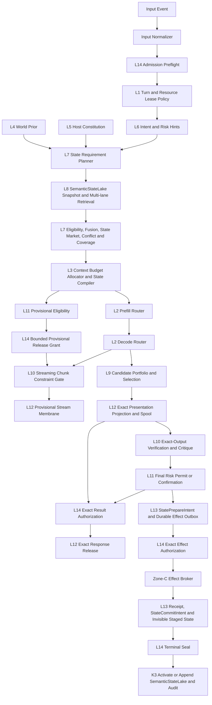

# iPhone Air → Future Apple Silicon 14-Layer System Architecture Design

**Status:** Design consistency locked after adversarial review; implementation conformance remains `REVISE`
**Date:** 2026-07-14
**Scope:** Current iPhone Air/A19 Pro baseline, iOS 18–27 transition, and capability-driven future Apple Silicon
**Decision:** Adopt a capability-driven backend portfolio under invariant semantic, quality, state, and sovereign contracts

## 1. Executive Decision

The architecture is fixed on four independent axes plus seven orthogonal views:

> **14 Semantic LayerCores own semantic authority; 4 Physical Kernels own shared mechanisms; 4 bounded ControlRings own feedback cadence; 7 top-level planes describe orthogonal system views. Silicon Capability Fabric connects capabilities and evidence across planes without becoming an eighth plane.**

The four counts must never be added together:

- `14` is exactly the semantic layer count, `L1` through `L14`.
- `4` Physical Kernels are software mechanism, deployment, resource, and fault-ownership domains; they are not Apple CPU/GPU cores.
- `4` ControlRings are bounded feedback protocols; they are not semantic layers or mutable-state owners.
- `7` planes are orthogonal views; they are not serial pipeline stages.

The selected runtime direction is:

- MLX/Metal remains the current production 4B trunk.
- Core ML is used only for separately certified microheads.
- Core AI is a research/certification lane until exact model, quality, StateABI, memory, thermal, and recovery gates pass.
- Future devices are admitted by observed capability and exact evidence profile, never by speculative `if A20/A21` chip-name branches.
- A turn has one authoritative heavy backend owner per phase. Healthy Apple Silicon utilization means best verified goodput, energy, memory, latency, and recovery behavior—not simultaneously saturating CPU, GPU, Neural Accelerators, and Neural Engine.

The final verdict is deliberately split:

| Question | Verdict |
|---|---|
| Is the revised architecture internally consistent under the abstract fault model? | **PASS** |
| Does current production code conform to this complete architecture? | **REVISE** |
| Can current iPhone Air promise general or sustained `40 tok/s`? | **NO; thermally-cold resident accepted-decode 40 is an UNVERIFIED workload-qualified stretch target** |
| Can current iPhone Air promise sustained `30 tok/s`? | **NO under current evidence** |

`PASS` in this document never means that the future architecture is implemented or production-certified.

## 2. Goal

Design a complete on-device cognitive runtime that:

1. preserves the exact 14-layer semantic doctrine;
2. gives every semantic decision, mutable mechanism, feedback loop, and hardware adapter one clear boundary;
3. allows deep cooperation through typed immutable artifacts and attenuated capabilities rather than hidden callbacks;
4. extracts the best healthy performance from current and future Apple Silicon;
5. preserves full model quality under thermal, memory, cache, backend, helper, and effect failures;
6. makes retrieval, generation, verification, external effects, and state evolution crash-recoverable and auditable;
7. can evolve across iOS and silicon generations without changing semantic authority or silently weakening quality.

## 3. Non-Goals

This design does not:

- claim the target architecture already exists in the repository;
- define an implementation task sequence or authorize production code changes;
- promise 40 tok/s on every prompt, context length, sampling policy, thermal state, or OS build;
- treat requested Core ML/Core AI compute units as proof of actual ANE placement;
- promise general exactly-once semantics for arbitrary external effects;
- invent public APIs for P/E-core pinning, ANE utilization, thermal-frequency control, or hard silicon reservations;
- make a new smaller, lower-bit, fixed-expert, or separately trained model a thermal fallback for the current full-quality model lineage;
- turn Silicon Capability Fabric, Effect Broker, Input Normalizer, or an operator recovery root into another semantic layer or Physical Kernel.

## 4. Evidence and Repository Truth

### 4.1 Evidence grades

Every runtime profile, optimization, and public performance claim carries one grade:

| Grade | Meaning |
|---|---|
| `E0` | Design or schema only |
| `E1` | Pure-function or canonicalization unit evidence |
| `E2` | Simulator or local functional evidence |
| `E3` | Reproducible evidence from one physical device and one OS/runtime build |
| `E4` | Multi-device, multi-cohort evidence including cold/warm cache, thermal, memory, revocation, helper crash/upgrade, and effect fault injection |
| `E5` | Controlled production canary with rollback, revocation, and incident drill |

A production `ModelExecutionProfile` requires at least E4. A cache hit, architecture label, API availability check, or microbenchmark cannot promote a backend.

### 4.2 Current iPhone Air public facts

Apple currently specifies iPhone Air with:

- A19 Pro;
- 6-core CPU: 2 performance and 4 efficiency cores;
- 5-core GPU with Neural Accelerators;
- 16-core Neural Engine;
- Apple C1X cellular modem and N1 wireless networking chip.

These public facts describe available hardware, not third-party scheduling authority. The app can request work through public frameworks and observe supported signals, but it cannot reserve silicon, pin arbitrary work to P/E cores, prove ANE utilization from a compute-unit preference, or command thermal frequency.

### 4.3 Current repository truth to preserve

The repository already contains valuable foundations:

- stable `L1...L14` identities and naming assets;
- MLX/Metal as the real 4B decode hot path;
- `BASDecodePlanner` and never-worse/acceptance concepts;
- thermal sampling, memory-cap modeling, pressure-ladder primitives, prefix/session state, and device evidence ledgers;
- sovereign token and signature foundations;
- SQLite event-log transactions;
- Core AI shadow/research gates;
- NAX-capable vendored MLX paths.

These are foundations, not proof of conformance. Current code also contains structural gaps that the target design must not disguise:

- `BASExecutionPlan` elects more than it actuates; load, prefill, and cache decisions are not one authoritative production spine.
- native-v2 stage closures can have outputs discarded before the v1 coordinator runs, creating future double-compute or double-effect risk when closures become real.
- multiple routing authorities overlap: execution plan, hardware scheduler, device routing, and MLX decode planner.
- live memory headroom is observed but not consistently used for admission.
- current ANE capability records contain estimates that are not direct hardware observations.
- requested tensor backing or compute units do not prove physical placement.
- the current `.statelake` reader is a neural NDArray/tensor-state format, not the semantic multi-lane memory system specified here.
- sovereign issuance, nonce, spent, and consumed-bundle state is currently in memory in important paths.
- the current Ed25519 raw seed is stored as a Keychain generic password and reconstructed in process; that is Keychain at-rest protection, not a non-exportable Secure Enclave Ed25519 key.
- no production implementation yet exists for the complete Artifact Mesh, Capability Mesh, LayerCell membrane, durable Effect Broker, StateABI fallback graph, or unified MemoryLedger described here.

The code audit captured these concrete ship blockers at the review snapshot:

| Area | Repository evidence | Target disposition |
|---|---|---|
| execution actuation | `BASExecutionPlan` explicitly limits actuation while load/prefill/cache remain elected; production sources do not show one universal elector→actuator spine | one typed plan owns load through receipt |
| admission | `BASExecutionPlanElector` observes memory headroom but admission is still dominated by static profile estimates; a non-fit plain plan can still exist | dynamic resident+transient reservation must reject before load |
| session path | `MLXOrganAdapter` session decode has paths that bypass or diverge from the shared planner/fallback behavior | every entry point consumes the same exact plan/executor |
| MTP recovery | stateless execution has a plain recovery path, while fused/session paths do not uniformly prove the same catch, rollback, and hysteresis | one fallback state machine and rollback receipt |
| dual runtime | `BASNativeStageExecutor` can execute closure-shaped stages whose outputs are not the authoritative turn result, followed by unconditional coordinator execution | one typed result owner; shadow work is explicitly non-authoritative |
| hardware scheduler | assignments describe backing/kernel/cost, while latency multipliers and ANE capacity fields include estimates | split raw observation, certified profile, policy preference, and actual receipt |
| model default | capability manifest and zero-argument MLX adapter name different production-default model families | one signed bundle/profile selection SSOT |
| pressure behavior | pressure-ladder actuation is feature-gated in important paths; pressure can quantize session KV despite known continuation divergence | production-default ledger policy; no unqualified identity-changing fallback |
| state reader | `BASStateLakeReader` performs neural tensor-state reads with multiple potential transient representations | rename/reframe as NeuralStateCache I/O and stream/map under ledger |
| semantic memory | existing cognition/memory paths can collapse candidates into a ranking pool and lose scope/sensitivity in projections | snapshot lanes, hard eligibility, typed conflict, preserved projection labels |
| mesh | `BAS14LayerMeshMap` is declared zero-behavior-change with no production semantic/capability spine; reference actors/hooks are not the authoritative path | migrate behind LayerCell contracts without claiming current conformance |
| kill/revoke | layer kill and production kill-switch identities are split and lack one pervasive generation check | one monotonic epoch checked through queue, dispatch, receipt, and seal |
| capability default | at least one adapter treats an empty allowed-domain set as permissive | empty/missing authority is deny |
| sovereign state | `BASSovereignTokenAuthority` and relevant consumed-bundle paths retain in-memory issuance/spend state | helper-private transactional durable ledger |
| receipt semantics | current control-plane receipts lack exact effect/profile/adapter/idempotency/seal state; some coordinator paths synthesize generic execution | expanded signed operation receipt and durable saga |
| state folding | SQLite event append has a strong transaction foundation, but convenience folding paths can start from zero, ignore duplicate/new status, or continue after append error | hydrate from log, deterministic event identity, CAS and projector cursor |

All entries in this table are implementation `REVISE`; none invalidates the selected target architecture.

### 4.4 Current performance truth

Repository device ledgers establish a more conservative reality than a headline peak:

- best observed short, nominal/thermally-cool Qwen3.5-4B decode result is approximately `34.6 tok/s`; this is not process-cold TTFT or end-to-end turn goodput;
- a 20-minute run reports approximately `15.9 tok/s` in the final quarter;
- measured memory bandwidth around `59 GB/s` implies a plain-decode roof around `25 tok/s` for the current 4-bit target path;
- existing adaptive multi-token evidence is workload-dependent, with acceptance and thermal behavior determining accepted-token goodput.

Therefore:

- `40 tok/s` is a qualified future certification target, not a current general capability;
- short nominal `30+` observations must not be presented as a product SLA;
- sustained `30 tok/s` is not supported by the current long-run evidence;
- the performance target is **accepted, verified, correctly terminated tokens per second**, not speculative proposals per second.

## 5. Approaches Considered

### Approach A — Capability-driven portfolio under invariant semantic contracts

Keep MLX/Metal as the incumbent, Core ML for certified microheads, Core AI as a measured promotion lane, and future silicon behind capability/evidence profiles.

Advantages:

- preserves current working paths while enabling deep Apple-specific optimization;
- avoids depending on a beta framework or an unreleased chip name;
- makes promotion, demotion, StateABI, thermal, and quality rules explicit;
- keeps the 14-layer semantic architecture stable.

Costs:

- requires a real profile registry, one execution actuator, receipts, and recovery protocols;
- does not offer a shortcut around physical bandwidth or thermal limits.

### Approach B — Air-first vertical specialization

Optimize directly around A19 Pro/Air implementation details, then abstract later.

Advantages:

- concentrated near-term engineering;
- may reach a local benchmark faster.

Costs:

- higher migration debt;
- invites chip-name policy and inferred-placement claims;
- makes future OS/runtime invalidation harder to contain.

### Approach C — Core AI-first migration

Make Core AI the primary trunk and adapt the model/runtime around it immediately.

Advantages:

- potential future stateful/AOT/layout benefits;
- closer alignment with Apple’s new generative-inference direction.

Costs:

- current API and conversion path are not yet certified for exact Qwen3.5 behavior, custom operations, StateABI, thermal stability, or full recovery;
- an OS-managed placement request is not a placement receipt;
- premature migration risks lower quality and silent state incompatibility.

### Decision

Choose **Approach A**. Approaches B and C remain bounded experiments whose artifacts can be promoted only through the same evidence gates.

## 6. Locked Counting and Naming Model

### 6.1 Cardinality invariant

The architecture contains exactly:

- `14` Semantic LayerCores;
- `4` Physical Kernels;
- `4` bounded ControlRings;
- `7` orthogonal top-level planes.

No object may be introduced as another member of these sets without a new architecture decision. In particular:

- there is no additional semantic layer after L14;
- there is no additional Physical Kernel for effects;
- Silicon Capability Fabric is not a top-level plane;
- outer feedback loops are not included in the 14 semantic count.

### 6.2 Stable identity and aliases

`L1...L14`, `K1...K4`, and the four ring IDs are canonical. Human names are aliases resolved through one `NamingMatrix`.

The target naming policy must reconcile current repository drift, including multiple layer identity types and the L9 `Kunlun`/`Dream` alias. Serialization, signatures, capability audience, kill epochs, telemetry, and replay use stable IDs, never a display alias.

### 6.3 Core distinction

The word “core” has two different qualified uses:

- **Semantic LayerCore:** owns meaning and a bounded semantic decision.
- **Physical Kernel:** owns shared mutable mechanism, resource, deployment, and fault containment.

“Physical” here means mechanism/fault-domain placement in the software architecture. It does not mean one-to-one binding to a CPU, GPU, Neural Engine, or hardware core.

## 7. Seven Orthogonal Top-Level Planes

| Plane | Owns | Does not own |
|---|---|---|
| **Semantic Authority** | L1–L14 decision ownership and semantic invariants | kernel implementation, hardware placement |
| **Kernel Ownership** | K1–K4 mutable mechanisms, resource brokers, fault domains | semantic truth or user-facing verdicts |
| **Execution DAG** | per-turn artifact dependencies, joins, remands, cancellation, deadlines | layer identity or durable state truth |
| **ControlRing** | bounded receipt-driven adaptation protocols | final decisions, state, effects, data ownership |
| **Data Plane** | immutable artifact bodies, snapshots, CAS, indexes, logs, outboxes, ledgers | semantic interpretation |
| **Adapter / IO** | model/runtime/storage/OS/tool/network bridges and Zone-C Effect Broker | semantic authorization |
| **Observe / Replay** | evidence, receipts, traces, deterministic replay, certification | live control authority or hidden mutation |

Silicon Capability Fabric spans only:

- Kernel Ownership;
- Adapter / IO;
- Observe / Replay.

It exposes facts, certified profiles, revocable offers, and receipts. It never generates a semantic answer, risk permit, state truth, or authorization decision.

## 8. Four Physical Kernels

| Kernel | Mechanism ownership | Required boundaries |
|---|---|---|
| **K1 Lease & Life** | thermal/power/memory observation, process-wide MemoryLedger, admission reservation, global heavy-owner gate, cancellation/checkpoint signals | consumes policy from L1; cannot decide answer/risk/state truth |
| **K2 Neural Organ** | model bytes, tokenizer sessions, NeuralStateCache, prefix cache mechanism, MLX/Core AI sessions, prefill/decode/token loop | consumes neural plan from L2; cannot choose user intent or weaken QualityIdentity/NeuralExecutionContractDigest |
| **K3 State & Evolution** | SemanticStateLake stores/indexes, artifact storage, event log, durable outbox, staged state, projector cursors, evolution graph | consumes L7/L8/L13 decisions; cannot make eligibility, conflict, or promotion truth by itself |
| **K4 Sovereign Microkernel** | signer, key manifest, durable issuance/reserve/spend ledger, nonce/replay defense, audit log, helper-private persistence | consumes L14 decision; cannot schedule silicon, execute tools, decode, or author an answer |

Layers do not have a unique “home kernel.” A layer may use multiple mechanism ports through membranes, while its semantic authority remains singular. Any current `primaryKernel` mapping is a migration aid, not the target authority model.

The Zone-C Effect Broker is Adapter/IO infrastructure, not another Physical Kernel.

## 9. Four Bounded ControlRings

| Ring | Observes | May request | Hard bound | Forbidden |
|---|---|---|---|---|
| **ΩR Resource** | lease, thermal, power, memory, command-buffer, latency receipts | defer, pause, cache eviction, safe checkpoint, compatible backend remand | transition deadline, retry cap, phase budget | semantic answer/risk/policy changes |
| **ΩG Grounding** | coverage, conflict, freshness, lane watermarks | bounded extra query, partial join, remand to requirements | max epochs, lanes, bytes, tokens, deadline | silent truth selection or completed-turn mutation |
| **ΩD Deliberation** | proposal, critique, verification receipts | bounded candidate revision or new branch | max branches, rounds, tokens, queue bytes | unbounded self-dialogue or commit authority |
| **ΩE Effect / Evolution** | prepare, authorization, dispatch, receipt, reconcile, seal | query provider, compensate, remand, activate next state/version | saga deadline, attempt/reconcile cap, operator escalation | automatic replay of an indeterminate irreversible effect |

A ControlRing may observe receipts, request a bounded remand, and propose adaptation. It owns no semantic truth, mutable state, verdict, or external effect.

Every ring terminates with one typed state:

- `converged`;
- `degraded_with_coverage`;
- `deferred`;
- `rejected`;
- `needs_confirmation`;
- `indeterminate_needs_reconciliation`.

Cycle detection or budget exhaustion cannot silently return a committable “last answer.”

## 10. LayerCell Boundary

Every semantic layer is implemented as:

```text
typed ingress membrane
    ↓ validate schema, parent, capability, epoch, snapshot
pure semantic core
    ↓ emit decision/proposal artifact; no direct I/O
typed egress membrane
    ↓ attenuate capability; invoke private mechanism port if authorized
```

The pure core:

- is deterministic relative to explicit inputs and declared model/non-determinism receipts;
- holds no cross-turn shared mutable state;
- does not call another layer’s private mechanism;
- does not perform filesystem, network, model-runtime, signer, or external-tool I/O;
- cannot bypass capabilities or kill epochs.

The membrane:

- validates canonical bytes, schema, lineage, audience, epoch, snapshot, deadline, and budget;
- translates semantic decisions into narrowly scoped mechanism requests;
- records request and usage receipts;
- attenuates—not broadens—capabilities across every edge.

L14 illustrates the boundary precisely:

- the L14 core emits an immutable `AuthorizationDecisionArtifact`, revocation decision, or seal decision;
- the L14 egress membrane asks K4 to mint/sign/reserve/spend/seal;
- K4 does not invent the decision;
- a helper process protects keys and ledger state but does not prove a compromised host’s semantic reasoning was correct.

## 11. Fourteen Semantic LayerCores

| Layer | Semantic authority | Primary outputs | Explicitly forbidden |
|---|---|---|---|
| **L1 Wick Life** | turn-life, resource-policy, phase budget, and lease-requirement truth | `TurnLifePolicy`, `ResourceRequirement`, `LeaseAcceptanceDecision` | reading prompt content beyond required labels; implementing thermal/memory mechanism |
| **L2 Brain Tissue (semantic)** | model requirement, neural execution plan, neural receipt interpretation | `NeuralRequirement`, `NeuralPlanDecision`, `NeuralResultArtifact` | owning model bytes/KV/token loop; silently changing model identity |
| **L3 Folded Lung** | context admission, budget allocation, compile/binding/fingerprint decisions | `ContextProjection`, `ContextBudget`, `CompiledContextDescriptor` | retrieval truth; direct model/file I/O |
| **L4 World Prior** | versioned world claims and domain assumptions | `WorldClaimSet`, `PriorRevision` | treating stale claims as timeless; direct final ranking |
| **L5 Host Constitution** | host preference, policy, disclosure, persona, and user-bound constraint truth | `ConstitutionProjection`, `PolicyEpoch` | effect execution; hardware scheduling |
| **L6 Situation** | normalized intent, current context, task frame, and risk hints | `SituationArtifact`, `IntentSet`, `RiskHintSet` | final risk permit; authoritative memory selection |
| **L7 Mirror Blade / Grounding** | StateRequirementPlan, hard eligibility, lane fusion, coverage, conflict manifest | `StateRequirementPlan`, `EligibleEvidenceSet`, `ConflictManifest`, `CoverageVector` | owning L8 storage; silently resolving unresolved material conflict |
| **L8 Hippocampal Memory** | snapshot/projection semantics and retrieval candidate production | `StateSnapshotRef`, `LaneResult`, `MemoryProjection` | final eligibility, market winner, answer truth; neural KV ownership |
| **L9 Kunlun / Dream** | candidate portfolio, alternatives, counterfactuals, and selection | `CandidatePortfolio`, `SelectedCandidate` | final verification, effect execution |
| **L10 Tribunal** | streaming-chunk constraint verification, exact-output verification, critique, claim support, and convergence status | `ChunkVerificationReceipt`, `ExactOutputVerification`, `ClaimSupportMap`, `ConvergenceDecision` | risk permit, state commit, unbounded self-loop |
| **L11 Risk** | provisional eligibility, final risk classification, confirmation requirement, and RiskPermit truth | `ProvisionalEligibility`, `RiskPermit`, `ConfirmationRequirement`, `DisclosureRequirement` | executing effects or weakening L14 policy |
| **L12 Soft Hand** | response projection, spool policy, provisional/final release semantics | `ResponseSpool`, `ReleaseProposal`, `PresentationProjection` | allowing provisional text to drive tools/state; bypassing the L10 streaming or exact-output verifier |
| **L13 Evolution** | prepare/commit/evolution proposal, reconciliation interpretation, next-version candidate truth | `StatePrepareIntent`, `StateCommitIntent`, `ReconciliationDecision`, `EvolutionProposal` | same-turn self-modification; activating unsealed staged state |
| **L14 Sovereign** | request admission preflight, exact authorization, revocation, and seal decisions | `AdmissionDecision`, `AuthorizationDecisionArtifact`, `RevocationDecision`, `SealDecision` | model execution, silicon scheduling, answer generation, direct tool/effect execution |

Additional invariants:

- L8 returns candidates bound to one immutable turn snapshot.
- L7 owns eligibility, fusion, coverage, and conflict semantics.
- L9 owns portfolio selection.
- L10 owns verification and critique.
- L11 owns the risk permit and confirmation requirement.
- L13 may prepare proposals and interpret receipts but cannot make staged state visible.
- L14 is invoked at admission and commit/release points; multiple L14 artifact nodes in a turn do not create a cyclic semantic graph.
- late optional retrieval results cannot mutate a completed turn and may enter only the next declared epoch/turn.

## 12. Dual Mesh

### 12.1 Artifact Mesh

Artifact Mesh is the immutable, typed, **keyed-content-addressed** semantic DAG inside one protected commitment scope. It carries meaning and evidence, never ambient authority.

Identity, storage, and attestation are three non-circular records.

Minimum `ArtifactIdentityCore` fields—the only bytes used to derive content identity—are:

```text
canonicalizationVersion
schemaID + schemaVersion
kind
parents[]
producerLayerID
turnID + branchID + logicalEpoch
createdLogicalTime
canonicalPayloadBytes + payloadLength
confidentialityLabel
provenanceRefs[]
snapshotRoot / readVersionVector when applicable
```

The canonical encoder rejects duplicate keys, non-canonical numbers/strings, unknown required fields, or unordered fields where order is semantic. It serializes the IdentityCore exactly once.

```text
artifactID = {
  integrityAlgorithm,
  commitmentKeyEpoch,
  KeyedCommit(commitmentScopeKey, CanonicalEncode(ArtifactIdentityCore))
}
```

`artifactID`, `payloadRef`, storage encoding/compression/encryption metadata, signature/MAC bytes, and producer/usage receipts are explicitly excluded from `ArtifactIdentityCore`. This prevents self-reference, locator-dependent identity, and receipt/signature dependency cycles.

`ArtifactStorageEnvelope` contains only storage concerns:

```text
artifactID
payloadRef
storedLength
storageEncoding / compression
encryptionKeyID + encryption metadata
```

Changing or relocating `payloadRef` cannot change `artifactID`; storage reads recompute the keyed commitment from canonical decoded payload and IdentityCore before use.

`ArtifactAttestation` is a separate child artifact:

```text
targetArtifactID
attestationPurpose
producerReceiptRef / usageReceiptRefs[]
signatureEnvelope or MAC metadata
logicalTime + policy/key epoch
```

Its signature signs `targetArtifactID + attestation context`. The attestation may have its own artifact ID after its signature bytes exist, but the target artifact never points backward to that child.

The same canonical `ArtifactIdentityCore` in one protected user/device/tenant scope and key epoch has the same ID; the same payload with different provenance, parent, turn, or logical identity is intentionally a different artifact. Content across different scopes or key epochs is not publicly linkable. Public telemetry must not expose raw hashes of low-entropy private artifacts. The design separates:

- internal integrity identity: the keyed canonical `artifactID`;
- storage location: an independent protected random `payloadRef`, never treated as content identity;
- external/audit correlation: blinded or keyed commitment with scoped disclosure;
- public performance correlation: non-content operation IDs.

Immutable DAG nodes are never updated in place. A saga, remand, revocation, or state transition appends a new transition artifact and updates a mutable head/index transactionally. Logical remand may revisit a layer ID, but every invocation creates a new artifact node, so the physical graph remains acyclic.

### 12.2 Capability Mesh

Capability Mesh is default-deny authority. It never travels as an unscoped boolean.

Minimum `CapabilityGrant` fields:

```text
grantID
issuer + subject + audience
operation + resource
requestDigest / inputDigest
neuralExecutionContractDigest when neural work is authorized
outputSchemaDigest + outputConstraintsDigest
projectionPolicyDigest
purpose
turnID + branchID + logicalEpoch
bootSessionID or durable warrant epoch
notBefore + monotonicDeadline / durable expiry
maxUses + maxFanout + maxBytes + maxCost
parentGrantID
revocationGeneration
nonce
signatureEnvelope
```

Rules:

- absent audience, operation, resource, purpose, projection, epoch, or digest binding means deny;
- child grants can only reduce audience, operation, projection, duration, uses, bytes, or cost;
- a queued task revalidates epoch, revocation generation, deadline, and snapshot at start;
- short-lived grants bind `bootSessionID` and monotonic deadlines; a reboot invalidates them;
- long-lived warrants bind a durable, server/operator-authoritative epoch and wall-clock policy;
- capability bytes are never used as an implicit data payload.

“Exact digest” is phase-aware:

- before a result exists, a query/generation capability binds `requestDigest + outputSchemaDigest + outputConstraintsDigest`;
- after a result exists, a derived release/commit capability binds `resultArtifactDigest` exactly;
- an effect authorization binds a canonical `EffectRequestDigest` and stable operation identity;
- the terminal receipt binds both request and result/observed-state digests.

This avoids the impossible requirement to predict a result digest before computation.

### 12.3 Kill and recovery epochs

Every layer and kernel boundary consumes a signed/authorized epoch:

```text
layerOrKernelID
monotonicGeneration
activationSequence
reason
authority
signature
```

Kill/revoke is checked at ingress, queue start, mechanism dispatch, effect authorization, and seal—not only once when an actor first receives input.

If L14/K4 is unavailable:

- new effects and durable state activation fail closed;
- local refusal and safe read-only responses may continue only under pre-authorized policy;
- recovery authority comes from a physical/operator root or signed recovery manifest, not from another semantic layer;
- ledger loss or integrity failure enters quarantine and cannot restart under the same key epoch with an empty spent history.

## 13. Collaboration Grammar

Cross-layer semantics use exactly five high-level verbs:

1. **Query** — request a bounded projection from an authority.
2. **Fan-out / Join** — create independent branches and reduce them under an explicit join policy.
3. **Proposal / Critique** — propose a candidate and attach typed criticism or verification.
4. **Remand** — return a typed deficiency to a named layer under bounded budget.
5. **Commit Saga** — prepare, authorize, execute/release, reconcile, seal, and activate.

Cancellation, deadline, retry, backpressure, reservation, and reconciliation are transport/control protocols, not additional semantic verbs.

Minimum typed control artifacts:

- `JoinArtifact`: expected/received/missing branches, policy, quorum, deadline, conflict sets, input digests;
- `RemandArtifact`: ID, parent digest, target layer, missing evidence/schema, round/hop, visited set, remaining budget, deadline, resolution state;
- `CancellationSignal`: turn/branch/operation target, reason, dispatch boundary, monotonic sequence;
- `BackpressureReceipt`: queue bytes, concurrency, resource debt, accepted/deferred/rejected result.

Remand invariants:

- maximum rounds, hops, branch count, tokens, bytes, and deadline are explicit;
- the resolution set must grow monotonically or the ring terminates;
- missing mandatory L5 or L14 input fails closed;
- optional retrieval lanes may degrade only with an explicit coverage vector;
- a branch stopped by cycle or budget cannot acquire a committable capability unless a downstream authority explicitly accepts the degraded state.

## 14. Canonical End-to-End Execution DAG

The canonical turn is a DAG, not fourteen serial actors:



The provisional, exact-response, and external-effect paths are distinct:

- L12 cannot release a provisional byte until L11 provisional eligibility and an L14 bounded grant exist **and** L10 has approved that exact hash-chained chunk under the streaming constraint set. Low-risk input classification alone never authorizes raw decode bytes.
- Completion flows through L9 selection → L12 exact projection/spool → L10 verification of those exact bytes → L11 final risk/confirmation → L14 exact-digest authorization → L12 release.
- If L10 or L11 requires a presentation change, a bounded typed remand creates a new L12 spool and repeats exact-output verification/risk; the previous digest can never be released under the new decision.
- A pure response does not pass through the external-effect outbox or Effect Broker.
- An external effect follows the independent L13/K3 → L14/K4 → Zone-C saga. A turn that both replies and acts may have both branches, but their capabilities and terminal states remain separate.
- A response-linked internal state update may use the direct known-result `StateCommitIntent` path after exact bytes exist; it is not disguised as an external effect.

### 14.1 Input Normalizer

Input Normalizer is Adapter/IO infrastructure outside Semantic Authority. It:

- establishes byte identity, source identity, event ID, encoding, length bounds, and canonical transport form;
- performs structural validation, not semantic intent or risk decisions;
- emits the ingress artifact consumed by L14 preflight and L6;
- cannot authorize the request.

### 14.2 Admission before expensive work

L14 preflight rejects structurally forbidden operations, invalid epochs, unavailable sovereign state, and impossible policy scopes before model load or retrieval fan-out. It does not pre-authorize the eventual effect. A later low-risk provisional grant may bind request plus output constraints before content exists, but it cannot authorize tools or state; exact response/effect authorization occurs only after the corresponding result or effect-request closure is known.

### 14.3 Parallelism

Parallelism exists only where artifacts are independent and budgets permit:

- retrieval lanes may fan out under one snapshot;
- candidate branches may fan out under ΩD;
- CPU parsing/index work may overlap low-intensity waits;
- a heavy neural backend retains one authoritative result owner;
- verifier work using the same constrained accelerator runs serially unless a certified profile proves parallel net benefit.

No execution path is allowed to run a routed stage, discard its result, and then recompute the same authoritative result through a legacy coordinator.

## 15. SemanticStateLake

### 15.1 Naming boundary

The design uses two distinct terms:

- **SemanticStateLake** — L8/K3 episodic, factual, entity, relation, metadata, and semantic retrieval state.
- **NeuralStateCache** — L2/K2 KV/recurrent/token-position state used by neural execution.

The current `BASStateLakeReader` reads a neural `.statelake` tensor bundle. It must be treated or migrated as a neural-state reader. It is not evidence that SemanticStateLake exists.

### 15.2 Turn snapshot

At turn admission, K3 creates one immutable `StateReadSnapshot`:

```text
snapshotRoot
versionVector
eventLogHighWatermark
laneWatermarks
policyEpoch
schemaEpoch
openedLogicalTime
```

Every lane query and result binds this snapshot. Required lanes that cannot satisfy it fail or remand according to policy. Optional late results are recorded for a later epoch and cannot change the completed turn.

### 15.3 Retrieval lanes

The standard lanes are:

- SQL / metadata;
- exact / FTS / BM25;
- dense semantic;
- temporal / episode;
- entity / relation.

Each `LaneQuery` carries:

- lane ID and query digest;
- snapshot root and `asOf` requirement;
- requested projection, sensitivity ceiling, scope, limit, byte/token budget, deadline;
- source/authority requirements.

Each `LaneResult` carries:

- lane ID, query digest, snapshot root, watermark, and completeness;
- claim key and candidate ID;
- `validFrom`, `validUntil`, `observedAt`, source revision, and provenance;
- sensitivity, scope, authority, freshness, and projection label;
- payload reference and integrity commitment;
- missing/timeout/error receipt.

Lane stores produce candidates; they do not decide final rank or truth.

### 15.4 Hard Eligibility Gate

L7 first applies non-compensable constraints:

- capability audience/purpose/projection;
- user/tenant/turn scope;
- sensitivity and disclosure policy;
- snapshot and schema compatibility;
- authority minimum;
- hard validity/expiry;
- provenance requirement;
- kill/revocation epoch;
- token/byte budget admissibility.

An ineligible candidate cannot re-enter because its relevance score is high.

### 15.5 State Market

Eligible candidates enter constrained multi-objective selection. The preserved vector is:

```text
relevance
authority
freshness
utility
diversity
tokenCost
conflictRisk
```

The implementation may use staged optimization, Pareto filtering, or a constrained objective, but it must not erase individual dimensions into an uninspectable magic scalar.

Minimum selection requirements:

- reserve budget for constitution, unresolved conflict, user request, and citations before optional enrichment;
- prevent one source/lane/entity from consuming all context;
- preserve diversity until conflict resolution is complete;
- emit selected, rejected, and truncated candidate reasons;
- emit a `CoverageVector`, not merely a top-k list.

### 15.6 Conflict resolution and grounding

L7 emits typed conflict sets keyed by claim identity. Conflict resolution considers:

- source authority and revision lineage;
- validity interval and observation time;
- direct versus inferred evidence;
- user-specific versus general scope;
- retraction/supersession edges;
- explicit uncertainty.

Material unresolved conflicts survive into L10/L11 or cause remand. They are never silently removed by a score tie-break.

### 15.7 State prepare and commit truth

Before an external result exists, a `StatePrepareIntent` binds only what can be known:

```text
expectedParentStateDigest + expectedVersion
sourceEventDigest
baseSnapshotRoot
effectRequestDigest when applicable
allowedOutcomeSchemaDigest
allowedMutationConstraintsDigest
policyEpoch
```

It does not contain a guessed result or new-state digest.

After computation or a terminal effect receipt exists, a `StateCommitIntent` binds:

```text
expectedParentStateDigest + expectedVersion
sourceEventDigest
terminalReceiptDigest when applicable
terminalOutcome
laneMutationDigests[]
baseSnapshotRoot
policyEpoch
newStateDigest
```

Pure internal mutations whose exact output is already known may create `StateCommitIntent` directly. Result-dependent external mutations must pass through prepare → terminal receipt → exact commit. Commit uses compare-and-swap. Same event ID with different canonical payload is a conflict. Duplicate identical events are idempotent. Event append is the source of truth; lane projectors persist `(logOffset, snapshotRoot)` and replay after crash. Append failure cannot be swallowed while state still folds forward.

## 16. Context Budget Allocation and State Compilation

L3 receives only L7-approved projections. It allocates a total context budget across:

- immutable system/sovereign instructions;
- L5 constitution;
- user input and conversation state;
- grounded evidence and conflict disclosures;
- tool schema/protocol;
- generation reserve.

`ContextBudget` records requested, admitted, truncated, compressed, and reserved tokens by class. Compression is provenance-preserving: the summary artifact points to source artifacts and declares loss/coverage.

`CompiledContextDescriptor` binds:

- canonical token history digest;
- tokenizer and template/tool-protocol digest;
- ordered projection digests;
- position convention;
- prefix-cache key;
- context budget receipt;
- QualityIdentity;
- exact per-turn `NeuralExecutionContractDigest`.

Tokenization is performed once per canonical compiled context. Any backend receiving the context must prove compatibility with the same tokenizer/template contract.

## 17. Cache Taxonomy

Caches are distinct and independently budgeted:

| Cache | Owner | Key requirements | Recovery rule |
|---|---|---|---|
| compiled context cache | L3/K3 | projection order, tokenizer/template, policy epoch | rebuild from artifacts |
| prefix cache | L2/K2 | exact model/quant/tokenizer/template, generation contract, prefix tokens, StateABI | discard/re-prefill on mismatch |
| NeuralStateCache | L2/K2 | session, position, exact QualityIdentity, NeuralExecutionContractDigest, StateABI | never reinterpret bytes under another ABI |
| Core AI specialization/AOT cache | Adapter/IO | source/AOT digest, device architecture, OS build, options, function/tensor ABI | cache miss/OS update triggers re-specialization and profile invalidation |
| SemanticStateLake index cache | K3 | snapshot/schema/index epoch | reload/rebuild without changing semantic source of truth |
| verifier/result cache | L10 mechanism port | exact input/model/policy/verifier digests | never cross policy or verifier epoch |

A cache is an optimization, not evidence of placement, correctness, authorization, or durability.

## 18. Silicon Capability Fabric

Silicon Capability Fabric is the cross-plane contract that makes current Air optimizations and future-device evolution honest.

### 18.1 `CapabilitySnapshot`

Contains raw or explicitly classified observations:

```text
snapshotID + capturedAt + freshness
device capability fingerprint
OS build + runtime/vendor build
public API availability
thermal state + Low Power state
memory advisory + resolved active hard cap
model/runtime access state
requested/observed/unknown placement fields
probe provenance + observation quality
```

Rules:

- unknown enum/state is not mapped to nominal;
- presence of an ANE does not imply operation support, batch size, memory, latency, or placement;
- private/undocumented diagnostics are research-only and cannot become a public SDK contract;
- architecture/chip names may namespace assets and evidence, but cannot alone select a production strategy.

### 18.2 `CertifiedBackendProfile`

Certification key:

```text
profileID
QualityIdentity
supported generationSemanticsDigest / contract family
artifact/bundle digest
adapter binary/build digest
backend graph/kernel digest
device capability fingerprint + SKU cohort
OS build cohort + runtime/vendor commit
phase + batch + context + shape bucket
StateABIDigest
specialization/AOT options and function identity
quality, latency, memory, thermal, energy evidence
evidence grade + sample count + devices + expiry
fallback graph digest
```

Any key change invalidates the profile. Outliers and cross-cohort aggregation are rejected unless the profile explicitly declares a safe common scope.

### 18.3 `SiliconLeaseOffer`

A lease is an app-level cooperative promise, not an OS silicon reservation. It carries:

```text
leaseID
snapshotID + snapshotEpoch
profileID + fallbackGraphDigest
phase + heavyOwnerID
memory reservation + maximum transient
deadline + expiry
revalidation conditions
cancellation/checkpoint policy
StateABIDigest
NeuralExecutionContractDigest
authorization binding digest
```

Start uses compare-and-start revalidation. Thermal, memory, access, OS, or profile changes may defer/revoke the offer. Running work moves through `revoke_pending` and reaches a safe checkpoint; it does not pretend that the OS resource was physically reserved.

### 18.4 `UsageReceipt`

Records actual outcome:

```text
lease/profile/snapshot identifiers
QualityIdentity + NeuralExecutionContractDigest
actual backend and strategy
requested, observed, inferred, and unknown placement fields
phase times and accepted-token counts
memory footprint and maximum transient
thermal/power transitions
cache/JIT/specialization state
MTP proposed/accepted/fallback data
command-buffer/runtime failures
state migration/rebuild decision
quality/verifier/termination result
```

Requested placement and actual placement remain separate. Unknown remains unknown.

### 18.5 Unknown future devices

A new device starts in `quarantine/conservative`:

1. validate public API compatibility;
2. run known-answer quality and canonicalization probes;
3. resolve memory cap and reserve a safe baseline;
4. execute bounded cold/warm/thermal/failure probes;
5. create exact-scope E3 evidence;
6. require E4 before production promotion.

An unknown device never inherits fixed ANE claims or performance certificates from A19 merely because it reports an accelerator.

If no portable profile passes admission, the feature is unavailable. It does not automatically run a 4B model on CPU.

## 19. Healthy Phase Ownership on Apple Silicon

| Phase | Authoritative owner | Useful cooperation | Prohibited pattern |
|---|---|---|---|
| normalize / intent | CPU at appropriate QoS | storage/network adapters supply bytes | blocking UI thread with model or whole-file state reads |
| retrieval | CPU + SQLite/index/storage under K3 budget | independent lanes fan out; dense microhead only if certified | SemanticStateLake work stealing heavy decode memory without reservation |
| context compile | CPU/K3 mechanism | copy-on-write artifacts, tokenize once | repeated serialization and tokenization per backend |
| model load | one K2 backend container | storage read, signature verification, prewarm | two resident trunks or load before dynamic admission |
| prefill | one heavy neural owner | GPU/NAX/ANE path only as certified by exact profile | parallel “race” whose losing full prefill is discarded |
| decode | one heavy neural owner; MLX may internally multiplex certified slots | prompt lookup/MTP proposal verified by target | concurrent MLX and Core AI trunks both producing authoritative output |
| verification | CPU first; accelerator only by profile | independent cheap checks overlap | verifier contention that reduces accepted-token goodput |
| prepare/commit | K3 storage + K4 helper + Zone-C broker | small crypto/SQLite work | model residency duplicated for commit |

“One heavy owner” means one authoritative accelerator-intensive execution owner per phase. It does not prevent safe internal batching or the current evidence-backed two decode slots inside one MLX owner.

## 20. Backend Portfolio and Horizons

### 20.1 H0 — Current production baseline

**MLX/Metal 4B trunk**

- authoritative full-quality production backend;
- owns model load, prefill, token loop, prefix/session state, plain decode, prompt lookup, and MTP under one K2 actuator;
- NAX/TensorOps use is an internal MLX/Metal optimization that requires actual-use evidence; a miss falls back inside the same MLX/Metal model identity;
- all entry points, including session decode, use the same planner/executor/fallback semantics.

**Core ML microheads**

- independent classifiers, rerankers, detectors, or verifiers;
- certified per model, function, shape, OS cohort, latency, memory, quality, and thermal result;
- `.all` or an accelerator preference means “allowed compute units,” not proof of Neural Engine placement.

**Foundation Models sidecar**

- optional and availability-gated;
- suitable only for replaceable auxiliary tasks with an explicit semantic contract;
- not the sovereign full-quality model, SemanticStateLake authority, or hidden fallback.

### 20.2 H1 — Core AI research and certification lane

Core AI may provide AOT, stateful inference, optimized layouts, preallocation, and improved framework integration. Its `InferenceFunction` concurrency capability permits concurrent tasks when memory policy allows; serialization is therefore a memory/thermal/ownership policy, not an assumed API-safety requirement.

Core AI remains research-only until it proves:

- exact source/model/function/options identity;
- compatible tokenizer/template and output semantics;
- exact StateABI or a certified converter/re-prefill path;
- quality and termination parity;
- memory and maximum transient within the global ledger;
- cold/warm specialization behavior across OS updates and cache eviction;
- thermal, energy, cancellation, helper, and recovery behavior;
- no regression under two devices and the required OS cohorts.

A 32-step architecture probe or one-device beta run is not a generative-backend certificate.

### 20.3 H2 — Future Apple Silicon

Future hardware changes only:

- `CapabilitySnapshot` values;
- available adapter implementations;
- certifiable backend profiles;
- measured performance/energy envelopes.

It does not change:

- 14-layer semantic authority;
- 4 kernel boundaries;
- 4 ring semantics;
- 7 plane count;
- Artifact/Capability Mesh;
- QualityIdentity, NeuralExecutionContractDigest, StateABI, authorization, effect saga, or evidence rules.

## 21. Full-Blood Quality Contract

### 21.1 Quality identity

```text
QualityIdentity = {
  modelLineageID,
  architectureDigest,
  weightsDigest,
  quantizationDigest,
  tokenizerDigest,
  templateAndToolProtocolDigest,
  generationSemanticsDigest,
  verifierDigest,
  sovereignPolicyEpoch
}
```

`generationSemanticsDigest` covers the versioned generation algorithm and defaults:

- greedy/sampling/speculative decision semantics;
- temperature, top-p/top-k/min-p and other warpers;
- logit processors, repetition/presence/frequency penalties, forced/banned tokens;
- RNG algorithm and seed/stream-derivation contract;
- stop/EOS, tool-call, structured-output, termination, and maximum-token semantics.

Every turn derives an exact:

```text
NeuralExecutionContractDigest = H(
  QualityIdentity,
  actual turn sampling parameters,
  RNG algorithm + seed/stream identity,
  active logit processors,
  stop/EOS/termination grammar,
  output/tool protocol and token limit
)
```

The model bundle declares the supported generation-semantics family. The exact per-turn `NeuralExecutionContractDigest` is bound into compiled context, lease, authorization, fallback edges, and usage/result receipts. Two backends are full-blood equivalent for a turn only if both QualityIdentity and this per-turn contract are identical.

The signed model bundle additionally binds runtime and execution material:

```text
bundleDigest = H(
  QualityIdentity,
  config + RoPE + adapters/LoRA,
  function/graph/kernel identity,
  StateABIDigest,
  supported generation-semantics contract,
  backend/runtime build,
  certified fallback graph
)
```

### 21.2 Allowed full-blood adaptation

Thermal or memory response may:

- run more slowly;
- reduce speculative depth or disable a negative-value speculative lane;
- wait, queue, pause, or reject new work;
- evict non-authoritative caches;
- preserve an incremental checkpoint at a safe token boundary;
- discard incompatible neural state and rebuild prefill from canonical token history;
- switch to a backend certified equivalent under the same QualityIdentity, per-turn NeuralExecutionContractDigest, and state rules.

It may not:

- change weights, quantization, tokenizer, template/tool protocol, verifier, or sovereign policy;
- silently switch to a smaller model;
- change KV precision in a way that fails quality identity gates;
- reduce mandatory retrieval, conflict, verification, or risk coverage;
- skip required verification or relax L14;
- cap the answer merely to make a throughput claim look better.

A separately trained 2-bit, fixed-expert, pruned, distilled, ReDrafter, or native-MTP model is a new model lineage. It may become a future promoted product profile after full certification, but it is never an in-turn thermal fallback for the current lineage.

### 21.3 Speculation never owns truth

Prompt lookup, MTP, ReDrafter, or other speculative mechanisms propose tokens. The target trunk verifies accepted tokens and termination. Every mechanism must pass a never-worse gate based on accepted-token goodput, quality, memory, energy, and thermal behavior.

The fallback from speculation is an explicit plan such as `mlxPlain(bundleDigest)`, not a generic decode purpose that might select speculation again.

## 22. Prefill and Decode Routing

### 22.1 Prefill Router

The four modes are:

1. **full prefill** — consume complete canonical tokens;
2. **suffix continuation** — reuse an exact compatible prefix state and prefill only the suffix;
3. **prefix cache restore** — restore state whose prefix key, QualityIdentity, NeuralExecutionContractDigest, and StateABI match exactly;
4. **context rebuild** — discard state and reconstruct canonical context/tokens before full prefill.

Selection records why a cache/state was accepted or rejected. “File exists” or “same model name” is insufficient.

### 22.2 Decode Router

The decode strategies are:

- plain target decode;
- prompt lookup with target verification;
- multi-token prediction/drafting with target verification.

Fallback is not a fourth decode strategy. It is a signed lease/recovery graph whose edges name an exact backend, strategy, bundle, StateABI rule, and recovery action.

All decode entry points share:

- the same dynamic admission;
- the same QualityIdentity and NeuralExecutionContractDigest;
- the same planner/executor;
- the same acceptance/fallback logic;
- the same receipt schema;
- the same state rollback/rebuild proof.

## 23. StateABI and Backend Switching

### 23.1 StateABI digest

`StateABIDigest` covers at least:

```text
state schema and canonicalization version
tensor names and order
dtypes, shapes, strides, layout and endianness
layer/head grouping
position and cache-index convention
RoPE/scaling convention
quantization scales/groups and precision
fill/empty value semantics
maximum sequence and batch semantics
model/config/weights binding
runtime/function state version
```

### 23.2 Switching rule

- Before prefill creates neural state, any admitted certified backend may be selected.
- After state exists, bytes may cross a backend boundary only when `StateABIDigest` matches exactly or a certified source→target converter exists.
- A converter has its own digest, quality proof, resource profile, and fallback receipt.
- Otherwise K2 discards NeuralStateCache and redoes prefill from canonical token history.
- Finite-looking output is not evidence that a mismatched state interpretation is correct.

Every fallback edge and converter identity is inside the signed authorization/model bundle closure. Runtime code cannot invent a wider fallback after authorization.

## 24. Process-Wide Memory Ledger

K1 owns one process-wide `MemoryLedger` covering:

- trunk weights and mapped model assets;
- draft/MTP weights;
- active KV/recurrent/NeuralStateCache;
- prefix/session caches;
- MLX pools and command buffers;
- Core AI/Core ML loaded functions and intermediates;
- SemanticStateLake indexes, lane results, whole-file/transient copies;
- verifier/model auxiliaries;
- response spool and artifact buffers;
- maximum concurrent activation/transient allocation;
- safety reserve for UI, OS, framework, and untracked growth.

`os_proc_available_memory` or equivalent public advice is advisory. Admission combines:

- resolved entitlement-aware active hard cap;
- live footprint/headroom;
- certified resident and peak/transient requirements;
- current reservations;
- safety reserve;
- thermal and Low Power policy.

The phase transaction is:

```text
observe → reserve resident + maximum transient → compare-and-start
→ allocate/execute → record actual peak → release or transfer reservation
```

If it does not fit, the system rejects/defer the phase before model load. Disabling speculation and then loading an unadmitted trunk is forbidden.

No large emergency checkpoint is first created at critical memory. Small incremental recovery state is maintained at already safe boundaries; critical handling releases optional memory and pauses at the next safe point.

## 25. Thermal, Power, Cancellation, and Backpressure

The resource state is explicit:

- `nominal`;
- `fair`;
- `serious`;
- `critical`;
- `unknown`;
- Low Power Mode as an independent signal.

Unknown is conservative/defer, not nominal.

Policy:

| State | New work | Running work | Quality |
|---|---|---|---|
| nominal | admit by profile and ledger | normal certified plan | unchanged |
| fair | reduce optional concurrency/spec depth; preserve headroom | continue with receipt | unchanged |
| serious | stop optional specialization/JIT/index work; prefer certified plain path; queue/defer | checkpoint, slow, or switch only by exact fallback rule | unchanged |
| critical | reject new heavy dispatch | stop accepting new commands, reach safe boundary, release optional residency, pause/recover | unchanged |
| unknown | defer until bounded probe or safe baseline | conservative cancellation/checkpoint | unchanged |
| Low Power | tighten concurrency and pace policy | continue only within certified envelope | unchanged |

Cancellation semantics:

- pure undispatched branches can be cancelled recursively;
- a submitted accelerator command may become `cancel_pending` and must be observed to a safe terminal result;
- effect cancellation before dispatch may be terminal;
- effect cancellation after dispatch becomes `cancel_requested` and requires reconciliation;
- cancellation never converts an unknown external outcome into “not executed.”

Backpressure bounds exist at turn, lane, branch, heavy-owner, state-commit, and effect-broker queues. Every queue declares concurrency, bytes, tokens/cost, deadline, and starvation policy.

## 26. Output Spooling and Streaming

Output has two release classes:

### Low-risk provisional stream

Before the first byte, L11 evaluates provisional eligibility from the admitted request, L5 policy, L7 coverage/conflict state, and L3 compiled-context descriptor. L14 then issues a bounded provisional release grant whose operation and budget cover only L10 streaming verification and L12 provisional UI release. Every L2 chunk must then pass the L10 streaming constraint gate before L12 may release it:

- output is hash-chained and marked provisional;
- `ChunkVerificationReceipt` binds prior-chain digest, chunk digest, active constraint/policy digests, sensitivity/risk result, turn/epoch, and remaining byte/token budget;
- a denied, timed-out, or missing chunk receipt stops provisional release; it never fails open;
- it cannot drive tools, external effects, durable state, or evolution;
- final verification may retract or replace it according to declared UI semantics;
- its grant binds maximum bytes/tokens, audience, turn, policy epoch, and expiry.

The streaming gate is deliberately narrower than final L10 but has real L10 verification authority and its own latency/resource budget. It may use deterministic constraints and separately certified classifiers; “low-risk request” is not a substitute for examining each chunk. The provisional grant does not authorize the final answer. Completed output still passes L9 selection, L12 exact presentation/spooling, L10 exact-byte verification, L11 final risk/confirmation, and L14 exact-result authorization.

### Medium/high-risk exact release

- L12 deterministically projects and spools the complete presentation artifact without releasing it;
- L10 verifies those exact bytes and their claim/projection mapping;
- L11 issues the final risk permit/confirmation requirement over the exact spool digest;
- L14 authorizes the exact result digest;
- only the exact authorized bytes are released.

If L10/L11 remands the presentation, L12 emits a new spool digest and the old authorization path is abandoned. Medium/high-risk output has no provisional release. Pure response release and external-effect execution are separate branches; an ordinary response does not enter the effect outbox. Provisional content never becomes an implicit state/effect instruction.

## 27. Process and Security Zones

### Zone A — Host runtime

Contains L1–L13 semantic execution and host-side L14 decision invocation, MLX/K2 model state, UI, retrieval, compiler, and verifier. It has public verification keys but no K4 private key or writable spent ledger.

### Zone B — Enhanced Security helper / K4

On supported OS versions, a minimal helper owns:

- signature operation;
- issuance/reserve/spend/nonce ledger;
- key manifest and rotation state;
- audit-chain anchoring;
- query-by-requestID recovery protocol.

It contains no model, KV, prompt corpus, UI, or effect adapter. Its private storage is not writable by Zone A. Enhanced Security narrows process/sandbox exposure; it does not automatically provide transactionality, remote attestation, semantic correctness, or effect idempotency.

On older supported OS versions, an in-process K4 compatibility mode must be explicitly attested and policy-limited. It cannot be described as equivalent process isolation.

### Zone C — Effect Broker

Contains adapter-scoped external capabilities and a durable outbox. It receives an exact operation authorization, not a general L14 private key or model context. Each adapter has the minimum network/filesystem/account entitlement required.

## 28. Signer and Key Lifecycle

### 28.1 Current truth

The current Ed25519 implementation stores a raw seed in Keychain and reconstructs a `Curve25519.Signing.PrivateKey` in process. The accurate claim is:

- Keychain at-rest protection;
- `ThisDeviceOnly` binding where configured;
- process/helper isolation according to deployment;
- not a non-exportable Secure Enclave Ed25519 private key.

### 28.2 Algorithm-agile target

`SovereignSigner` supports explicit suites:

- v1 compatibility: Ed25519 in Keychain/helper, with honest custody label;
- optional hardware-root/epoch anchor: `SecureEnclave.P256.Signing.PrivateKey` where supported and policy-selected;
- future suites only after public API availability and separate certification.

Minimum `SignatureEnvelope`:

```text
signatureSuite
hashSuite
signatureEncoding
canonicalizationVersion
keyID + keyEpoch
publicKeyDigest
signedArtifactDigest
signatureBytes
custodyClass
```

Replay identity is `authID + nonce + exact request digest`, never ECDSA signature bytes.

Rotation uses a signed trusted-key manifest, overlapping verification window, legacy verify-only status, explicit revocation, and audit continuity. Unknown suites, downgrade attempts, key/ledger discontinuity, or missing historical verification keys fail closed.

## 29. Durable Authorization Ledger

K4 commits issuance before returning a signature. The helper-private transaction covers:

```text
requestID uniqueness
authID + nonce uniqueness
canonical request/model/profile/lease/effect/fallback/StateABI digest
QualityIdentity + NeuralExecutionContractDigest when neural output is in scope
issued/reserved/spent/revoked status
operationID binding
key epoch + policy epoch + boot/warrant epoch
deadline
audit-chain link
```

The K4-local claim transaction atomically changes `issued/reserved → spent_for_operation` and persists a `ClaimReceipt` before returning it. That atomicity stops at the K4 storage boundary; it does not include Zone-C storage. A crash or lost IPC reply is recovered by querying the same `requestID/operationID`; the host does not ask for a fresh signature.

Ledger corruption, rollback suspicion, missing schema migration, or loss enters quarantine. Recreating an empty ledger under the same signing key is forbidden.

The helper XPC boundary treats Zone A as untrusted input:

- bounded message lengths;
- canonical decoding and schema version;
- anti-downgrade negotiation;
- deadlines and cancellation;
- request/response correlation;
- replay checks before semantic acceptance.

## 30. Effect Broker and Commit Saga

### 30.1 Effect classes

Every adapter declares one class:

- `readOnly`;
- `idempotentWrite`;
- `queryableWrite`;
- `compensatable`;
- `irreversibleNonQueryable`.

This classification determines recovery. It is part of the adapter profile and effect authorization digest.

### 30.2 Durable protocol

The expanded saga is append-only:

```text
proposed
→ prepared
→ authorized
→ reserved
→ zone_c_dispatch_pending
→ k4_claimed
→ dispatch_ready
→ dispatched
→ succeeded_unsealed
   | failed_before_effect
   | failed_final
   | partial
   | outcome_indeterminate
→ reconciling / compensating when allowed
→ succeeded | failed_final | compensated | reconciled_indeterminate
→ receipt_unsealed
→ sealed
→ staged_state_activated
```

Required ordering:

1. L13 creates `StatePrepareIntent`, stable `operationID`, canonical `EffectRequestDigest`, expected base revision, allowed outcome/mutation constraints, and adapter recovery class. It does not guess the provider result or `newStateDigest`.
2. K3 transactionally persists the outbox and prepare state before dispatch.
3. L14 decides exact authorization; K4 durably issues/reserves it.
4. Zone C uses a local transaction to persist `dispatch_pending(operationID, authID, requestDigest, attemptID)`.
5. Zone C asks K4 to claim that exact authorization. K4 uses its own transaction to bind/spend it for the operation and returns a durable signed `ClaimReceipt`.
6. Zone C uses a second local transaction to persist the ClaimReceipt and move to `dispatch_ready`.
7. Only then may Zone C persist the dispatch boundary and call the external adapter with the stable provider idempotency key where supported.
8. The adapter executes; Zone C records provider transaction/result/observed-state data and a signed terminal or indeterminate receipt.
9. L13 reconciles the exact receipt, creates `StateCommitIntent` with terminal receipt/outcome and `newStateDigest`, and stages the resulting state invisibly under compare-and-swap.
10. L14 decides the terminal seal; K4 signs it.
11. K3 activates staged state and advances the visible head only after seal.

There is no cross-process atomic transaction between K4 and Zone C. Crash gaps close by stable identity and queries:

- after Zone-C `dispatch_pending` but before K4 claim, retry/query the same K4 request;
- after K4 claim but before Zone C stores the reply, recover the same ClaimReceipt by `requestID/operationID`;
- after `dispatch_ready` but before the recorded dispatch boundary, resume the same attempt;
- at or after the external dispatch boundary, use adapter idempotency/query/reconciliation, or remain `outcome_indeterminate` when the adapter cannot establish truth.

### 30.3 Failure rules

- effect success followed by reply/receipt/seal failure is `succeeded_unsealed`; only receipt/seal is retried;
- dispatch with unknown provider outcome is `outcome_indeterminate`;
- idempotent/queryable operations reuse the same operation/idempotency key and query/reconcile;
- compensatable operations require a separately authorized compensation saga;
- irreversible non-queryable operations are never automatically retried after ambiguous dispatch;
- a generic exception cannot be mapped to ordinary failure without dispatch-boundary evidence;
- only signed terminal outcomes may be sealed as their matching terminal state;
- `partial`, `cancel_requested`, or unresolved unknown outcomes cannot be sealed as committed success;
- capability reserve/spend is a durable saga continuation, not a one-shot burn that prevents recovery.

The system does not promise general exactly-once external effects. It promises durable intent, stable identity, at-most-one automatic dispatch where possible, adapter idempotency/query, explicit indeterminate state, compensation where defined, and auditable recovery.

### 30.4 Minimum effect receipt

```text
operationID + attemptID + idempotencyKey
request/action digest
adapter ID + version + recovery class
target and target revision
dispatch boundary and timestamps
provider transaction ID
outcome
result/observed-state digest
cancellation/partial/unknown fields
reconcile/compensation lineage
authorization and lease references
signature and seal status
```

## 31. State Evolution

L13 evolution consumes completed, sealed experience from prior turns. It never modifies the currently executing semantic core, model bundle, policy, or SemanticStateLake schema in place.

Evolution flow:

```text
sealed evidence → candidate → shadow trial → critique/risk
→ signed promotion proposal → L14 authorization
→ versioned activation at a future epoch → monitored canary
→ promote, demote, quarantine, or retract
```

New trained models, quantizations, expert/pruning layouts, draft heads, converters, indexes, policies, and adapters each have explicit lineage. A promotion changes future profile selection only after its own evidence gate; it never appears as an opportunistic fallback inside an already authorized turn.

## 32. Observe, Replay, and Privacy

### 32.1 Required metrics

Latency and throughput are not collapsed into one tok/s number:

- `processColdTTFT` — process/model not resident, including verified load and required specialization;
- `warmResidentTTFT` — model and required assets resident;
- `cacheColdPrefillTPS` and cache-warm `prefillTPS` by prompt/context bucket;
- `thermallyColdResidentAcceptedDecodeTPS` — model/runtime resident, decode timer only, device entering under the declared cool-state protocol;
- `proposedDecodeTPS` and `acceptedDecodeTPS`;
- `verifiedReleaseTPS`;
- `turnShapedEndToEndGoodput` and task completion latency, including the declared normalize/retrieval/prefill/decode/verify/release boundaries;
- MTP proposed/accepted distribution and termination identity;
- energy per accepted/released token and per completed task;
- process footprint, ledger reservations, maximum transient, allocation slope;
- thermal state/time and transition latency;
- cache/JIT/AOT/specialization hit class;
- requested/observed/unknown placement;
- retrieval coverage/conflict/remand data;
- effect recovery class and terminal saga state.

### 32.2 Replay record

A replayable turn records references to:

- canonical input and source event identity;
- policy, naming, layer-kill, and key epochs;
- SemanticStateLake snapshot and lane watermarks;
- admitted/selected artifacts and conflict manifest;
- canonical compiled token history;
- QualityIdentity, NeuralExecutionContractDigest, bundle, profile, lease, fallback graph, and StateABI;
- randomness seed/sampling receipt where policy permits;
- every proposal, acceptance, fallback, remand, verification, risk, release, effect, state, and seal receipt.

Replay differentiates:

- deterministic semantic replay from immutable artifacts;
- neural replay under exact runtime/model identity;
- behavioral re-evaluation under a new runtime/profile;
- effect simulation—never blind re-execution.

### 32.3 Privacy

Tracing uses data minimization:

- artifact bodies stay in their protected data plane;
- telemetry exposes IDs and blinded/keyed commitments, not raw private text or low-entropy hashes;
- projection capabilities constrain what a verifier, adapter, or debug UI can inspect;
- production logs default to structure, sizes, timings, outcomes, and evidence references;
- explicit user/developer consent and policy are required for payload capture;
- trace retention, export, deletion, and key rotation are independently governed.

## 33. Production Certification Gates

The following are target ship gates, not claims that current code already passes them.

### 33.1 Full-blood identity gate

- exact `bundleDigest` covers QualityIdentity, supported generation semantics, and runtime material; every turn also binds its exact NeuralExecutionContractDigest through lease, authorization, fallback, and receipt;
- greedy: at least `50 prompts × 2 physical devices × every fallback transition`, with 100% token and termination identity;
- sampling: at least 128 draws per arm, total-variation distance `≤ 0.01` and no worse than self-noise baseline by more than `0.003`;
- no policy, retrieval, verifier, tool-protocol, or termination drift.

### 33.2 Memory gate

- measured phase `phys_footprint ≤ 0.85 × resolvedActiveHardCap`;
- before a reallocating phase, headroom is at least `max(15% of cap, 512 MiB, certified next-phase maximum transient)`;
- zero jetsam, OOM, second trunk residency, unledgered whole-file decode-state copy, or positive long-run footprint slope;
- pressure handling is production-default, not a disabled environment-variable experiment;
- full-blood mode evicts/defers/pauses at pressure boundaries rather than changing model/KV precision without identity certification.

### 33.3 Thermal and power gate

- every exact profile runs `1800 s` on at least two physical devices;
- zero crash, jetsam, non-finite output, state corruption, or policy drift;
- minute-by-minute accepted TPS, thermal state, acceptance, energy, and footprint are reported;
- Low Power/thermal transition is reflected within one decode round or 250 ms, whichever is later under the public API observation cadence;
- critical stops accepting new heavy dispatch within 250 ms after the runtime receives the transition signal and drains only already-submitted commands;
- serious-path paired accepted-goodput ratio against matched certified plain is `p10 ≥ 0.95`, or the profile selects plain directly.

### 33.4 Concurrency and UI gate

- one global authoritative heavy owner;
- at most the separately certified internal decode slots for that owner; the current candidate cap is two;
- eight-seat stress: no starvation, no duplicate authoritative result, and footprint remains under the same cap;
- main-thread synchronous blocking `p99 < 8 ms`;
- model and SemanticStateLake files are not synchronously whole-file-read on MainActor;
- cancellation and backpressure leave no orphan reservation, branch, session, or saga.

### 33.5 MTP/prompt lookup gate

- target verification proves token and termination identity;
- paired windows measure accepted-token goodput, energy, memory, and thermal drift;
- collapse if `EMA accepted < 0.15` or two consecutive paired windows have net ratio `< 1.0`;
- fallback is immediate, exact, and state-rollback verified;
- promotion requires at least 50 prompts per device, zero correctness failures, engaged mean `≥ 1.20×`, and every arm outside the measured thermal drift band;
- re-probe uses hysteresis to prevent oscillation.

### 33.6 NAX and heterogeneous execution gate

- actual runtime/kernel receipt, not OS/architecture availability alone;
- a NAX-labeled profile requires at least 95% of eligible dispatches to show the expected path under the available observation mechanism;
- miss versus matched Metal regression `≤ 5%` and full identity gate remains green;
- GPU/Neural Engine parallelism is allowed only if parallel wall time `≤ 0.95 ×` serial wall time without memory, thermal, energy, or quality regression;
- otherwise the work is serialized.

### 33.7 Core AI promotion gate

At minimum:

- `n ≥ 50` representative cases on each of at least two physical devices;
- label/token/termination agreement according to the task contract;
- tensor/state numerical MAE `≤ 1e-3` where applicable, plus end-task quality parity;
- latency and memory each improve by at least 5% after including specialization and copy costs for the declared cache class;
- cold/warm cache, OS-update invalidation, helper interruption, state rebuild, cancellation, memory warning, and thermal tests pass;
- a generative fallback additionally passes complete QualityIdentity, NeuralExecutionContractDigest, and StateABI gates.

### 33.8 40/30 performance claim gates

The word “cold” is never used without a qualifier. Four different claims remain separate:

| Metric | Residency/cache state | Thermal state | Timer |
|---|---|---|---|
| `processColdTTFT` | process/model absent; required load/specialization included | declared | event receipt → first releasable token |
| `cacheColdPrefillTPS` | model state declared; prefix/state cache absent | declared | first prefill dispatch → final prefill state |
| `thermallyColdResidentAcceptedDecodeTPS` | model/runtime resident; JIT/specialization and prefix policy declared | standardized cool entry | first target decode dispatch → final target-verified accepted/terminal token |
| `turnShapedEndToEndGoodput` | every residency/cache class declared | full observed trajectory | admitted input → exact final release/effect terminal state |

Any public performance statement names:

```text
device/SKU + OS/runtime build + bundle/profile digest
prompt/context/output buckets + sampling policy
process/model/cache/thermal state
metric definition, timer boundaries and percentile
power/accessory/ambient conditions
cool-down or inter-turn interval and background-load policy
device count, run count, failures and exclusions
```

The user-facing “cold 40” target is defined here specifically as **thermally-cold, resident, accepted decode 40**, not process-cold or end-to-end performance. To claim it:

- at least two physical devices;
- at least 100 defined workload turns per certified cohort;
- each measured turn begins at ambient `22 ± 2 °C`, Low Power Mode off, declared battery/external-power and screen/radio conditions, no competing heavy app, and public thermal state continuously `nominal` for at least 300 seconds; external active cooling is forbidden unless named in the claim;
- the model/runtime is already resident; JIT/AOT/specialization state is declared; each turn performs the protocol’s specified full prefill, with prefix/suffix restore disabled unless the claim explicitly names that cache class;
- decode timing starts at the first target decode dispatch after prefill and ends at the final target-verified accepted/terminal token; prefill, TTFT, L10 verification, and end-to-end goodput are reported separately rather than hidden;
- prompt/context/output buckets, natural termination handling, sampling/RNG contract, fixed inter-turn interval, and all exclusions are pre-registered;
- `thermallyColdResidentAcceptedDecodeTPS p10 ≥ 40 tok/s` on each device;
- identity, memory, error, and thermal gates all pass.

To claim **sustained 30 tok/s**:

- the two-device 1800-second continuous-arrival protocol passes with no inserted cool-down gaps;
- arrival pattern, prompt/prefill mix, output buckets, model/cache state, power/ambient conditions, and decode timer are fixed and reported;
- `last-quarter accepted decode p10 ≥ 30 tok/s` on each device, with separate `turnShapedEndToEndGoodput` and TTFT results;
- no positive memory slope or hidden quality/length/coverage reduction.

Until then, “40” remains a workload-qualified thermally-cool resident-decode stretch target and “30+” may only describe the exact measured short-run condition. Neither number implies process-cold TTFT or end-to-end turn goodput.

## 34. Eight Adversarial Verification Loops

Three independent domain reviews attacked semantic/state boundaries, performance/thermal/memory behavior, and sovereign/future-device behavior. A fourth independent lock review then attacked the integrated specification and forced two more correction rounds. The design was revised until each abstract loop had a closed invariant.

| Loop | Failure found | Revision locked | Design result |
|---|---|---|---|
| **1. Cardinality/counting** | 14 could be misread as 10 cores + 4 loops; Silicon was called another plane | four independent axes; exact seven-plane list; Silicon Capability Fabric is cross-plane only | PASS |
| **2. Authority/purity** | L14 appeared both pure and stateful; final bytes and provisional chunks could bypass their proper L10/L11 authority | L14 core emits decisions and K4 signs; exact output is L12 spool → L10 verify → L11 risk → L14 authorize; every provisional chunk has an L10 receipt | PASS |
| **3. Artifact/capability isolation** | unknown result/new-state digests were pre-bound; artifact ID could include itself/random locator/signature; private hashes leaked correlations | StatePrepare before result and StateCommit after receipt; explicit IdentityCore/Storage/Attestation split; keyed/blinded commitments | PASS |
| **4. Crash/effect saga** | token could burn before effect; K4/Zone C were treated as one atomic domain; success could be retried after lost receipt | two local transactions joined by durable ClaimReceipt/query, stable operation ID, `succeeded_unsealed`, `outcome_indeterminate`, adapter recovery classes | PASS |
| **5. StateABI/fallback** | MLX/Core AI state could look finite while being semantically incompatible | exact StateABI or certified converter; otherwise discard state and canonical re-prefill; signed fallback edges | PASS |
| **6. Thermal/full-blood** | serious/critical collapsed; pressure fallback could change KV precision; generation/RNG/termination semantics and “cold 40” were ambiguous | explicit states, one MemoryLedger, QualityIdentity + NeuralExecutionContract, four distinct cold/resident/end-to-end metrics and exact claim protocol | PASS |
| **7. Replay/release/concurrency** | late retrieval could mutate a turn; provisional/final/effect branches were conflated; remand/cycle or native-v2 could produce stale/double authority | snapshot-bound turn, pre-byte chunk gate, separate exact/effect branches, digest-changing remand, bounded loops, one authoritative result owner | PASS |
| **8. Security/future evolution** | Ed25519 was conflated with Secure Enclave; unknown device inherited fake ANE facts; cache looked like evidence | algorithm-agile custody labels, P-256 hardware option, quarantine-first profiles, exact cohort evidence, cache non-authoritative | PASS |

These are abstract architecture results. The same loops remain `REVISE` against current implementation until the corresponding code and physical-device tests exist.

## 35. Current Code: Preserve, Reframe, Replace, Add

### 35.1 Preserve and promote

- stable layer IDs and naming intent;
- `BASOrganAdapter`-style model abstraction;
- MLX/Metal production trunk and fused token loop;
- decode policy, acceptance, never-worse, and pressure primitives;
- thermal sampling/freshness and entitlement-aware memory-cap work;
- SQLite event-log transaction foundation;
- sovereign envelope/token types after schema expansion;
- Core AI default-deny shadow doctrine;
- device ledgers and benchmark discipline.

### 35.2 Reframe

- current kernel mapping becomes migration/placement metadata, not semantic ownership;
- scheduler/tensor-backing output becomes advisory observation until one actuator consumes it;
- ANE/device capability estimates become `inferred/estimated`, never raw observations;
- Core AI serialization becomes a MemoryLedger/thermal policy;
- the existing `.statelake` name is explicitly neural state.

### 35.3 Replace or unify

- overlapping ExecutionPlan, hardware scheduler, device-routing, and decode-planner authorities → one typed lease/profile/actuator spine;
- native-v2 scaffold plus unconditional v1 result path → exactly one authoritative typed artifact result;
- static device memory constants → live cap + certified peak + reservation ledger;
- generic decode-purpose fallback → exact backend/strategy/bundle/StateABI edge;
- permissive empty capability domains → default deny;
- in-memory nonce/spent/consumed state → K4 durable transactional ledger;
- direct effect closure and generic executed receipt → durable Zone-C saga and typed receipt;
- random/wall-clock state folding without source-event CAS → deterministic event-derived state commit;
- ambiguous legacy `.statelake` naming → explicit SemanticStateLake versus NeuralStateCache.

### 35.4 Add

- `ArtifactIdentityCore`, `ArtifactStorageEnvelope`, `ArtifactAttestation`, `CapabilityGrant`, `LayerCell` membranes, and typed collaboration artifacts;
- `StateReadSnapshot`, lane query/result, coverage, conflict, and State Market contracts;
- `QualityIdentity`, `NeuralExecutionContractDigest`, `StateABIDigest`, `CertifiedBackendProfile`, signed fallback graph;
- process-wide `MemoryLedger` and heavy-owner lease;
- K4 helper-private ledger, algorithm-agile signer, key manifest, interruption/recovery protocol;
- Zone-C Effect Broker, durable outbox, adapter recovery class, reconciliation state machine;
- exact response spool/release grant and provisional-stream isolation;
- evidence-grade registry, profile invalidation, demotion/quarantine, and replay manifest.

## 36. Dependency Seams for Later Planning

This section defines architectural seams, not an implementation plan. A later implementation plan must preserve these dependency constraints:

- typed identity/canonicalization must precede signatures and cross-process persistence;
- one execution authority and MemoryLedger must precede adding another production backend;
- StateABI must precede any cross-backend resident-state handoff;
- durable prepare/outbox and ledger semantics must precede external-effect migration;
- SemanticStateLake snapshot/eligibility/conflict contracts must precede widening retrieval lanes;
- observation-only profile collection must precede promotion automation;
- Core AI and future-device work remains shadow-only until certification closes.

Compatibility adapters may bridge existing paths, but only one path may own the authoritative result or effect for a turn.

## 37. Acceptance Matrix

| Area | Required verification |
|---|---|
| counts/naming | compile/schema test finds exactly L1–L14, K1–K4, four ring IDs, seven plane IDs; aliases round-trip to stable IDs |
| LayerCell purity | dependency/lint tests reject direct I/O/private mechanism calls from pure cores; deterministic fixture replay |
| artifact canonicalization | cross-process/platform vectors; parent/schema/epoch tamper rejection; privacy commitment non-linkability tests |
| capability attenuation | mutate each audience/operation/resource/projection/purpose/turn/epoch/digest/budget field; every mismatch denies |
| kill/revoke | queue, start, dispatch, and seal epoch races; stale work cannot commit; physical-root recovery tested |
| SemanticStateLake snapshot | lane delay/crash/restart, partial joins, conflict preservation, late result next epoch, deterministic projector replay |
| State Market | hard-ineligible high-score items never enter; diversity/budget/conflict invariants; selection reasons replay |
| context compiler | tokenization once; projection order and budget identity; cache collision and policy-epoch invalidation |
| backend plan | every entry point consumes one exact plan; no discarded authoritative result; no second trunk |
| StateABI | field-by-field mismatch, corrupt state, converter failure, mid-decode revoke; canonical re-prefill identity |
| memory | resident/transient reservation, warning/jetsam simulation, cache eviction, eight-seat stress, no reservation leaks |
| thermal/power | Low Power and each thermal state, unknown enum, transition race, critical checkpoint and resume |
| MTP/prompt lookup | acceptance collapse, head mismatch, termination mismatch, state rollback, hysteretic re-probe |
| K4 ledger | crash before/after commit/reply/spend, replay, duplicate request, corruption, rollback, schema upgrade, key rotation |
| Effect Broker | crash at every state transition for all five adapter classes; duplicate delivery; partial/cancel/unknown/reconcile/compensate |
| response release | provisional isolation, hash-chain break, verifier failure, exact-spool digest mismatch, no tool/state consumption |
| future profile | unknown device quarantine, OS/runtime/profile invalidation, specialization-cache loss, evidence promotion/demotion |
| performance | two-device cold/warm/1800-second protocols, accepted goodput, energy, memory slope, thermal and failure disclosure |

## 38. Non-Promises and Hard Boundaries

The architecture explicitly refuses these claims:

- “A19 Pro has Neural Accelerators, therefore this operation ran there.”
- “The app obtained a lease, therefore the OS reserved silicon.”
- “The model name and parameter count match, therefore state/backends are equivalent.”
- “The signature helper approved a digest, therefore host semantic reasoning is uncompromised.”
- “The external call returned no receipt, therefore it did not happen.”
- “The current Ed25519 key is a Secure Enclave key.”
- “Shared memory means zero-copy, synchronization-free, or contention-free.”
- “A cache hit is certification evidence.”
- “All hardware units at 100% is the healthiest or fastest execution.”
- “51 existing unit tests or an abstract model prove the future system is production-ready.”
- “Current iPhone Air is a sustained 30 or 40 tok/s product.”

## 39. Locked Decisions and Remaining Empirical Questions

### Locked by this design

- counting, naming, plane, layer, kernel, ring, and fabric boundaries;
- LayerCell purity and Dual Mesh interaction;
- L7/L8/L9/L10/L11/L13/L14 authority split;
- one heavy owner and one authoritative result;
- QualityIdentity, NeuralExecutionContractDigest, and new-model lineage rule;
- StateABI handoff/re-prefill rule;
- durable authorization/effect saga and indeterminate semantics;
- signer custody truth and algorithm agility;
- quarantine-first future-device policy;
- evidence grades and performance-claim protocol.

### Empirical questions intentionally left to implementation and device research

- which A19 shapes actually use NAX under a supportable evidence mechanism;
- the best fused Qwen3.5-4B token loop and memory layout in the pinned MLX/runtime version;
- prompt classes where lookup or MTP produces stable accepted-token gains;
- whether a separately trained ReDrafter/native MTP/2-bit lineage can pass full quality and thermal gates;
- whether Core AI can represent the exact trunk and StateABI with net end-to-end benefit across iOS cohorts;
- which future devices/OS builds earn a production profile;
- whether a workload-qualified cold 40 and sustained 30 certification can actually be achieved.

These questions can change backend profiles and performance claims. They cannot change the locked semantic architecture without a new reviewed design decision.

## 40. Source Grounding

### Apple public platform sources

- [iPhone Air Technical Specifications](https://www.apple.com/iphone-air/specs/)
- [Introducing iPhone Air](https://www.apple.com/newsroom/2025/09/introducing-iphone-air-a-powerful-new-iphone-with-a-breakthrough-design/)
- [Metal capabilities](https://developer.apple.com/metal/capabilities/)
- [A19 and M5 TensorOps tech talk](https://developer.apple.com/videos/play/tech-talks/111432/)
- [Core AI](https://developer.apple.com/core-ai/)
- [Core AI InferenceFunction](https://developer.apple.com/documentation/coreai/inferencefunction)
- [Managing Core AI model specialization and caching](https://developer.apple.com/documentation/coreai/managing-model-specialization-and-caching)
- [Compiling Core AI models ahead of time](https://developer.apple.com/documentation/coreai/compiling-core-ai-models-ahead-of-time)
- [Core ML compute units](https://developer.apple.com/documentation/coreml/mlcomputeunits)
- [Scheduling CPU work efficiently](https://developer.apple.com/documentation/xcode/scheduling-cpu-work-efficiently)
- [Creating Enhanced Security helper extensions](https://developer.apple.com/documentation/xcode/creating-enhanced-security-helper-extensions)
- [SecureEnclave P-256 Signing](https://developer.apple.com/documentation/cryptokit/secureenclave/p256/signing)
- [Protecting keys with the Secure Enclave](https://developer.apple.com/documentation/security/protecting-keys-with-the-secure-enclave)

### Apple research directions used only as research inputs

- [Apple Foundation Models 2025 updates](https://machinelearning.apple.com/research/apple-foundation-models-2025-updates)
- [ReDrafter: Recurrent Drafting for Fast Speculative Decoding](https://machinelearning.apple.com/research/recurrent-drafter)
- [EpiCache](https://machinelearning.apple.com/research/epicache)

These research results motivate certifiable experiments; they do not prove this repository’s model, device, workload, or thermal envelope.

### Repository evidence reviewed

The design was grounded against, among others:

- `BehavioralAISubstrate/Sources/BASRuntimeCore/BASMotherboardLayerMapping.swift`
- `BehavioralAISubstrate/Sources/BASRuntimeCore/BASMotherboardArchitecture.swift`
- `BehavioralAISubstrate/Sources/BASOrgan/BASExecutionPlan.swift`
- `BehavioralAISubstrate/Sources/BASOrgan/BASExecutionPlanElector.swift`
- `BehavioralAISubstrate/Sources/BASOrgan/BASDecodePlanner.swift`
- `BehavioralAISubstrate/Sources/BASMLXAdapter/MLXOrganAdapter.swift`
- `BehavioralAISubstrate/Sources/BASHostKit/BASNativeStageExecutor.swift`
- `BehavioralAISubstrate/Sources/BASHostKit/BASTurnRuntimeEngine.swift`
- `BehavioralAISubstrate/Sources/BASAppleAdapters/BASStateLakeReader.swift`
- `BehavioralAISubstrate/Sources/BASAppleAdapters/BASCoreAIModelRunner.swift`
- `BehavioralAISubstrate/Sources/BASSovereign/BASSovereignKeychainBinding.swift`
- `BehavioralAISubstrate/Sources/BASSovereign/BASSovereignTokenAuthority.swift`
- `BehavioralAISubstrate/Sources/BASRuntimeCore/BASSQLiteEventLogStorage.swift`
- `BehavioralAISubstrate/Docs/THROUGHPUT_CAMPAIGN_2026-06.md`
- `BehavioralAISubstrate/Docs/SYSTEM_EFFICIENCY_CAMPAIGN_2026-07.md`
- `BehavioralAISubstrate/Docs/FRONTIER_2026H2_EVOLUTION.md`
- `BehavioralAISubstrate/Docs/COREML_COREAI_DECISION.md`
- `BehavioralAISubstrate/Docs/ONDEVICE_DUET_ARCHITECTURE.md`

## 41. Final Architecture Statement

The target is not a fourteen-stage monolith and not a hardware free-for-all. It is a typed semantic DAG whose authorities are stable, whose shared mechanisms have four clear owners, whose feedback is bounded, whose state/effects recover explicitly, and whose silicon choices are earned by exact evidence.

For current iPhone Air, the elegant path is to make the existing MLX trunk more truthful, unified, memory-aware, and recovery-safe before adding more concurrent backends. For future Apple Silicon, the same architecture accepts stronger capabilities through new certified profiles without renaming truth, weakening quality, or adding hidden authority.

## 42. Design Validation Record

Before this design was locked:

- three independent domain red teams reviewed semantic/state correctness, performance/thermal/memory behavior, and security/future-device behavior; a fourth independent lock reviewer found nine integration blockers over two rounds, all of which were corrected before its final `PASS`;
- the eight adversarial loops in Section 34 were revised to a design-level pass;
- the final broad abstract model executed 832 assertions and the post-lock-review focused model executed another 264 assertions: 1,096 final-design assertions covering capability mutation, branch/release ordering, effect crashes and cross-domain gaps, StateABI, memory admission, bounded remand, exact generation identity, keyed artifact identity, and the thermally-cold 40 entry protocol;
- the first abstract-model run exposed a bug in its own string-based oracle; that oracle was corrected to an enum-equivalence check before any pass was accepted;
- the existing `BASExecutionPlanElectorTests`, `BASNativeStageExecutorTests`, `BASSovereignTokenAuthorityTests`, and `BASThermalTwinTests` were run three consecutive times: `153/153` test executions passed with zero failures;
- final static structure validation found exactly 14 authoritative layer rows, 4 kernel rows, 4 ring rows, and 7 plane rows; 54 code fences were balanced and 18 referenced local evidence paths were present;
- `git diff --check` and HTML parse validation passed for the design artifacts.

The existing Swift tests validate retained foundations only. They do not test or certify the not-yet-implemented Artifact Mesh, Capability Mesh, durable K4 ledger, Effect Broker, StateABI graph, SemanticStateLake, unified MemoryLedger, future backend profiles, or 40/30 performance gates.
